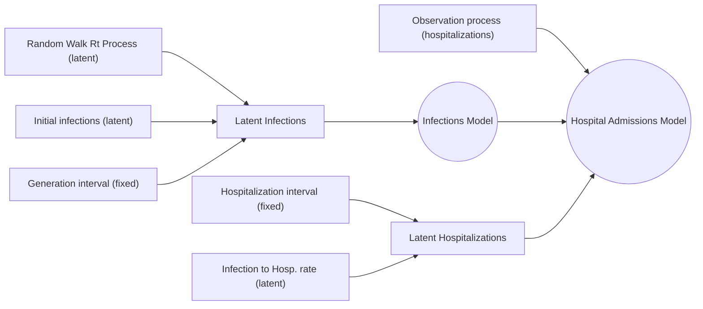

# PyRenew: A Package for Bayesian Renewal Modeling with JAX and NumPyro.

⚠️ This is a work in progress ⚠️

The PyRenew package is a flexible tool for simulation and statistical inference of epidemiological models, emphasizing renewal models. Built on top of the [numpyro](https://num.pyro.ai/) Python library, `pyrenew` provides core components for model building, including pre-defined models for processing various types of observational processes.

The [fundamental](https://cdcgov.github.io/PyRenew/tutorials/getting_started.html#the-fundamentals)  building blocks are the `Model` metaclass, from which we can draw samples, and the `RandomVariable` metaclass which has been abstracted to allow for sampling from distributions, computing a mechanistic equation, or simply returning a fixed value.  (See the tutorial  [Fitting a basic renewal model](https://cdcgov.github.io/PyRenew/tutorials/basic_renewal_model.html) to see how this works.)

The following diagram illustrates the composition of the `HospitalAdmissionsModel` class.    (See the tutorial  [Fitting a hospital-only admissions model](https://cdcgov.github.io/PyRenew/tutorials/hospital_admissions_mode..html) for details.)



## Installation

Install via pip with

```bash
pip install git+https://github.com/CDCgov/PyRenew@main
```

## Models Implemented With PyRenew

- [CDCgov/pyrenew-covid-wastewater](https://github.com/CDCgov/pyrenew-covid-wastewater): _Models and infrastructure for forecasting COVID-19 hospitalizations using wastewater data with PyRenew._
- [CDCgov/pyrenew-flu-light](https://github.com/CDCgov/pyrenew-flu-light/): _An instantiation in PyRenew of an influenza forecasting model used in the 2023-24 respiratory season._

## Resources

* [The PyRenew documentation suite](https://cdcgov.github.io/PyRenew) provides API reference documentation and  tutorials on implementing multisignal renewal models with PyRenew.
* [The Model Equations Sheet](https://github.com/CDCgov/PyRenew/blob/main/equations.md) describe the  mathematics of the multisignal renewal processes and models PyRenew supports.
* Additional reading on renewal processes in epidemiology
  * [_Semi-mechanistic Bayesian modelling of COVID-19 with renewal processes_](https://academic.oup.com/jrsssa/article-pdf/186/4/601/54770289/qnad030.pdf)
  * [_Unifying incidence and prevalence under a time-varying general branching process_](https://link.springer.com/content/pdf/10.1007/s00285-023-01958-w.pdf)

## General Disclaimer

This repository was created for use by CDC programs to collaborate on public health related projects in support of the [CDC mission](https://www.cdc.gov/about/cdc/index.html#cdc_about_cio_mission-our-mission).  GitHub is not hosted by the CDC, but is a third party website used by CDC and its partners to share information and collaborate on software. CDC use of GitHub does not imply an endorsement of any one particular service, product, or enterprise.

## Public Domain Standard Notice

This repository constitutes a work of the United States Government and is not
subject to domestic copyright protection under 17 USC § 105. This repository is in
the public domain within the United States, and copyright and related rights in
the work worldwide are waived through the [CC0 1.0 Universal public domain dedication](https://creativecommons.org/publicdomain/zero/1.0/).
All contributions to this repository will be released under the CC0 dedication. By
submitting a pull request you are agreeing to comply with this waiver of
copyright interest.

## License Standard Notice

This repository is licensed under ASL v2 or later.

This source code in this repository is free: you can redistribute it and/or modify it under
the terms of the Apache Software License version 2, or (at your option) any
later version.

This source code in this repository is distributed in the hope that it will be useful, but WITHOUT ANY
WARRANTY; without even the implied warranty of MERCHANTABILITY or FITNESS FOR A
PARTICULAR PURPOSE. See the Apache Software License for more details.

You should have received a copy of the Apache Software License along with this
program. If not, see [http://www.apache.org/licenses/LICENSE-2.0.html](http://www.apache.org/licenses/LICENSE-2.0.html).

The source code forked from other open source projects will inherit its license.

## Privacy Standard Notice

This repository contains only non-sensitive, publicly available data and
information. All material and community participation is covered by the
[Disclaimer](https://github.com/CDCgov/template/blob/master/DISCLAIMER.md)
and [Code of Conduct](https://github.com/CDCgov/template/blob/master/code-of-conduct.md).
For more information about CDC's privacy policy, please visit [http://www.cdc.gov/other/privacy.html](https://www.cdc.gov/other/privacy.html).

## Contributing Standard Notice

Anyone is encouraged to contribute to the repository by [forking](https://help.github.com/articles/fork-a-repo)
and submitting a pull request. (If you are new to GitHub, you might start with a
[basic tutorial](https://help.github.com/articles/set-up-git).) By contributing
to this project, you grant a world-wide, royalty-free, perpetual, irrevocable,
non-exclusive, transferable license to all users under the terms of the
[Apache Software License v2](http://www.apache.org/licenses/LICENSE-2.0.html) or
later.

All comments, messages, pull requests, and other submissions received through
CDC including this GitHub page may be subject to applicable federal law, including but not limited to the Federal Records Act, and may be archived. Learn more at [http://www.cdc.gov/other/privacy.html](http://www.cdc.gov/other/privacy.html).

## Records Management Standard Notice

This repository is not a source of government records but is a copy to increase
collaboration and collaborative potential. All government records will be
published through the [CDC web site](http://www.cdc.gov).

## Additional Standard Notices

Please refer to [CDC's Template Repository](https://github.com/CDCgov/template)
for more information about [contributing to this repository](https://github.com/CDCgov/template/blob/master/CONTRIBUTING.md),
[public domain notices and disclaimers](https://github.com/CDCgov/template/blob/master/DISCLAIMER.md),
and [code of conduct](https://github.com/CDCgov/template/blob/master/code-of-conduct.md).
