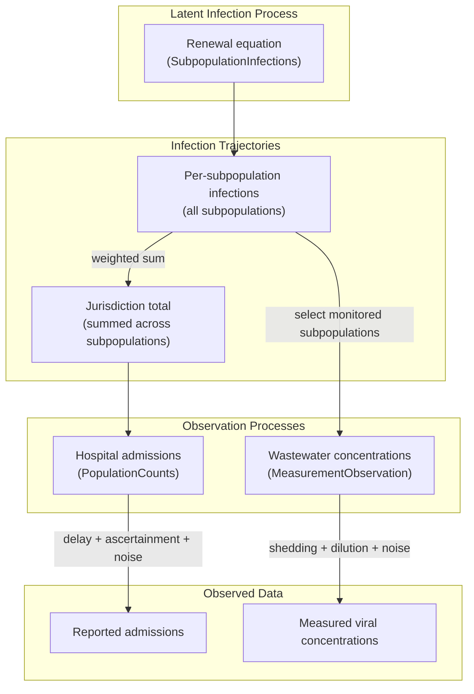

```{python}
#| label: setup
#| output: false

import numpyro

# to run samplers in parallel you must run `set_host_device_count` before importing jax
numpyro.set_host_device_count(4)
numpyro.enable_x64()
```

```{python}
#| label: imports-base

import arviz as az
import jax
import jax.numpy as jnp
import jax.random as random
import numpy as np
import numpyro.distributions as dist
import plotnine as p9
import pandas as pd
import time
import warnings
from datetime import date

warnings.filterwarnings("ignore")

from _tutorial_theme import theme_tutorial
```

```{python}
#| label: imports-pyrenew

from jax.typing import ArrayLike

from pyrenew import datasets
from pyrenew.deterministic import (
    DeterministicPMF,
    DeterministicVariable,
)
from pyrenew.metaclass import RandomVariable
from pyrenew.randomvariable import DistributionalVariable

from pyrenew.latent import (
    SubpopulationInfections,
    DifferencedAR1,
    RandomWalk,
    StepwiseTemporalProcess,
    WeeklyTemporalProcess,
    GammaGroupSdPrior,
    HierarchicalNormalPrior,
)
from pyrenew.model import PyrenewBuilder

from pyrenew.observation import (
    PopulationCounts,
    HierarchicalNormalNoise,
    MeasurementObservation,
    MeasurementNoise,
    NegativeBinomialNoise,
)
from pyrenew.time import MMWR_WEEK
```

## Overview

Renewal models in PyRenew combine two types of components:

1. **Latent infection process**: Generates unobserved infections via the renewal equation, driven by a time-varying reproduction number $\mathcal{R}(t)$

2. **Observation processes**: Transform latent infections into observable signals (hospital admissions, wastewater concentrations, etc.) by applying delays, ascertainment, and noise

A **multi-signal model** combines multiple observation processes---each representing a different data stream, e.g., hospital admissions, emergency department visits, wastewater concentrations, which stem from the same underlying latent infection process.
By jointly modeling these signals, we can improve estimation and prediction of the time-varying reproduction number $\mathcal{R}(t)$.
Such a model must:

- Generate a single coherent infection trajectory (or set of trajectories for subpopulations)
- Route those infections to each observation process appropriately
- Handle the initialization period required by delay distributions

The `PyrenewBuilder` class handles this plumbing.
You specify:

1. A single **latent process** (e.g., `SubpopulationInfections`) that defines how infections evolve.
2. One or more **observation processes** (e.g., `PopulationCounts`, `MeasurementObservation`) that define how infections become data.

The builder computes initialization requirements, wires components together, and produces a model ready for inference.

### Related Tutorials

Before diving into multi-signal models, you may want to review these foundational tutorials:

- **[Latent Infections](latent_infections.md)** and **[Latent Subpopulation Infections](latent_subpopulation_infections.md)**: Understanding temporal process choices for $\mathcal{R}(t)$
- **[Observation Processes: Counts](observation_processes_counts.md)**: Modeling count data (admissions, deaths)
- **[Observation Processes: Measurements](observation_processes_measurements.md)**: Modeling continuous data (wastewater)

This tutorial shows how to combine these components into a complete multi-signal model.

### What This Tutorial Covers

This tutorial demonstrates building a multi-signal renewal model using:

- `SubpopulationInfections` --- subpopulations share a jurisdiction-level baseline $\mathcal{R}(t)$ with subpopulation-specific deviations
- `PopulationCounts` --- hospital admissions (jurisdiction-level)
- A custom `Wastewater` class --- viral concentrations (subpopulation-level)

## Model Structure

In this tutorial, we build a model that jointly fits two data streams to a shared latent infection process:

- **Hospital admissions** --- jurisdiction-level counts that reflect a delayed and partially observed subset of total infections across all subpopulations
- **Wastewater concentrations** --- site-level measurements from a subset of subpopulations (catchment areas), reflecting viral shedding and dilution

The diagram below shows how data flows through the model.
The latent process generates infection trajectories for all subpopulations.
Each observation process receives the infections it needs --- aggregated totals or per-subpopulation arrays --- and transforms them into predicted observations via delays, ascertainment, shedding kinetics, and noise.



### Infection Resolution

Different observation processes observe different levels of the model hierarchy.
Each observation process declares an **infection resolution** that determines what infection data it receives:

  | Resolution    | Receives                                                            | Example signals                        |
  | ------------- | ------------------------------------------------------------------- | -------------------------------------- |
  | `"aggregate"` | Aggregated infections (sum across all subpopulations), shape `(T,)` | Hospital admissions, case counts       |
  | `"subpop"`    | Infection matrix for all subpopulations, shape `(T, n_subpops)`     | Wastewater, site-specific surveillance |

The `PyrenewBuilder` routes latent infections to observation processes based on each process's declared resolution.

For subpopulation-level observations, the observation process selects which subpopulations it observes using `subpop_indices` provided at sample/fit time.
This allows flexible observation patterns---for example, wastewater samples might only cover 5 of 6 subpopulations (catchment areas), while the 6th represents areas without wastewater monitoring.

With this structure in mind, we'll now define each component following the generative direction: first the latent infection process, then the observation processes.

## Latent Infection Process

Latent infection processes implement the renewal equation to generate infection trajectories.
All latent processes share common components:

- **Generation interval**: PMF for secondary infection timing
- **Initial infections ($I(0)$)**: Starting condition for the renewal process
- **Temporal dynamics**: How $\mathcal{R}(t)$ evolves over time

### Generation Interval

The generation interval PMF specifies the probability that a secondary infection occurs $\tau$ days after the primary infection.

```{python}
#| label: gen-interval

covid_gen_int = [0.16, 0.32, 0.25, 0.14, 0.07, 0.04, 0.02]
gen_int_pmf = jnp.array(covid_gen_int)
gen_int_rv = DeterministicPMF("gen_int", gen_int_pmf)

days = np.arange(len(gen_int_pmf))
print(f"Generation interval: {gen_int_pmf}")
```

### I0: Initial Infections

The initial infections RV `I0_rv` specifies the **proportion of the population infected** at the first observation time.
This must be a value in the interval (0, 1\].
We use a Beta prior centered near a small value:

```{python}
#| label: initial-infections

I0_rv = DistributionalVariable("I0", dist.Beta(1, 100))
```

### Log Rt at time $0$

We place a prior on the log $\mathcal{R}(t)$ at time $0$, centered at $0.0$ ($\mathcal{R}(t) = 1.0$) with moderate uncertainty:

```{python}
#| label: log-rt-time-0

log_rt_time_0_rv = DistributionalVariable("log_rt_time_0", dist.Normal(0.0, 0.5))
```

### Temporal Processes for $\mathcal{R}(t)$

We configure two temporal processes:

- **Jurisdiction-level** (`baseline_rt_process`): DifferencedAR(1) process for the baseline $\mathcal{R}(t)$
- **Subpopulation-level** (`subpop_rt_deviation_process`): RandomWalk for subpopulation deviations

The RandomWalk allows flexible evolution of subpopulation-specific transmission without mean reversion.

```{python}
#| label: temporal-processes

# DifferencedAR1 allows persistent trends while stabilizing the growth rate.
baseline_rt_process = DifferencedAR1(
    autoreg_rv=DeterministicVariable("autoreg", 0.5),
    innovation_sd_rv=DeterministicVariable("innovation_sd", 0.01),
)

# RandomWalk allows flexible subpopulation deviations
subpop_rt_deviation_process = RandomWalk(
    innovation_sd_rv=DeterministicVariable("innovation_sd", 0.025),
)
```

### Choosing the $\mathcal{R}(t)$ Parameter Cadence

The renewal equation is evaluated on the model's daily time axis, but the temporal process for $\mathcal{R}(t)$ does not have to sample a new parameter every day.
This separates three model choices:

- **Parameter cadence**: how often the $\mathcal{R}(t)$ temporal process samples a new latent value
- **Model time axis**: the daily axis used by the renewal equation and delay convolutions
- **Observation cadence**: the temporal granularity for each signal, such as daily ED visits or weekly hospital admissions

The `DifferencedAR1` process above samples one value per model day:

```python
baseline_rt_process = DifferencedAR1(
    autoreg_rv=DeterministicVariable("autoreg", 0.5),
    innovation_sd_rv=DeterministicVariable("innovation_sd", 0.01),
)
```

To use a weekly $\mathcal{R}(t)$ while still running the renewal equation daily, wrap the temporal process in `WeeklyTemporalProcess`.
The wrapper samples a weekly trajectory and broadcasts it to the daily model axis before the latent infection process uses it.

```python
weekly_baseline_rt_process = WeeklyTemporalProcess(
    inner=DifferencedAR1(
        autoreg_rv=DeterministicVariable("autoreg", 0.5),
        innovation_sd_rv=DeterministicVariable("innovation_sd", 0.01),
    ),
    start_dow=MMWR_WEEK,
)
```

Use `WeeklyTemporalProcess` when the weekly Rt blocks should align to a calendar week.
The `start_dow` parameter is the day of week on which the calendar-week cycle begins (0=Monday, 6=Sunday, ISO convention).
`pyrenew.time` exports `MMWR_WEEK = 6` (Sunday-Saturday epiweeks) and `ISO_WEEK = 0` (Monday-Sunday); pass any integer in `[0, 6]` for other conventions.
At sample or run time, pass the date of the first observation day as `obs_start_date`.
Argument `obs_start_date` is required whenever any component performs calendar-aligned work: a `WeeklyTemporalProcess`, a count observation with `aggregation="weekly"`, or any observation with a day-of-week effect.
For `StepwiseTemporalProcess` and daily observations with no day-of-week effect, `obs_start_date` can be omitted.
The model handles the calendar bookkeeping and forwards the day-of-week information to every component that needs it.

## Observation Processes

Observation processes transform latent infections into observable signals and define the statistical model linking predictions to data.
Each observation process:

- Has a unique **name** that identifies the signal in model outputs
- Declares what **infection resolution** it needs (`"aggregate"` or `"subpop"`)
- Applies signal-specific transformations (ascertainment, delay convolution, shedding kinetics)
- Defines the noise model

### Signal Naming

Each observation process requires a `name` parameter---a short, meaningful identifier like `"hospital"` or `"wastewater"`.
This name serves as the single identifier for the signal throughout the model:

- **Numpyro sites**: Prefixes all sample and deterministic sites (e.g., `hospital_obs`, `hospital_predicted`)
- **Data binding**: Becomes the keyword argument for passing data to `model.run()` (e.g., `hospital={...}`)

This unified naming provides several benefits:

- **Interpretable outputs**: When examining MCMC samples or posterior diagnostics, site names like `hospital_predicted` immediately indicate which signal each quantity refers to
- **Multiple signals of the same type**: You can include multiple count observations (e.g., hospital admissions and deaths) by giving each a distinct name
- **Clearer debugging**: Error messages and trace inspection show meaningful signal names rather than generic identifiers

### Hospital Admissions

In this example we use a dataset consisting of hospital admissions for COVID-19 across California for the first 10 months of 2023 (as reported to the CDC).

```{python}
#| label: load-hospital-data

# Load daily hospital admissions for California
ca_hosp_data = datasets.load_hospital_data_for_state("CA", "2023-11-06.csv")
obs_start_date = ca_hosp_data["dates"][0]
hosp_admits = ca_hosp_data["daily_admits"]
population_size = ca_hosp_data["population"]
n_hosp_days = ca_hosp_data["n_days"]

print("State: California")
print(f"Population: {population_size:,}")
print(f"Date range: {ca_hosp_data['dates'][0]} to {ca_hosp_data['dates'][-1]}")
print(f"Number of days: {n_hosp_days}")
print(f"Admissions range: {int(hosp_admits.min())} to {int(hosp_admits.max())}")
```

The hospital admissions data is aggregated at the jurisdiction level, therefore we specify a `PopulationCounts` observation process.

```{python}
#| label: hospital-obs-process

# Infection-to-hospitalization delay (COVID-19, from literature)
inf_to_hosp_pmf = jnp.array(
    [
        0,
        0.00469,
        0.01452,
        0.02786,
        0.04237,
        0.05581,
        0.06657,
        0.07379,
        0.07729,
        0.07737,
        0.07465,
        0.06988,
        0.06377,
        0.05696,
        0.04996,
        0.04315,
        0.03677,
        0.03097,
        0.02583,
        0.02135,
        0.01751,
        0.01427,
        0.01156,
        0.00931,
        0.00746,
        0.00596,
        0.00474,
        0.00375,
        0.00296,
        0.00233,
        0.00183,
        0.00143,
        0.00107,
        0.00077,
        0.00054,
        0.00036,
        0.00024,
        0.00015,
        0.00009,
        0.00005,
        0.00003,
        0.00002,
        0.00001,
    ]
)
hosp_delay_rv = DeterministicPMF("inf_to_hosp_delay", inf_to_hosp_pmf)

# IHR: ~1% of infections lead to hospitalization
ihr_rv = DeterministicVariable("ihr", 0.01)

# Negative binomial concentration (moderate overdispersion)
hosp_concentration_rv = DeterministicVariable("hosp_concentration", 10.0)

# Create hospital observation process
hosp_obs = PopulationCounts(
    name="hospital",
    ascertainment_rate_rv=ihr_rv,
    delay_distribution_rv=hosp_delay_rv,
    noise=NegativeBinomialNoise(hosp_concentration_rv),
)

print("Hospital observation:")
print(f"  Infection resolution: {hosp_obs.infection_resolution()}")
print(f"  Delay PMF length: {len(inf_to_hosp_pmf)} days")
```

### Wastewater Concentrations

#### Wastewater Observation Process

The `MeasurementObservation` base class handles continuous observation processes.
Domain-specific implementations subclass it and implement `_predicted_obs()` to transform infections into predicted values.
See `observation_processes_measurements.md` for a detailed tutorial.

```{python}
#| label: wastewater-class

class Wastewater(MeasurementObservation):
    """
    Wastewater viral concentration observation process.

    Transforms site-level infections into predicted log-concentrations
    via shedding kinetics convolution and genome/volume scaling.
    """

    def __init__(
        self,
        name: str,
        shedding_kinetics_rv: RandomVariable,
        log10_genome_per_infection_rv: RandomVariable,
        ml_per_person_per_day: float,
        noise: MeasurementNoise,
    ) -> None:
        super().__init__(name=name, temporal_pmf_rv=shedding_kinetics_rv, noise=noise)
        self.log10_genome_per_infection_rv = log10_genome_per_infection_rv
        self.ml_per_person_per_day = ml_per_person_per_day

    def validate(self) -> None:
        shedding_pmf = self.temporal_pmf_rv()
        self._validate_pmf(shedding_pmf, "shedding_kinetics_rv")
        self.noise.validate()

    def lookback_days(self) -> int:
        return len(self.temporal_pmf_rv()) - 1

    def _predicted_obs(self, infections: ArrayLike) -> ArrayLike:
        shedding_pmf = self.temporal_pmf_rv()
        log10_genome = self.log10_genome_per_infection_rv()

        def convolve_site(site_infections):
            convolved, _ = self._convolve_with_alignment(
                site_infections, shedding_pmf, p_observed=1.0
            )
            return convolved

        shedding_signal = jax.vmap(convolve_site, in_axes=1, out_axes=1)(infections)
        genome_copies = 10**log10_genome
        concentration = shedding_signal * genome_copies / self.ml_per_person_per_day
        return jnp.log(concentration)
```

#### Wastewater Data

For the wastewater data, we use a simulated dataset for California with realistic noise patterns that covers the same time period.

```{python}
#| label: load-wastewater-data

# Load wastewater data for California
ca_ww_data = datasets.load_wastewater_data_for_state("CA", "fake_nwss.csv")

ww_conc = ca_ww_data["observed_conc"]  # log concentrations
ww_site_ids = ca_ww_data["site_ids"]
ww_time_indices = ca_ww_data["time_indices"]
ww_n_sites = ca_ww_data["n_sites"]
ww_n_obs = ca_ww_data["n_obs"]
ww_wwtp_names = ca_ww_data["wwtp_names"]

print("State: California")
print(f"Number of sites: {ww_n_sites}")
print(f"Number of observations: {ww_n_obs}")
print(f"Date range: {ca_ww_data['dates'][0]} to {ca_ww_data['dates'][-1]}")
print(f"Time index range: {int(ww_time_indices.min())} to {int(ww_time_indices.max())}")
print("\nSites:")
for i, name in enumerate(ww_wwtp_names[:5]):
    print(f"  {i}: {name}")
if ww_n_sites > 5:
    print(f"  ... and {ww_n_sites - 5} more")
```

Wastewater observations are site-level: each measurement is associated with a specific measurement site.
The `Wastewater` observation process uses `LogNormalNoise`, which takes hierarchical priors for the site-level mode and standard deviation parameters.
This enables partial pooling across measurement sites.

Here we specify `HierarchicalNormalPrior` for the site-level mode and `GammaGroupSdPrior` for the standard deviation.

```{python}
#| label: wastewater-obs-process

# Viral shedding kinetics PMF (days post-infection)
shedding_pmf = jnp.array(
    [
        0.0,
        0.02,
        0.08,
        0.15,
        0.20,
        0.18,
        0.14,
        0.10,
        0.06,
        0.04,
        0.02,
        0.01,
    ]
)
shedding_pmf = shedding_pmf / shedding_pmf.sum()  # normalize
shedding_rv = DeterministicPMF("shedding_kinetics", shedding_pmf)

# Log10 genomes shed per infection
log10_genome_rv = DeterministicVariable("log10_genome_per_inf", 9.0)

# Wastewater volume per person per day (mL)
ml_per_person_per_day = 1000.0

# Hierarchical priors for site-level effects
site_mode_prior = HierarchicalNormalPrior(
    "ww_site_mode", sd_rv=DeterministicVariable("site_mode_sd", 0.5)
)
site_sd_prior = GammaGroupSdPrior(
    "ww_site_sd",
    sd_mean_rv=DeterministicVariable("site_sd_mean", 0.3),
    sd_concentration_rv=DeterministicVariable("site_sd_conc", 4.0),
)

# Create wastewater observation process
ww_obs = Wastewater(
    name="wastewater",
    shedding_kinetics_rv=shedding_rv,
    log10_genome_per_infection_rv=log10_genome_rv,
    ml_per_person_per_day=ml_per_person_per_day,
    noise=HierarchicalNormalNoise(site_mode_prior, site_sd_prior),
)

print("Wastewater observation:")
print(f"  Infection resolution: {ww_obs.infection_resolution()}")
print(f"  Shedding PMF length: {len(shedding_pmf)} days")
```

## Model Building

We instantiate a `PyrenewBuilder` object which handles the composition of the latent infection process and the observation process.

```{python}
#| label: model-builder-init

# Build the multi-signal model
builder = PyrenewBuilder()
```

The `PyrenewBuilder` object has 3 key methods:

- `configure_latent`
- `add_observation`
- `build`

Methods `configure_latent` and `add_observation` can be called in any order.
Method `build` is called once all processes have been specified in the model.

### Configuring the Latent Process

We use `configure_latent` to specify the **model structure**: generation interval, initial infections, and temporal dynamics.

```{python}
#| label: configure-latent

print("Latent process configuration:")
print(f"  Generation interval length: {len(gen_int_rv())} days")

builder.configure_latent(
    SubpopulationInfections,
    gen_int_rv=gen_int_rv,
    I0_rv=I0_rv,
    log_rt_time_0_rv=log_rt_time_0_rv,
    baseline_rt_process=baseline_rt_process,
    subpop_rt_deviation_process=subpop_rt_deviation_process,
)
```

### Specifying the Observation Processes, Data

Each observation process's `name` attribute becomes the keyword used to pass that observation's data to `model.run()` (e.g., `hospital={...}`, `wastewater={...}`).

```{python}
#| label: add-observations-build

builder.add_observation(hosp_obs)  # Uses hosp_obs.name = "hospital"
builder.add_observation(ww_obs)  # Uses ww_obs.name = "wastewater"
model = builder.build()

n_init = model.latent.n_initialization_points
print("Model built successfully")
print(f"  n_initialization_points: {n_init}")
print(f"  Latent process: {type(model.latent).__name__}")
print(f"  Observation processes: {list(model.observations.keys())}")
```

### Model  Identifiability.

The renewal equation is linear in the initial infections `I0_rv`, so scaling `I0_rv` by a factor $c$ scales the entire infection trajectory by $c$.
In practice, `I0_rv` is weakly identified because each observation process links infections to data through a signal-specific ascertainment rate $\alpha_s$ --- the probability that an infection is observed as an event in signal $s$.
Doubling `I0_rv` while halving all ascertainment rates produces identical expected observations.
Without external information to anchor either the ascertainment rates or the absolute infection level, the data cannot distinguish "more infections, lower ascertainment" from "fewer infections, higher ascertainment."
The priors on `I0_rv` and on the ascertainment rates resolve this ambiguity.

## Fitting the Model to Data:  `model.run()`

When you call `model.run()`, you supply three types of information:

- **Model and population information** --- the fitting period, total population size, and subpopulation fractions
- **Observation data** --- one data dictionary per registered observation process
- **MCMC controls** --- basic settings for posterior sampling

For this model, a complete call has the following structure:

```python
model.run(
    num_warmup=500,
    num_samples=500,
    rng_key=random.PRNGKey(42),
    mcmc_args={"num_chains": 4, "progress_bar": False},
    n_days_post_init=n_days,
    population_size=population_size,
    subpop_fractions=subpop_fractions,
    **obs_data,
)
samples = model.mcmc.get_samples()
```

The `**obs_data` dictionary supplies the observation start date and one data dictionary per observation process.
The keys of the observation dictionaries are the names registered on the builder: `hospital` and `wastewater`.

### Model Time vs. Observation Time

In the raw data, day 0 is the first day with observations.
PyRenew adds an initialization period before this date so the renewal process has enough past infections to generate infections during the observed period.

This means the model has two related time scales:

- **Observation time** starts at the first day in the data.
- **Model time** starts `n_init` days earlier.

On the model time axis, indices `0` through `n_init - 1` are initialization days.
The first observed day is model index `n_init`, and the last observed day is model index `n_init + n_days - 1`.

The model provides helper methods to convert observation data onto this model time axis:

- `model.pad_observations(obs)` prepends `n_init` NaN values to dense daily observation vectors.
- `model.shift_times(times)` adds `n_init` to sparse observation time indices.

The hospital admissions signal is dense: it has one value per observation day, so we pad it.
The wastewater signal is sparse: each row has an observation day, so we shift its time index.

### Population Structure

First we declare the population structure.
We have 6 subpopulations, where 5 have wastewater monitoring and 1 does not.
The subpopulations with wastewater monitoring need not be contiguous indices; they can be any subset of {0, 1, ..., n_subpops-1}.

```{python}
#| label: population-structure

# All 6 subpopulations with their population fractions
subpop_fractions = jnp.array([0.10, 0.14, 0.21, 0.22, 0.07, 0.26])

n_subpops = len(subpop_fractions)

# Which subpopulations have wastewater monitoring?
# These indices will be used in subpop_indices for wastewater observations.
# They can be any subset of {0, 1, ..., n_subpops-1}, not necessarily contiguous.
ww_monitored_subpops = jnp.array(
    [0, 1, 2, 3, 4]
)  # subpop 5 has no wastewater monitoring

print(f"Total subpopulations: {n_subpops}")
print(f"Subpopulations with wastewater monitoring: {list(ww_monitored_subpops)}")
print(
    f"Wastewater coverage: {float(jnp.sum(subpop_fractions[ww_monitored_subpops])):.0%}"
)
print(f"Total population: {float(jnp.sum(subpop_fractions)):.0%}")
```

The `subpop_fractions` array defines all subpopulations in the latent infection process, and its entries must sum to 1.0.
Which subpopulations each observation process sees is determined by the observation data.

Measurement data typically exhibits sensor-level variability: different instruments, labs, or sampling locations may have systematic biases and different precision levels.
The wastewater observations record both the wastewater treatment plant from which the sample was collected and the laboratory at which the sample was processed.
For wastewater, a "sensor" is a WWTP/lab pair - the combination of treatment plant and laboratory associated with sensor-specific bias and measurement variability.
Because the wastewater component's `HierarchicalNormalNoise` samples one mode and one standard deviation parameter.
Therefore, the wastewater signal's data dictionary includes:

- `subpop_indices` links each observation to the appropriate subpopulation
- `sensor_indices` selects the sensor-specific noise parameters.
- `n_sensors` the total number of sensors, used to size the sensor-level noise parameters.

### Preparing Observation Data

The observation data dictionary is structured to match the keyword arguments of `model.run()`: `obs_start_date` at the top level, plus one sub-dictionary per observation process.
The entries in the sub-dictionaries are forwarded as arguments to each observation process's `sample` method.

The two observation streams are aligned differently because they are represented differently.
Hospital admissions are a dense daily series: every day in the fitting window has a position in the vector, so `model.pad_observations()` prepends `n_init` missing values for the initialization period.
Wastewater measurements are sparse rows: only sampled days appear in the table, so the observations themselves are not padded.
Instead, `model.shift_times()` adds `n_init` to each wastewater time index so those rows point to the correct days on the model's shared time axis.

```{python}
#| label: prepare-observation-data

n_days_90 = 90

# Hospital: dense, NaN-padded to length n_total
hosp_obs = model.pad_observations(hosp_admits[:n_days_90])

# Wastewater: sparse, times shifted to shared axis
ww_mask = ca_ww_data["time_indices"] < n_days_90
ww_times = model.shift_times(ca_ww_data["time_indices"][ww_mask])
ww_conc = ca_ww_data["observed_conc"][ww_mask]
ww_sites = ca_ww_data["site_ids"][ww_mask]

# Map wastewater sensors to subpopulation indices.
# In practice, this mapping comes from your data
# (which WWTP serves which catchment). For this demo, we cycle
# sensors through the monitored subpopulations.
n_ww_sites = ca_ww_data["n_sites"]
n_monitored = len(ww_monitored_subpops)
sensor_to_subpop = {
    i: int(ww_monitored_subpops[i % n_monitored]) for i in range(n_ww_sites)
}
ww_subpop_indices = jnp.array([sensor_to_subpop[int(s)] for s in ww_sites])

obs_data_90 = {
    "obs_start_date": obs_start_date,
    "hospital": {
        "obs": hosp_obs,
    },
    "wastewater": {
        "obs": ww_conc,
        "times": ww_times,
        "subpop_indices": ww_subpop_indices,
        "sensor_indices": ww_sites,
        "n_sensors": n_ww_sites,
    },
}
```

The observation dictionary has the following structure:

```python
{
    "obs_start_date": ...,
    "hospital": {
        "obs": ...
    },
    "wastewater": {
        "obs": ...
        "times": ...
        "subpop_indices": ...
        "sensor_indices": ...
        "n_sensors": ...
    },
}
```

At call time, we unpack this dictionary with `**`, forwarding each entry as a keyword argument to `model.run()`.
Note that we could also have manually passed each dictionary entry to `model.run()`.
We chose to create (and then unpack) an `obs_data` dictionary to keep our data organized in one place.

### MCMC Controls

`model.run()` uses NumPyro's No-U-Turn Sampler (NUTS) through `numpyro.infer.MCMC`.
For this introductory example, the main controls are:

- `num_warmup`, the number of warmup iterations
- `num_samples`, the number of posterior samples to keep
- `rng_key`, the random seed for sampling
- `mcmc_args`, optional NumPyro MCMC settings

For this fit, we use 4 chains and turn off the progress bar:

```python
mcmc_args = {"num_chains": 4, "progress_bar": False}
```

See the [NumPyro MCMC reference](https://num.pyro.ai/en/stable/mcmc.html) for more advanced MCMC options.

## Running the Model

We now unpack the observation dictionary prepared above into `model.run()`.
The fit uses 90 days of data.

### Fit: 90 Days

```{python}
#| label: fit-90-days

# Clear JAX caches to avoid interference from earlier cells
jax.clear_caches()

print(f"Fitting model with {n_days_90} days of data...")
print("  This may take a few minutes...")

start_time = time.time()
model.run(
    num_warmup=500,
    num_samples=500,
    rng_key=random.PRNGKey(42),
    mcmc_args={"num_chains": 4, "progress_bar": False},
    n_days_post_init=n_days_90,
    population_size=population_size,
    subpop_fractions=subpop_fractions,
    **obs_data_90,
)
# JAX uses asynchronous dispatch, so we must block until sampling completes
# to get accurate timing
samples_90 = model.mcmc.get_samples()
jax.block_until_ready(samples_90)
elapsed_90 = time.time() - start_time
print(f"Elapsed time: {elapsed_90:.1f} seconds")
```

We use [ArviZ](https://python.arviz.org/en/stable/) to assess MCMC convergence and mixing via the $\hat{R}$ statistic and effective sample size (ESS).
Before running these diagnostics, we trim the first `n_init` time steps from all time-series variables.
Since the model cannot estimate latent infections until it has seen a full generation interval's worth of data, these early time steps have no meaningful epidemiological interpretation and therefore should be excluded from summaries and visualizations.

```{python}
#| label: helper-trim-time

def trim_time(ds):
    """Trim first n_init entries from time dimension and reindex."""
    if "time" in ds.dims:
        ds = ds.isel(time=slice(n_init, None))
        ds = ds.assign_coords(time=range(ds.sizes["time"]))
    return ds
```

We first label the time axis of all time-series variables using the dims argument to [az.from_numpyro](https://python.arviz.org/projects/base/en/latest/api/generated/arviz_base.from_numpyro.html).
Then we trim the first `n_init` time steps from all time-series variables.
Finally we call the [az.summary](https://python.arviz.org/projects/stats/en/latest/api/generated/arviz_stats.summary.html) report.

```{python}
#| label: arviz-diagnostics-90

idata_90 = az.from_numpyro(
    model.mcmc,
    dims={
        "latent_infections": ["time"],
        "SubpopulationInfections::infections_aggregate": ["time"],
        "SubpopulationInfections::log_rt_baseline": ["time", "dummy"],
        "SubpopulationInfections::rt_baseline": ["time", "dummy"],
        "SubpopulationInfections::rt_subpop": ["time", "subpop"],
        "SubpopulationInfections::subpop_deviations": ["time", "subpop"],
        "latent_infections_by_subpop": ["time", "subpop"],
        "hospital_predicted": ["time"],
        "wastewater_predicted": ["time", "subpop"],
    },
)

idata_90_trimmed = idata_90.map_over_datasets(trim_time)
az.summary(idata_90_trimmed, var_names=["latent_infections", "hospital_predicted"])
```

We extract the posterior quantiles and print summary statistics.

```{python}
#| label: extract-quantiles-90

latent_inf = idata_90_trimmed.posterior["latent_infections"]

quantiles_90 = {
    "q05": latent_inf.quantile(0.05, dim=["chain", "draw"]).values,
    "q50": latent_inf.quantile(0.50, dim=["chain", "draw"]).values,
    "q95": latent_inf.quantile(0.95, dim=["chain", "draw"]).values,
}

ci_width_90 = quantiles_90["q95"] - quantiles_90["q05"]
print(f"Posterior summary for {n_days_90} days:")
print(f"  Mean 90% CI width: {ci_width_90.mean():,.0f} infections")
print(f"  Median infections (day 45): {quantiles_90['q50'][45]:,.0f}")
```

Finally, we visualize the posterior latent infections alongside observed hospitalizations.
Note that **hospital admissions lag behind infections** by the infection-to-hospitalization delay (mode \~10 days in our delay PMF).
When comparing the two panels, peaks in the infection curve should precede corresponding peaks in hospitalizations by roughly 10-14 days.

```{python}
#| label: fig-posterior-90
#| fig-cap: Posterior latent infections and observed hospitalizations (90 days).

# Visualize posterior latent infections and observed hospitalizations (90 days)
# Create separate dataframes for faceted plot
infections_df_90 = pd.DataFrame(
    {
        "day": np.arange(n_days_90),
        "median": quantiles_90["q50"],
        "q05": quantiles_90["q05"],
        "q95": quantiles_90["q95"],
        "signal": "Latent Infections",
    }
)

# Add 14-day moving average to smooth noisy daily admissions
hosp_raw_90 = np.array(hosp_admits[:n_days_90], dtype=float)
hosp_ma_90 = pd.Series(hosp_raw_90).rolling(window=14, center=True).mean().values

hosp_df_90 = pd.DataFrame(
    {
        "day": np.arange(n_days_90),
        "median": hosp_ma_90,
        "raw": hosp_raw_90,
        "q05": np.nan,
        "q95": np.nan,
        "signal": "Hospital Admissions (14-day MA)",
    }
)

plot_df_90 = pd.concat([infections_df_90, hosp_df_90], ignore_index=True)
plot_df_90["signal"] = pd.Categorical(
    plot_df_90["signal"],
    categories=["Hospital Admissions (14-day MA)", "Latent Infections"],
    ordered=True,
)

(
    p9.ggplot(plot_df_90, p9.aes(x="day"))
    + p9.geom_ribbon(
        p9.aes(ymin="q05", ymax="q95"),
        fill="steelblue",
        alpha=0.3,
    )
    + p9.geom_point(
        p9.aes(y="raw"),
        color="gray",
        alpha=0.3,
        size=1,
    )
    + p9.geom_line(
        p9.aes(y="median"),
        color="darkblue",
        size=1,
    )
    + p9.facet_wrap("~signal", ncol=1, scales="free_y")
    + p9.scale_y_log10()
    + p9.labs(
        x="Day",
        y="Count",
        title="Posterior Latent Infections vs Observed Hospitalizations (90 days)",
    )
    + theme_tutorial
)
```

### Month-by-month uncertainty

The posterior ribbon above shows the infection trajectory and its 90% credible interval, but the ribbon width itself is hard to compare across days.
To focus directly on uncertainty, we compute the daily 90% interval width and summarize it over each 30-day period.

```{python}
#| label: monthly-CI

ci_width_90 = quantiles_90["q95"] - quantiles_90["q05"]

ci_width_df = pd.DataFrame(
    {
        "day": np.arange(n_days_90),
        "ci_width": ci_width_90,
        "period": pd.cut(
            np.arange(n_days_90),
            bins=[-1, 29, 59, 89],
            labels=["Days 0-29", "Days 30-59", "Days 60-89"],
        ),
    }
)

period_summary_df = (
    ci_width_df.groupby("period", observed=True)
    .agg(
        start=("day", "min"),
        end=("day", "max"),
        mean_ci_width=("ci_width", "mean"),
    )
    .reset_index()
)

print("\nMean 90% interval width by time period:")
for row in period_summary_df.itertuples(index=False):
    print(f"  {row.period}: {row.mean_ci_width:,.0f}")

(
    p9.ggplot(ci_width_df, p9.aes(x="day", y="ci_width"))
    + p9.geom_line(color="gray", alpha=0.6, size=0.7)
    + p9.geom_segment(
        data=period_summary_df,
        mapping=p9.aes(
            x="start",
            xend="end",
            y="mean_ci_width",
            yend="mean_ci_width",
            color="period",
        ),
        size=1.6,
    )
    + p9.scale_y_log10()
    + p9.labs(
        x="Day",
        y="90% interval width",
        color="Period",
        title="Posterior uncertainty in latent infections over the 90-day fit",
    )
    + theme_tutorial
)
```

This pattern has a direct implication for forecasting: **renewal models are most uncertain at the edge of the observation window**.
The daily line shows local changes in posterior uncertainty, while the monthly means make the broader edge effect easier to see.
Future observations constrain past latent infections through the renewal equation and observation delays, but the most recent days have less future signal available to anchor them.
That edge uncertainty is the same uncertainty that carries forward when the model is used for forecasting.

## Summary

In this tutorial, we built a renewal model that combines hospital admissions and wastewater concentrations through a shared latent infection process.
The latent process describes infections through time and across subpopulations; each observation process describes how one data stream is generated from those infections.

The main workflow was:

1. Configure the latent infection process with `configure_latent`.
2. Add named observation processes with `add_observation`.
3. Build the model with `build`.
4. Prepare observation dictionaries whose keys match the observation process names.
5. Fit the model with `model.run`.

A few details are especially important when adapting this pattern:

- Observation process names become the data argument names passed to `model.run`, such as `hospital={...}` and `wastewater={...}`.
- Dense daily observations are padded with `model.pad_observations`.
- Sparse observations use shifted time indices from `model.shift_times`.
- `subpop_fractions` defines the latent subpopulations; `subpop_indices` tells an observation process which subpopulation each measurement observes.
- The model time axis starts before the first observed day because PyRenew adds an initialization period for the renewal process.

The 90-day fit shows why the end of the observation window matters.
Future observations help constrain past latent infections, so posterior uncertainty is usually largest near the most recent observed days.
That same edge uncertainty is what carries forward when the model is used for forecasting.

### Next Steps

- Explore different temporal processes for $\mathcal{R}(t)$ in the [Latent Infections](latent_infections.md) and [Latent Subpopulation Infections](latent_subpopulation_infections.md) tutorials
- Learn about count-based observation models in [Observation Processes: Counts](observation_processes_counts.md)
- Learn about continuous measurement models in [Observation Processes: Measurements](observation_processes_measurements.md)
