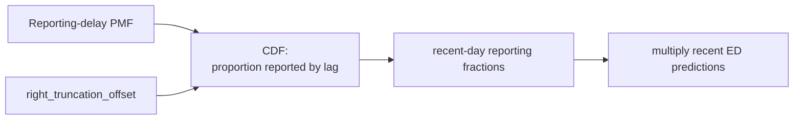

```{python}
#| label: setup
#| output: false

from datetime import date
import warnings

import jax.numpy as jnp
import numpyro
import numpyro.distributions as dist

warnings.filterwarnings("ignore")

from pyrenew.ascertainment import JointAscertainment
from pyrenew.datasets import (
    load_example_infection_admission_interval,
    load_synthetic_daily_ed_visits,
    load_synthetic_true_parameters,
    load_synthetic_weekly_hospital_admissions,
)
from pyrenew.deterministic import DeterministicPMF, DeterministicVariable
from pyrenew.latent import DifferencedAR1, PopulationInfections, WeeklyTemporalProcess
from pyrenew.model import PyrenewBuilder
from pyrenew.observation import NegativeBinomialNoise, PopulationCounts
from pyrenew.randomvariable import DistributionalVariable, TransformedVariable
from pyrenew.time import MMWR_WEEK
import pyrenew.transformation as transformation
```

This tutorial builds a small hospital + emergency department model using PyRenew's high-level components which approximates a production model used to produce weekly short-term forecasts of Covid, flu, and RSV for the [CDC ensemble forecast hubs](https://www.cdc.gov/cfa-modeling-and-forecasting/covid19-data-vis).
The production model is coded directly in NumPyro.
Here we use PyRenew's high-level components and `PyrenewBuilder` class to specify a model with the same core shape:

- one latent population-level infection process,
- weekly hospital admissions,
- daily ED visits, with a day of the week effect
- a weekly-parameterized reproduction number,
- joint scalar ascertainment for the two clinical signals.

The renewal equation and delay convolutions run on a daily model axis, while the hospital likelihood is evaluated on weekly totals and the ED likelihood is evaluated on daily counts.

## Model Structure

The model has one latent infection process.
Both observations receive the same aggregate infection trajectory, but they map it to data on different reporting grids.


The components are:

- **Latent infections**: `PopulationInfections` produces a single aggregate infection trajectory.
- **Rt process**: `WeeklyTemporalProcess(DifferencedAR1(...), start_dow=MMWR_WEEK)` samples weekly values and broadcasts them to the daily renewal equation.
- **Ascertainment**: `JointAscertainment` samples scalar hospital and ED ascertainment rates from one joint prior.
- **Hospital observation**: `PopulationCounts(..., aggregation="weekly", start_dow=MMWR_WEEK)` scores weekly hospital totals.
- **ED observation**: `PopulationCounts(...)` scores daily ED counts and includes a day-of-week effect.

## Production Extensions and Model Comparison

The model implemented here uses the same high-level H+E structure as the production model, but omits several production-specific components: We keep these components out of the tutorial model so the example can focus on the mixed daily/weekly observation cadence.

- **Infection feedback**: the latent infection process includes a state-dependent damping term, so higher infection levels can reduce future transmission.
  This can help regularize epidemic trajectories, but it is a substantive modeling assumption.

- **Inferred delay distributions**: some delay distributions are estimated rather than fixed, allowing the model to learn timing relationships between latent infections and observed signals.
  PyRenew's observation API accepts delay distributions as `RandomVariable` objects, so fixed delays can be replaced by inferred PMFs or custom parametric delay models, provided the sampled value is a valid fixed-length PMF.
  In this tutorial we keep the delays fixed.

- **Time-varying ED ascertainment**: the ED visit rate can vary over time, while the hospital ascertainment rate is modeled relative to the ED rate.
  In the tutorial model, we use `JointAscertainment` instead.
  This relates the hospital and ED ascertainment rates through a joint prior, while keeping both rates scalar over time.

These alternatives are good candidates for model comparison and sensitivity analysis.
One advantage of specifying the model with `PyrenewBuilder` is that closely related models can be built from the same components while changing only the feature under study: fixed versus inferred delays, scalar versus time-varying ascertainment, or renewal dynamics with versus without feedback.
In practice, each candidate model can be defined as a named Python object, factory function, or separate model specification file.
This makes it easier to compare posterior predictive checks, held-out forecast performance, and the stability of inferred latent infections across model variants.

## Load Synthetic Inputs

We use the synthetic H+E data bundled with PyRenew.
The true parameters are used only to keep the tutorial priors on a reasonable scale.

```{python}
#| label: load-data

N_DAYS_FIT = 126
OBS_START_DATE = date(2023, 11, 5)

true_params = load_synthetic_true_parameters()
weekly_hosp = load_synthetic_weekly_hospital_admissions()
daily_ed = load_synthetic_daily_ed_visits()

hosp_delay_pmf = jnp.array(
    load_example_infection_admission_interval()["probability_mass"].to_numpy()
)
ed_delay_pmf = jnp.array(true_params["ed_visits"]["delay_pmf"])

population_size = float(weekly_hosp["pop"][0])

print(f"Weekly hospital rows: {len(weekly_hosp)}")
print(f"Daily ED rows: {len(daily_ed)}")
print(f"Population size: {population_size:,.0f}")
```

## Latent Infection Process

The production model uses a weekly process for transmission.
Here we use a weekly differenced AR(1) process for log $\mathcal{R}(t)$.
The differenced process allows persistent upward or downward movement, while the weekly wrapper keeps the parameter cadence coarser than the daily renewal equation.

```{python}
#| label: latent-components

gen_int_pmf = jnp.array(
    [0.6326975, 0.2327564, 0.0856263, 0.03150015, 0.01158826, 0.00426308, 0.0015683]
)

gen_int_rv = DeterministicPMF("gen_int", gen_int_pmf)
I0_rv = DistributionalVariable("I0", dist.Beta(1, 10))
log_rt_time_0_rv = DistributionalVariable(
    "log_rt_time_0",
    dist.Normal(0.0, 0.5),
)

weekly_rt_process = WeeklyTemporalProcess(
    DifferencedAR1(
        autoreg_rv=DeterministicVariable("rt_diff_autoreg", 0.5),
        innovation_sd_rv=DeterministicVariable("rt_diff_innovation_sd", 0.01),
    ),
    start_dow=MMWR_WEEK,
)
```

The weekly process is calendar-aligned.
When fitting or sampling this model, pass `obs_start_date` so PyRenew can compute the day of week for the padded daily model axis.

## Joint Ascertainment

Hospital admissions and ED visits are different clinical event streams generated from the same latent infections.
Their ascertainment rates can differ, but it is reasonable to model them as related because both depend on clinical care-seeking and reporting.

```{python}
#| label: joint-ascertainment

true_ihr = true_params["hospitalizations"]["ihr"]
true_iedr = true_params["ed_visits"]["iedr"]

ascertainment = JointAscertainment(
    name="he_ascertainment",
    signals=("hospital", "ed_visits"),
    baseline_rates=jnp.array([true_ihr, true_iedr]),
    scale_tril=jnp.array(
        [
            [0.7, 0.0],
            [0.35, 0.606],
        ]
    ),
)
```

The order of `signals` determines how `baseline_rates` and `scale_tril` are interpreted.
Here the first entry is hospital admissions and the second is ED visits.

## Observation Processes

Both signals are count observations, so both use `PopulationCounts`.
The difference is the reporting grid.

### ED day-of-week effect

ED visits often have a weekly reporting pattern.
The production H+E model samples seven weekday multipliers from a symmetric Dirichlet prior and repeats them across the ED time series.


PyRenew's `PopulationCounts` exposes this as `day_of_week_rv`.
The concentration value of 5 keeps the prior centered near equal weekday effects while still allowing weekday variation.
Scaling the Dirichlet draw by 7 preserves the average daily scale, so the ED ascertainment rate remains interpretable as an average infection-to-ED-visit ratio.

### ED right truncation

Recent ED observations may be incomplete if not all visits have been reported by the data pull date.
PyRenew's `right_truncation_rv` takes a reporting-delay PMF and converts it into the proportion of each recent day's events expected to have been reported.



The adjustment is activated at fit time by passing `right_truncation_offset`, the number of days between the last observation and the data pull.
The synthetic data used here are complete, so later calls omit the offset.

```{python}
#| label: observation-processes

ed_day_of_week_rv = TransformedVariable(
    name="ed_day_of_week_effect",
    base_rv=DistributionalVariable(
        name="ed_day_of_week_effect_raw",
        distribution=dist.Dirichlet(jnp.ones(7) * 5),
    ),
    transforms=transformation.AffineTransform(loc=0.0, scale=7.0),
)

ed_reporting_delay_pmf = jnp.array([0.40, 0.30, 0.15, 0.08, 0.04, 0.02, 0.01])
ed_right_truncation_rv = DeterministicPMF(
    "ed_right_truncation_delay",
    ed_reporting_delay_pmf,
)

hospital_obs = PopulationCounts(
    name="hospital",
    ascertainment_rate_rv=ascertainment.for_signal("hospital"),
    delay_distribution_rv=DeterministicPMF("hosp_delay", hosp_delay_pmf),
    noise=NegativeBinomialNoise(
        DistributionalVariable("hosp_conc", dist.LogNormal(5.0, 1.0))
    ),
    aggregation="weekly",
    reporting_schedule="regular",
    start_dow=MMWR_WEEK,
)

ed_obs = PopulationCounts(
    name="ed_visits",
    ascertainment_rate_rv=ascertainment.for_signal("ed_visits"),
    delay_distribution_rv=DeterministicPMF("ed_delay", ed_delay_pmf),
    noise=NegativeBinomialNoise(
        DistributionalVariable("ed_conc", dist.LogNormal(4.0, 1.0))
    ),
    day_of_week_rv=ed_day_of_week_rv,
    right_truncation_rv=ed_right_truncation_rv,
)
```

For hospital admissions, daily predicted admissions are aggregated to MMWR weeks before the likelihood is evaluated.
For ED visits, the likelihood is evaluated on the daily axis and a multiplicative day-of-week effect is applied before sampling counts.
If the most recent ED observations are incomplete, pass `right_truncation_offset` in the `ed_visits` data dictionary:

```python
ed_visits = {
    "obs": ed_observed,
    "right_truncation_offset": 0,
}
```

## Build the Model

`PyrenewBuilder` computes the initialization period from the generation interval and both observation delay distributions, then wires the latent and observation components together.

```{python}
#| label: build-model

builder = PyrenewBuilder()
builder.configure_latent(
    PopulationInfections,
    gen_int_rv=gen_int_rv,
    I0_rv=I0_rv,
    log_rt_time_0_rv=log_rt_time_0_rv,
    single_rt_process=weekly_rt_process,
)
builder.add_ascertainment(ascertainment)
builder.add_observation(hospital_obs)
builder.add_observation(ed_obs)

model = builder.build()

print(f"Initialization points: {model.latent.n_initialization_points}")
print(f"Observations: {list(model.observations)}")
print(f"Ascertainment models: {list(model.ascertainment_models)}")
```

## Align Observed Data

Daily observations are padded with `NaN` for the initialization period.
Weekly observations live on the weekly period grid, so they need a dense weekly array with leading `NaN` values for unobserved pre-data periods.

```{python}
#| label: align-data

def build_hospital_obs_on_period_grid(model, weekly_values, n_days_fit, obs_start_date):
    hospital = model.observations["hospital"]
    first_day_dow = model._resolve_first_day_dow(obs_start_date)
    n_init = model.latent.n_initialization_points
    n_total = n_init + n_days_fit
    offset = hospital._compute_period_offset(first_day_dow, hospital.start_dow)
    n_periods = (n_total - offset) // hospital.aggregation_period
    n_pre = n_periods - len(weekly_values)
    return jnp.concatenate([jnp.full(n_pre, jnp.nan, dtype=jnp.float32), weekly_values])


hospital_observed = build_hospital_obs_on_period_grid(
    model,
    jnp.array(weekly_hosp["weekly_hosp_admits"].to_numpy(), dtype=jnp.float32),
    N_DAYS_FIT,
    OBS_START_DATE,
)

ed_observed = model.pad_observations(
    jnp.array(daily_ed["ed_visits"].to_numpy(), dtype=jnp.float32)
)

print(f"Hospital observation array shape: {hospital_observed.shape}")
print(f"ED observation array shape: {ed_observed.shape}")
```

## Inspect the Model Graph

Before running MCMC, it is useful to inspect one model trace.
This confirms that the latent process is weekly-parameterized while predictions still live on the daily axis where needed.

```{python}
#| label: trace-model

with numpyro.handlers.seed(rng_seed=0):
    with numpyro.handlers.trace() as trace:
        model.sample(
            n_days_post_init=N_DAYS_FIT,
            population_size=population_size,
            obs_start_date=OBS_START_DATE,
            hospital={"obs": hospital_observed},
            ed_visits={"obs": ed_observed},
        )

for site in [
    "log_rt_single_weekly",
    "PopulationInfections::log_rt_single",
    "he_ascertainment_eta",
    "hospital_predicted_daily",
    "hospital_predicted",
    "ed_visits_predicted",
]:
    value = trace[site]["value"]
    print(f"{site}: {value.shape}")
```

The expected pattern is:

- `log_rt_single_weekly` is shorter than the daily model axis.
- `PopulationInfections::log_rt_single` is daily, because the renewal equation runs daily.
- `hospital_predicted_daily` is daily before aggregation.
- `hospital_predicted` is weekly, matching the hospital data.
- `ed_visits_predicted` is daily, matching the ED data.

## What This Leaves Out

This tutorial uses high-level PyRenew components to specify a vanilla H+E model.
Several production features are intentionally omitted:

- infection feedback,
- time-varying ED ascertainment,
- IHR derived as a ratio relative to IEDR,
- inferred hospital delay distributions,
- production nowcasting inputs upstream of the PyRenew model.

Those features require additional model components or stronger assumptions.
The model here is meant to show the core high-level PyRenew interface for mixed-cadence hospital and ED signals.
