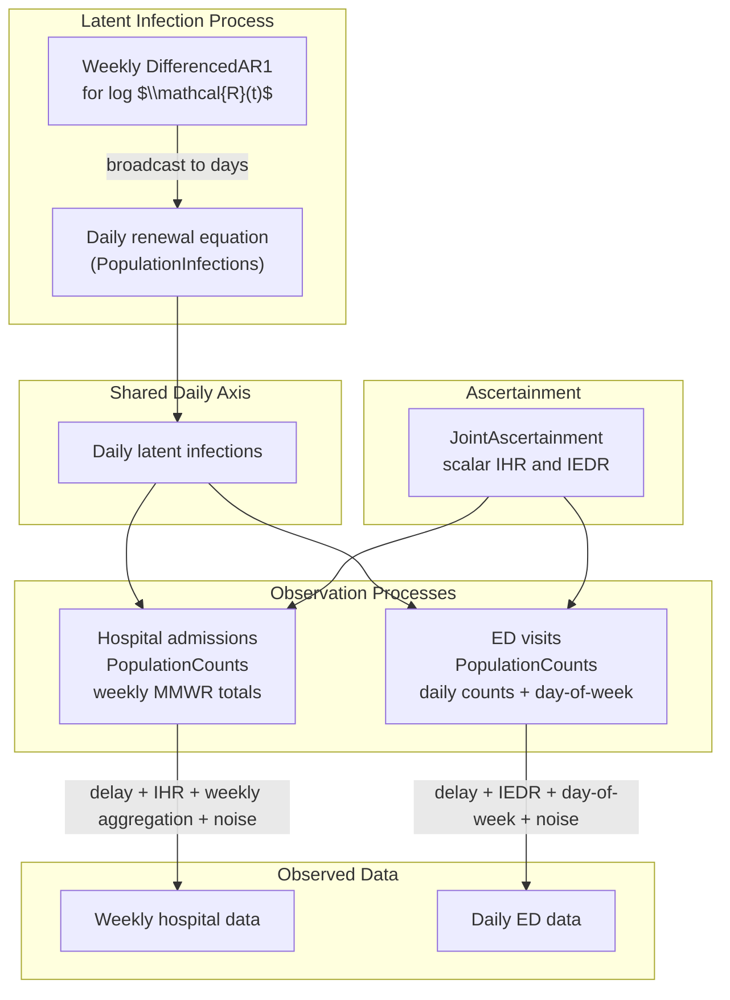

```{python}
#| label: setup
#| output: false

from datetime import date
import time
import warnings

import arviz as az
import numpyro

numpyro.set_host_device_count(4)
numpyro.enable_x64()

import jax
import jax.numpy as jnp
import jax.random as random
import numpy as np
import numpyro.distributions as dist
import pandas as pd
import plotnine as p9

warnings.filterwarnings("ignore")

from _tutorial_theme import theme_tutorial
from pyrenew.ascertainment import JointAscertainment
from pyrenew.datasets import (
    load_synthetic_daily_infections,
    load_example_infection_admission_interval,
    load_synthetic_daily_ed_visits,
    load_synthetic_true_parameters,
    load_synthetic_weekly_hospital_admissions,
)
from pyrenew.deterministic import DeterministicPMF, DeterministicVariable
from pyrenew.latent import DifferencedAR1, PopulationInfections, WeeklyTemporalProcess
from pyrenew.model import PyrenewBuilder
from pyrenew.observation import NegativeBinomialNoise, PopulationCounts
from pyrenew.randomvariable import DistributionalVariable, TransformedVariable
from pyrenew.time import MMWR_WEEK
import pyrenew.transformation as transformation
```

This tutorial builds a small hospital + emergency department model using PyRenew's high-level components which approximates a production model used to produce weekly short-term forecasts of Covid, flu, and RSV for the [CDC ensemble forecast hubs](https://www.cdc.gov/cfa-modeling-and-forecasting/covid19-data-vis).
The production model is coded directly in NumPyro.
Here we use PyRenew's high-level components and `PyrenewBuilder` class to specify a model with the same core shape:

- one latent population-level infection process
- a weekly-parameterized $\mathcal{R}(t)$ process
- weekly hospital admissions
- daily ED visits with a day-of-week effect
- joint scalar ascertainment for the two clinical signals

The renewal equation and delay convolutions run on a daily model axis, while the hospital likelihood is evaluated on weekly totals and the ED likelihood is evaluated on daily counts.

## Model Structure

The model has one latent infection process.
Both observations receive the same aggregate infection trajectory, but they map it to data on different reporting grids.



The components are:

- **Latent infections**: `PopulationInfections` produces a single aggregate infection trajectory.
- **$\mathcal{R}(t)$ process**: `WeeklyTemporalProcess` samples weekly values and broadcasts them to the daily renewal equation.
- **Ascertainment**: `JointAscertainment` samples scalar hospital and ED ascertainment rates from one joint prior.
- **Hospital observation**: `PopulationCounts` scores weekly hospital totals.
- **ED observation**: `PopulationCounts` scores daily ED counts and includes a day-of-week effect.

### Temporal Cadence and Aggregation

This model has two different temporal questions:

1. How often should latent transmission parameters vary?
2. On what time grid is each observation likelihood evaluated?

PyRenew treats these as separate modeling choices.

The renewal equation always runs on the shared daily model axis.
The latent process therefore produces daily infections, even when the temporal process for $\mathcal{R}(t)$ is parameterized more coarsely.
If `single_rt_process` is a daily process, PyRenew estimates a daily $\mathcal{R}(t)$ trajectory.
If it is wrapped in `WeeklyTemporalProcess`, PyRenew estimates weekly $\mathcal{R}(t)$ values and broadcasts them to the daily axis before computing infections.

Observation aggregation happens later, inside each count observation process.
For weekly hospital admissions, `PopulationCounts(..., aggregation="weekly", start_dow=MMWR_WEEK)` first computes daily predicted admissions from daily infections using ascertainment and the delay distribution.
It then sums those daily predictions to the weekly grid, so the negative-binomial observation model is evaluated against weekly observed admissions rather than daily counts.
For daily ED visits, no aggregation is applied.
Each observed daily count is modeled with a negative-binomial distribution whose mean is the corresponding daily prediction.

The end-to-end flow for the weekly hospital signal is:

1. Sample or construct daily $\mathcal{R}(t)$, possibly by broadcasting weekly values.
2. Run the daily renewal equation to produce daily infections.
3. Convert daily infections to daily predicted hospital admissions using hospital delay and joint ascertainment component's `for_signal("hospital")`.
4. Sum daily predicted admissions to MMWR weeks.
5. Evaluate the negative-binomial observation model on the weekly hospital observations.

The daily ED signal shares steps 1--3, but remains on the daily grid for the likelihood.

1. Sample or construct daily $\mathcal{R}(t)$, possibly by broadcasting weekly values.
2. Run the daily renewal equation to produce daily infections.
3. Convert daily infections to daily predicted ED visits using delay and joint ascertainment component's `for_signal("ed_visits")`.
4. Evaluate the negative-binomial observation model on the daily ED visits.

This separation means that mixed-cadence models are natural: weekly hospital admissions and daily ED visits can share the same latent daily infection trajectory, regardless of whether $\mathcal{R}(t)$ is parameterized daily, weekly, or with another stepwise cadence.

The cadence of the temporal process affects both model flexibility and computational cost.
A daily $\mathcal{R}(t)$ process estimates one latent $\mathcal{R}(t)$ state per day, while a `WeeklyTemporalProcess` estimates one latent $\mathcal{R}(t)$ state per week and broadcasts the weekly trajectory to the daily renewal equation.
The daily infections and expected observations are still computed on the daily axis, but they are deterministic functions of the sampled parameters.

A coarser $\mathcal{R}(t)$ cadence reduces the number of latent dimensions sampled by HMC/NUTS.
It also regularizes the latent process: the model cannot use day-to-day changes in $\mathcal{R}(t)$ to explain short-term noise or reporting artifacts.
This can improve sampling and forecast stability when the data do not support daily transmission changes, but it is a modeling assumption rather than a universal improvement.

### Production Extensions

The model implemented here uses the same high-level H+E structure as the production model, but omits several production-specific components.
We keep these components out of the tutorial model so the example can focus on the mixed daily/weekly observation cadence.

- **Infection feedback**: the latent infection process includes a state-dependent damping term, so higher infection levels can reduce future transmission.
  This can help regularize epidemic trajectories, but it is a substantive modeling assumption.

- **Inferred delay distributions**: some delay distributions are estimated rather than fixed, allowing the model to learn timing relationships between latent infections and observed signals.
  PyRenew's observation API accepts delay distributions as `RandomVariable` objects, so fixed delays can be replaced by inferred PMFs or custom parametric delay models, provided the sampled value is a valid fixed-length PMF.
  In this tutorial we keep the delays fixed.

- **Time-varying ED ascertainment**: the ED visit rate can vary over time, while the hospital ascertainment rate is modeled relative to the ED rate.
  In the tutorial model, we use `JointAscertainment` instead.
  This relates the hospital and ED ascertainment rates through a joint prior, while keeping both rates scalar over time.

These alternatives are good candidates for model comparison and sensitivity analysis.
One advantage of specifying the model with `PyrenewBuilder` is that closely related models can be built from the same components while changing only the feature under study: fixed versus inferred delays, scalar versus time-varying ascertainment, or renewal dynamics with versus without feedback.
In practice, each candidate model can be defined as a named Python object, factory function, or separate model specification file.
This makes it easier to compare posterior predictive checks, held-out forecast performance, and the stability of inferred latent infections across model variants.

## Specifying Model Components for `PyrenewBuilder`

The `PyrenewBuilder` class assembles the model components.
It checks component compatibility and coherence, computes initialization requirements, and produces a model ready for inference.

### Latent Infection Process

The `PyrenewBuilder` object's `configure_latent` method handles configuration of the latent process.
It requires the following:

- **Generation interval**: PMF for secondary infection timing.
- **Initial conditions ($I(0)$ and $\log(\mathcal{R}(0))$)**: Infection prevalence at time $0$ as a proportion of the population, and the starting point of the $\log(\mathcal{R}(t))$ trajectory.
- **Temporal dynamics**: How $\mathcal{R}(t)$ evolves over time.

We use the same seven-day generation interval PMF used to generate the synthetic data; this PMF also matches the default/test-data parameterization used in the H+E pipeline.
For the initial infection level and initial $\mathcal{R}(t)$ value, we specify priors rather than fixing them to the true synthetic-data values.

Following the production model, we use a weekly differenced AR(1) process for log $\mathcal{R}(t)$ temporal dynamics.
The differenced process allows persistent upward or downward movement.
The weekly wrapper estimates one latent $\mathcal{R}(t)$ state per week and broadcasts the weekly trajectory to the daily renewal equation.

```python
weekly_rt_process = WeeklyTemporalProcess(
    DifferencedAR1(
        autoreg_rv=DeterministicVariable("rt_diff_autoreg", 0.5),
        innovation_sd_rv=DeterministicVariable("rt_diff_innovation_sd", 0.01),
    ),
    start_dow=MMWR_WEEK,
)
```

`WeeklyTemporalProcess` uses calendar weeks, not arbitrary 7-day blocks starting at index 0.
The `start_dow=MMWR_WEEK` argument says that each $\mathcal{R}(t)$ value applies to an MMWR week, which runs Sunday through Saturday.

At model runtime, `obs_start_date` is used to align the weekly $\mathcal{R}(t)$ blocks with the daily model axis.
The same calendar anchor is used when daily predicted hospital admissions are aggregated to MMWR weeks.

### Ascertainment

`JointAscertainment` defines one shared ascertainment component for the hospital and ED signals.
The component has a `name`, used to identify it in the multisignal model, and a tuple of signal names supplied through `signals`.

For each signal, the model samples a scalar ascertainment rate.
The rates are modeled jointly: `baseline_rates` gives their prior centers on the probability scale, while `covariance_matrix` describes uncertainty and dependence on the logit scale.
The logit-scale representation keeps sampled rates between 0 and 1 after transformation back to the probability scale.

Here the prior centers are 0.005 for the hospital infection-hospitalization ratio and 0.0075 for the ED infection-to-ED-visit ratio.
We choose a logit-scale standard deviation of 0.7 for both rates and a prior correlation of 0.5.
This says that the two rates may differ, but prior draws that are high for hospital ascertainment also tend to be high for ED ascertainment.

```python
ascertainment_sd = 0.7
ascertainment_corr = 0.5
ascertainment_cov = jnp.array(
    [
        [ascertainment_sd**2, ascertainment_corr * ascertainment_sd**2],
        [ascertainment_corr * ascertainment_sd**2, ascertainment_sd**2],
    ]
)

ascertainment = JointAscertainment(
    name="he_ascertainment",
    signals=("hospital", "ed_visits"),
    baseline_rates=jnp.array([0.005, 0.0075]),
    covariance_matrix=ascertainment_cov,
)
```
The order of `signals` determines how `baseline_rates` and the rows and columns of `covariance_matrix` are interpreted.
Observation processes do not access those values by row or column index.
Instead, the ascertainment object provides signal-specific accessors: `ascertainment.for_signal("hospital")` returns the hospital ascertainment rate, and `ascertainment.for_signal("ed_visits")` returns the ED ascertainment rate.

### Observation Processes

Both hospital admissions and ED visits are count observations, so both components are specified as `PopulationCounts` objects.
They share the same daily latent infection trajectory, but the observation model is evaluated at different reporting cadences: weekly totals for hospital admissions and daily counts for ED visits.

To define a `PopulationCounts` object, you must specify its

- **Ascertainment rate**: the probability that an infection results in an observed event
- **Delay distribution**: the distribution of times from infection to the corresponding event
- **Noise model**: the count distribution used to model variation around the expected number of events.

In addition, count data observation processes have optional parameters for:

- **Day-of-week effects**: recurring multiplicative adjustments for systematic differences among days of the week.
- **Right truncation**: adjustment for recent observations that may be incomplete because not all reports have arrived.

#### ED Visits

For ED visits, we include a day-of-week effect.

ED visits often have systematic day-of-week patterns.
Day-to-day volumes may differ because of care-seeking behavior, clinic availability, staffing, coding, or reporting workflows.
Those patterns are part of the observation process, not necessarily evidence that infections changed from one day to the next.

The ED observation model includes $7$ multiplicative effects, one for each day of the week.
The day-of-week effect multiplies the expected daily ED visits before the count observation model is applied.
Each day of the week has its own multiplier: a value above 1 increases expected ED visits on that day, and a value below 1 decreases them.

Following the production H+E model, we place a symmetric Dirichlet prior with concentration value $5$ on these weights and scale the draw by $7$.
Because the prior is symmetric, it does not assume in advance which days have higher or lower ED volume.
It centers the multipliers near equal day-of-week effects while still allowing per-day variation.

```python
ed_day_of_week_rv = TransformedVariable(
    name="ed_day_of_week_effect",
    base_rv=DistributionalVariable(
        name="ed_day_of_week_effect_raw",
        distribution=dist.Dirichlet(jnp.ones(7) * 5),
    ),
    transforms=transformation.AffineTransform(loc=0.0, scale=7.0),
)
```

This is passed to `PopulationCounts` constructor as `day_of_week_rv`.

In this tutorial, `ascertainment.for_signal("ed_visits")` connects the ED observation process to the ED component of the joint ascertainment model.
The delay PMF matches the synthetic data-generating process, and the observation model uses negative-binomial noise.

```python
ed_obs = PopulationCounts(
    name="ed_visits",
    ascertainment_rate_rv=ascertainment.for_signal("ed_visits"),
    delay_distribution_rv=DeterministicPMF("ed_delay", ed_delay_pmf),
    noise=NegativeBinomialNoise(
        DistributionalVariable("ed_conc", dist.LogNormal(4.0, 1.0))
    ),
    day_of_week_rv=ed_day_of_week_rv,
)
```

Count observation processes also support an optional `right_truncation_rv` for incomplete recent reports.
The synthetic ED data used here are complete, so the tutorial model omits right truncation.
The production H+E model applies a right-truncation adjustment to recent ED observations when reports are incomplete; the reporting-delay PMF is supplied as an external input rather than inferred by the model.

#### Hospital Admissions

Hospital admissions are also modeled with `PopulationCounts`.
The hospital signal uses the hospital component of the joint ascertainment model, a fixed infection-to-hospital-admission delay PMF, and negative-binomial observation noise.

The hospital data are reported as weekly MMWR totals.
PyRenew still computes daily predicted hospital admissions from the shared daily infection trajectory, delay distribution, and ascertainment rate.
The argument `aggregation="weekly"` then sums those daily predictions before comparing them with the observed weekly totals.
The argument `start_dow=MMWR_WEEK` aligns the aggregation to MMWR weeks, and `reporting_schedule="regular"` indicates that the data are supplied as one value per week.

```python
hospital_obs = PopulationCounts(
    name="hospital",
    ascertainment_rate_rv=ascertainment.for_signal("hospital"),
    delay_distribution_rv=DeterministicPMF("hosp_delay", hosp_delay_pmf),
    noise=NegativeBinomialNoise(
        DistributionalVariable("hosp_conc", dist.LogNormal(5.0, 1.0))
    ),
    aggregation="weekly",
    reporting_schedule="regular",
    start_dow=MMWR_WEEK,
)
```

The hospital and ED observation processes therefore share the same latent infections, but differ in reporting cadence and signal-specific observation details.

### Full model specification via `PyrenewBuilder`

The full specification of the model requires defining all model `RandomVariable` objects passed in to all components.
In this example we use the synthetic H+E data bundled with PyRenew, which includes the parameters used to generate the data, including the generation interval pmf and hospitalization and ED visits delay pmfs and ascertainment rates.

```{python}
#| label: load-data

N_DAYS_FIT = 126
OBS_START_DATE = date(2023, 11, 5)

true_params = load_synthetic_true_parameters()
daily_infections = load_synthetic_daily_infections()
weekly_hosp = load_synthetic_weekly_hospital_admissions()
daily_ed = load_synthetic_daily_ed_visits()

hosp_delay_pmf = jnp.array(
    load_example_infection_admission_interval()["probability_mass"].to_numpy()
)
ed_delay_pmf = jnp.array(true_params["ed_visits"]["delay_pmf"])

population_size = float(weekly_hosp["pop"][0])

print(f"Weekly hospital rows: {len(weekly_hosp)}")
print(f"Daily ED rows: {len(daily_ed)}")
print(f"Population size: {population_size:,.0f}")
```

First we specify the latent components

```{python}
#| code-fold: false
#| label: latent-components

gen_int_pmf = jnp.array(
    [0.6326975, 0.2327564, 0.0856263, 0.03150015, 0.01158826, 0.00426308, 0.0015683]
)

gen_int_rv = DeterministicPMF("gen_int", gen_int_pmf)
I0_rv = DistributionalVariable("I0", dist.Beta(1, 10))
log_rt_time_0_rv = DistributionalVariable(
    "log_rt_time_0",
    dist.Normal(0.0, 0.5),
)

weekly_rt_process = WeeklyTemporalProcess(
    DifferencedAR1(
        autoreg_rv=DeterministicVariable("rt_diff_autoreg", 0.5),
        innovation_sd_rv=DeterministicVariable("rt_diff_innovation_sd", 0.01),
    ),
    start_dow=MMWR_WEEK,
)
```

Next we specify the joint ascertainment

```{python}
#| code-fold: false
#| label: joint-ascertainment

true_ihr = true_params["hospitalizations"]["ihr"]
true_iedr = true_params["ed_visits"]["iedr"]

ascertainment_sd = 0.7
ascertainment_corr = 0.5
ascertainment_cov = jnp.array(
    [
        [ascertainment_sd**2, ascertainment_corr * ascertainment_sd**2],
        [ascertainment_corr * ascertainment_sd**2, ascertainment_sd**2],
    ]
)

ascertainment = JointAscertainment(
    name="he_ascertainment",
    signals=("hospital", "ed_visits"),
    baseline_rates=jnp.array([true_ihr, true_iedr]),
    covariance_matrix=ascertainment_cov,
)
```

Next we specify the hospital and ED visit observation processes

```{python}
#| code-fold: false
#| label: observation-processes

hospital_obs = PopulationCounts(
    name="hospital",
    ascertainment_rate_rv=ascertainment.for_signal("hospital"),
    delay_distribution_rv=DeterministicPMF("hosp_delay", hosp_delay_pmf),
    noise=NegativeBinomialNoise(
        DistributionalVariable("hosp_conc", dist.LogNormal(5.0, 1.0))
    ),
    aggregation="weekly",
    reporting_schedule="regular",
    start_dow=MMWR_WEEK,
)

ed_day_of_week_rv = TransformedVariable(
    name="ed_day_of_week_effect",
    base_rv=DistributionalVariable(
        name="ed_day_of_week_effect_raw",
        distribution=dist.Dirichlet(jnp.ones(7) * 5),
    ),
    transforms=transformation.AffineTransform(loc=0.0, scale=7.0),
)

ed_obs = PopulationCounts(
    name="ed_visits",
    ascertainment_rate_rv=ascertainment.for_signal("ed_visits"),
    delay_distribution_rv=DeterministicPMF("ed_delay", ed_delay_pmf),
    noise=NegativeBinomialNoise(
        DistributionalVariable("ed_conc", dist.LogNormal(4.0, 1.0))
    ),
    day_of_week_rv=ed_day_of_week_rv,
)
```

Finally, we instantiate a `PyrenewBuilder` object.

```{python}
#| code-fold: false
#| label: build-model

builder = PyrenewBuilder()
builder.configure_latent(
    PopulationInfections,
    gen_int_rv=gen_int_rv,
    I0_rv=I0_rv,
    log_rt_time_0_rv=log_rt_time_0_rv,
    single_rt_process=weekly_rt_process,
)
builder.add_ascertainment(ascertainment)
builder.add_observation(hospital_obs)
builder.add_observation(ed_obs)

model = builder.build()
```

The `PyrenewBuilder` computes the initialization period from the generation interval and both observation delay distributions.

```{python}
#| code-fold: false
#| label: inspect-model

print(f"Initialization points: {model.latent.n_initialization_points}")
print(f"Observations: {list(model.observations)}")
print(f"Ascertainment models: {list(model.ascertainment_models)}")
```

## Fit the Model

After the model is built, we prepare the observed data for `model.run()`.
Each observation process receives a data dictionary whose keyword matches the name registered with the builder: `hospital={...}` and `ed_visits={...}`.

The model includes an initialization period before the first observed day.
During that period, PyRenew computes latent infections and predicted observations, but there are no data to condition on.
We mark those unobserved positions with `NaN`.

We prepare one observed array for each signal.
Daily ED observations are padded with `model.pad_observations()`.
Weekly hospital observations are padded with `model.pad_aggregated_observations()`, which pads on the hospital observation process's weekly reporting cadence.

```{python}
#| code-fold: false
#| label: align-observed-data

ed_observed = model.pad_observations(
    jnp.array(daily_ed["ed_visits"].to_numpy(), dtype=jnp.float32)
)

hospital_observed = model.pad_aggregated_observations(
    jnp.array(weekly_hosp["weekly_hosp_admits"].to_numpy(), dtype=jnp.float32),
    observation_name="hospital",
    n_days_post_init=N_DAYS_FIT,
    obs_start_date=OBS_START_DATE,
)

print(f"ED observation array shape: {ed_observed.shape}")
print(f"Hospital observation array shape: {hospital_observed.shape}")
```

### Check the Mixed-Cadence Structure

Before fitting, it can be useful to run one seeded model execution and inspect selected site shapes.
This is a quick check that the weekly and daily pieces are aligned as intended.

```{python}
#| code-fold: false
#| label: trace-model

with numpyro.handlers.seed(rng_seed=0):
    with numpyro.handlers.trace() as trace:
        model.sample(
            n_days_post_init=N_DAYS_FIT,
            population_size=population_size,
            obs_start_date=OBS_START_DATE,
            hospital={"obs": hospital_observed},
            ed_visits={"obs": ed_observed},
        )

for site in [
    "log_rt_single_weekly",
    "PopulationInfections::log_rt_single",
    "hospital_predicted_daily",
    "hospital_predicted",
    "ed_visits_predicted",
]:
    print(f"{site}: {trace[site]['value'].shape}")
```

The expected pattern is:

- `log_rt_single_weekly` has one value for each calendar week touched by the padded daily model axis, including a leading partial week.
- `PopulationInfections::log_rt_single` is daily, because the renewal equation runs daily.
- `hospital_predicted_daily` is daily before aggregation.
- `hospital_predicted` contains complete weekly hospital reporting periods only, so it can be one shorter than `log_rt_single_weekly`.
- `ed_visits_predicted` is daily, matching the ED data.

### Fit the Model to Synthetic Data

We now run MCMC on the synthetic hospital and ED observations.
The model arguments are the same ones used in the trace check above.

```{python}
#| code-fold: false
#| label: fit-synthetic-data

jax.clear_caches()

start_time = time.time()
model.run(
    num_warmup=500,
    num_samples=500,
    rng_key=random.PRNGKey(42),
    mcmc_args={"num_chains": 4, "progress_bar": False},
    n_days_post_init=N_DAYS_FIT,
    population_size=population_size,
    obs_start_date=OBS_START_DATE,
    hospital={"obs": hospital_observed},
    ed_visits={"obs": ed_observed},
)
samples = model.mcmc.get_samples()
jax.block_until_ready(samples)
print(f"Elapsed time: {time.time() - start_time:.1f} seconds")
```

We use ArviZ for a small convergence check and a synthetic-data recovery check.
The first `n_init` daily time points are initialization points, so we trim them from daily posterior quantities before summarizing or plotting.

```{python}
#| code-fold: false
#| label: arviz-checks

n_init = model.latent.n_initialization_points


def trim_time(ds):
    if "time" in ds.dims:
        ds = ds.isel(time=slice(n_init, None))
        ds = ds.assign_coords(time=range(ds.sizes["time"]))
    return ds


idata = az.from_numpyro(
    model.mcmc,
    dims={
        "latent_infections": ["time"],
        "PopulationInfections::infections_aggregate": ["time"],
        "PopulationInfections::log_rt_single": ["time", "dummy"],
        "PopulationInfections::rt_single": ["time", "dummy"],
        "log_rt_single_weekly": ["rt_week", "dummy"],
        "hospital_predicted_daily": ["time"],
        "hospital_predicted": ["week"],
        "ed_visits_predicted": ["time"],
    },
)
idata_trimmed = idata.map_over_datasets(trim_time)

summary = az.summary(
    idata_trimmed,
    var_names=[
        "I0",
        "log_rt_time_0",
        "he_ascertainment_hospital",
        "he_ascertainment_ed_visits",
    ],
)
summary
```

For this synthetic example, the sampler should mix well for the core scalar parameters.
The posterior $\mathcal{R}(t)$ interval should also cover most of the true synthetic $\mathcal{R}(t)$ trajectory.

```{python}
#| code-fold: false
#| label: synthetic-recovery-check

rhat = summary["r_hat"].astype(float)
ess = summary["ess_bulk"].astype(float)
print(f"Max R-hat: {rhat.max():.3f}")
print(f"Min bulk ESS: {ess.min():.0f}")

rt_posterior = idata_trimmed.posterior["PopulationInfections::rt_single"]
rt_q05 = rt_posterior.quantile(0.05, dim=["chain", "draw"]).values.squeeze()
rt_q50 = rt_posterior.quantile(0.50, dim=["chain", "draw"]).values.squeeze()
rt_q95 = rt_posterior.quantile(0.95, dim=["chain", "draw"]).values.squeeze()

true_rt = daily_infections["true_rt"].to_numpy()
n_compare = min(len(true_rt), len(rt_q05))
rt_covered = (true_rt[:n_compare] >= rt_q05[:n_compare]) & (
    true_rt[:n_compare] <= rt_q95[:n_compare]
)
print(f"90% interval coverage for true R(t): {np.mean(rt_covered):.1%}")
```

Finally, we plot the observed signals against the inferred $\mathcal{R}(t)$ trajectory.
The panels use separate y-axes because hospital admissions, ED visits, and $\mathcal{R}(t)$ are on different scales.

```{python}
#| label: fig-fit-synthetic-data
#| fig-cap: Observed synthetic hospital and ED data with inferred time-varying reproduction number.

rt_dates = pd.to_datetime(daily_infections["date"].to_numpy())[:n_compare]
rt_df = pd.DataFrame(
    {
        "date": rt_dates,
        "median": rt_q50[:n_compare],
        "q05": rt_q05[:n_compare],
        "q95": rt_q95[:n_compare],
        "true": true_rt[:n_compare],
        "panel": "$\\mathcal{R}(t)$",
    }
)

hosp_df = pd.DataFrame(
    {
        "date": pd.to_datetime(weekly_hosp["week_end"].to_numpy()),
        "observed": weekly_hosp["weekly_hosp_admits"].to_numpy(),
        "panel": "Weekly hospital admissions",
    }
)

ed_df = pd.DataFrame(
    {
        "date": pd.to_datetime(daily_ed["date"].to_numpy()),
        "observed": daily_ed["ed_visits"].to_numpy(),
        "panel": "Daily ED visits",
    }
)

plot_df = pd.concat(
    [
        rt_df[["date", "median", "q05", "q95", "true", "panel"]],
        hosp_df.assign(median=np.nan, q05=np.nan, q95=np.nan, true=np.nan),
        ed_df.assign(median=np.nan, q05=np.nan, q95=np.nan, true=np.nan),
    ],
    ignore_index=True,
)
plot_df["panel"] = pd.Categorical(
    plot_df["panel"],
    categories=[
        "$\\mathcal{R}(t)$",
        "Weekly hospital admissions",
        "Daily ED visits",
    ],
    ordered=True,
)

(
    p9.ggplot(plot_df, p9.aes(x="date"))
    + p9.geom_ribbon(
        p9.aes(ymin="q05", ymax="q95"),
        data=rt_df,
        fill="steelblue",
        alpha=0.25,
    )
    + p9.geom_line(
        p9.aes(y="median"),
        data=rt_df,
        color="steelblue",
        size=1.0,
    )
    + p9.geom_line(
        p9.aes(y="true"),
        data=rt_df,
        color="black",
        linetype="dashed",
        size=0.8,
    )
    + p9.geom_point(
        p9.aes(y="observed"),
        data=hosp_df,
        color="firebrick",
        size=1.8,
        alpha=0.85,
    )
    + p9.geom_point(
        p9.aes(y="observed"),
        data=ed_df,
        color="darkgreen",
        size=0.8,
        alpha=0.35,
    )
    + p9.facet_wrap("~panel", ncol=1, scales="free_y")
    + p9.labs(x=None, y=None)
    + theme_tutorial
)
```

### Optional: Run the Production HEW Model

The bundled synthetic H+E data can also be exported to the `model_dir` layout expected by the production HEW fitting code.
This is useful for development checks, but it requires local checkouts of `pyrenew-multisignal` and `cfa-stf-routine-forecasting`.
For that reason, this block is not evaluated when the tutorial is rendered.

```{python}
#| label: optional-run-production-hew
#| eval: false
#| code-fold: false

from pathlib import Path
import sys

from pyrenew.datasets import write_synthetic_hew_model_dir

PYRENEW_MULTISIGNAL_DIR = Path("~/github/CDC/pyrenew-multisignal").expanduser()
CFA_STF_DIR = Path("~/github/CDC/cfa-stf-routine-forecasting").expanduser()

sys.path.insert(0, str(PYRENEW_MULTISIGNAL_DIR / "src"))
sys.path.insert(0, str(CFA_STF_DIR))

from pipelines.pyrenew_hew.fit_pyrenew_model import fit_and_save_model

model_dir = Path("scratch/synthetic_pyrenew_hew_model")

write_synthetic_hew_model_dir(
    model_dir,
    overwrite=True,
    # Optional: use downstream priors instead of the PyRenew synthetic default.
    # priors_path=CFA_STF_DIR / "pipelines/priors/test_data_generation_priors.py",
)

fit_and_save_model(
    model_dir=model_dir,
    fit_ed_visits=True,
    fit_hospital_admissions=True,
    fit_wastewater=False,
    n_warmup=500,
    n_samples=500,
    n_chains=4,
    rng_key=42,
)
```

The exporter writes `priors.py`, `metadata.json`, `data/data_for_model_fit.json`, and `data/model_params.json`.
The production fit writes posterior samples to `posterior_samples.pickle` inside the same `model_dir`.
