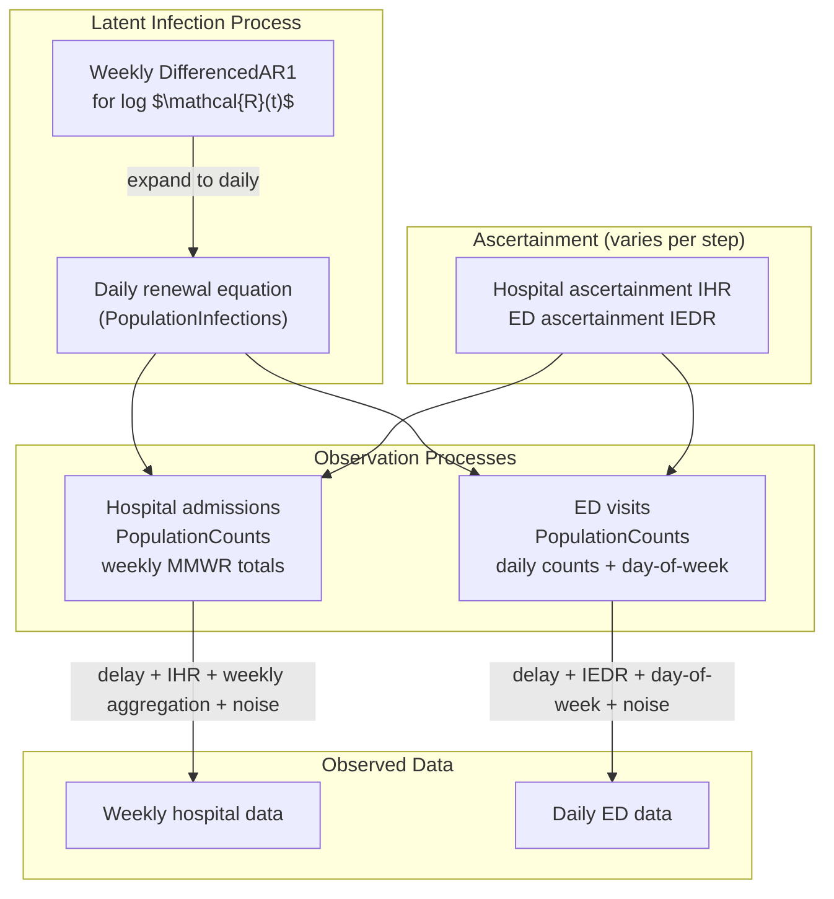

```{python}
#| label: setup
#| output: false

from datetime import date
import time
import warnings

import arviz as az
import numpyro

numpyro.set_host_device_count(4)
numpyro.enable_x64()

import jax
import jax.numpy as jnp
import jax.random as random
import numpy as np
import numpyro.distributions as dist
import pandas as pd
import plotnine as p9

warnings.filterwarnings("ignore")

from _tutorial_theme import theme_tutorial
from pyrenew.ascertainment import AscertainmentModel
from pyrenew.datasets import (
    load_example_infection_admission_interval,
    load_synthetic_daily_ed_visits,
    load_synthetic_daily_infections,
    load_synthetic_true_parameters,
    load_synthetic_weekly_hospital_admissions,
)
from pyrenew.deterministic import DeterministicPMF, DeterministicVariable
from pyrenew.latent import DifferencedAR1, PopulationInfections, WeeklyTemporalProcess
from pyrenew.metaclass import RandomVariable
from pyrenew.model import PyrenewBuilder
from pyrenew.observation import NegativeBinomialNoise, PopulationCounts
from pyrenew.randomvariable import DistributionalVariable, TransformedVariable
from pyrenew.time import MMWR_WEEK
import pyrenew.transformation as transformation
```

## Overview

This tutorial walks through fitting a joint hospital admissions and emergency department (ED) visits renewal model and uses small model variations to show what these two data streams can and cannot tell us when fit together.
The model approximates a production model used at the CDC for short-term forecasting of Covid, flu, and RSV.

When hospital admissions and ED visits are fit jointly with no outside information, the two signals jointly pin down how much more common ED visits are than hospitalizations, but not the absolute rates themselves.
The same observed time series is consistent with many combinations of initial infection level and absolute ascertainment rate.
Pinning down the absolute level needs outside information: an informative prior on one of the rates, a separate signal that ties infections to a known scale, or both.

The model samples $\mathcal{R}(t)$ once per week and runs the renewal equation day by day.
This is a deliberate modeling choice that affects both inference and interpretation; we discuss the trade-offs when we set up the $\mathcal{R}(t)$ process.

A general note before we begin.
In dynamical models fit to noisy data, the data anchor the model's *outputs* (latent trajectories and predicted observations) more reliably than the individual parameters that combine to produce those outputs.
Trajectory recovery and parameter recovery are different questions and they can give different answers on the same fit.
We will see this pattern in several of the steps below.

We work through this in five short fits.
Each fit changes one piece of the model and shows what the data can recover under that choice.

  | Step | $I_0$ | Hospital ascertainment (IHR)     | ED ascertainment (IEDR)      |
  | ---- | ----- | -------------------------------- | ---------------------------- |
  | 1    | fixed | fixed                            | fixed                        |
  | 2    | free  | fixed                            | fixed                        |
  | 3    | fixed | free                             | free                         |
  | 4    | free  | free, independent priors         | free, independent priors     |
  | 5    | free  | linked: IHR = IEDR $\cdot$ ratio | free, with informative prior |

The first four steps build up the picture from "everything known" to "everything free", and the fifth step links the two ascertainment rates the way the production model does.
Each step is a small edit to the builder configuration: the latent infection process and the two observation processes stay the same.

## Model Structure

All five fits use the same underlying renewal model:

- A single population-level latent infection process.
- A weekly $\mathcal{R}(t)$ that updates calendar-week by calendar-week.
- Weekly hospital admissions reported as MMWR totals.
- Daily ED visits with a fixed day-of-week effect.



The renewal equation steps day by day.
Hospital admissions are aggregated to weekly MMWR totals before they are compared with the observed weekly counts; ED visits are compared with the observed daily counts.
Across the five steps, the latent process and the two observation processes stay the same.
Only the ascertainment and $I_0$ pieces change.

## Synthetic Data and True Parameters

For this tutorial we use a bundled synthetic H+E dataset generated from a known infection trajectory.
Because the data-generating values are known, we can ask whether each model variant recovers them.

```{python}
#| label: load-data

N_DAYS_FIT = 126
OBS_START_DATE = date(2023, 11, 5)

true_params = load_synthetic_true_parameters()
daily_infections = load_synthetic_daily_infections()
weekly_hosp = load_synthetic_weekly_hospital_admissions()
daily_ed = load_synthetic_daily_ed_visits()

hosp_delay_pmf = jnp.array(
    load_example_infection_admission_interval()["probability_mass"].to_numpy()
)
ed_delay_pmf = jnp.array(true_params["ed_visits"]["delay_pmf"])

population_size = float(weekly_hosp["pop"][0])
true_i0 = float(true_params["i0_per_capita"])
true_ihr = float(true_params["hospitalizations"]["ihr"])
true_iedr = float(true_params["ed_visits"]["iedr"])
true_dow_effects = jnp.array(true_params["ed_visits"]["day_of_week_effects"])

print(f"Population size: {population_size:,.0f}")
print(f"Weekly hospital rows: {len(weekly_hosp)}")
print(f"Daily ED rows: {len(daily_ed)}")
print()
print("Data-generating values we will try to recover:")
print(f"  Initial infections per capita (I0): {true_i0:.5f}")
print(f"  Hospital ascertainment (IHR):       {true_ihr:.5f}")
print(f"  ED ascertainment (IEDR):            {true_iedr:.5f}")
print(f"  Ratio IHR / IEDR:                   {true_ihr / true_iedr:.3f}")
```

Both ascertainment rates are small (well under 1% of infections), and IHR is about two-thirds of IEDR, so a randomly infected person is more likely to show up in the ED than to be admitted to the hospital.
The model variants below will be judged on whether they recover these values, the ratio, the latent infection trajectory, or some subset of these.

## Shared Model Components

The five variants share the same generation interval, delay distributions, $\mathcal{R}(t)$ process, day-of-week effect, and noise priors.
We define these once.

### Generation Interval and Delay Distributions

```{python}
#| label: shared-pmfs
#| code-fold: false

gen_int_pmf = jnp.array(
    [0.6326975, 0.2327564, 0.0856263, 0.03150015, 0.01158826, 0.00426308, 0.0015683]
)
gen_int_rv = DeterministicPMF("gen_int", gen_int_pmf)

hosp_delay_rv = DeterministicPMF("hosp_delay", hosp_delay_pmf)
ed_delay_rv = DeterministicPMF("ed_delay", ed_delay_pmf)
```

The generation interval PMF matches the data-generating process.
We fix both delay PMFs at their data-generating values.
The production model has the option to infer delay parameters; we keep delays fixed here so that the experiments below isolate the role of ascertainment and $I_0$.

### Weekly $\mathcal{R}(t)$ Process

```{python}
#| label: shared-rt-process
#| code-fold: false

log_rt_time_0_rv = DistributionalVariable("log_rt_time_0", dist.Normal(0.0, 0.5))

weekly_rt_process = WeeklyTemporalProcess(
    DifferencedAR1(
        autoreg_rv=DeterministicVariable("rt_diff_autoreg", 0.5),
        innovation_sd_rv=DeterministicVariable("rt_diff_innovation_sd", 0.03),
    ),
    start_dow=MMWR_WEEK,
)
```

The differenced AR(1) process for log $\mathcal{R}(t)$ allows persistent upward or downward movement.
The weekly wrapper samples one $\mathcal{R}(t)$ value per MMWR week (Sunday through Saturday).
PyRenew expands the weekly trajectory to one value per day before the renewal equation runs, so the renewal step still produces daily infections.

Sampling $\mathcal{R}(t)$ once per week instead of once per day reduces the number of $\mathcal{R}(t)$ parameters MCMC has to estimate by a factor of seven: 18 weekly values over our 126-day fitting window, versus 126 daily values.
This is a deliberate modeling choice.
It embeds the assumption that transmission shifts week to week, not day to day.
For COVID-style respiratory data fit over short windows, the weekly choice is the default in the production model; day-to-day transmission swings rarely move enough signal in hospital admissions or ED visits to be recoverable.
If a daily $\mathcal{R}(t)$ is needed, the inner `DifferencedAR1` can be passed to `configure_latent` directly without the weekly wrapper, and the rest of the model is unchanged.

The starting log $\mathcal{R}(t)$ has a moderately broad prior; the AR(1) parameters are fixed at values typical for the production model.

### Day-of-Week Effect

```{python}
#| label: shared-dow
#| code-fold: false

ed_day_of_week_rv = DeterministicVariable(
    "ed_day_of_week_effect",
    true_dow_effects,
)
```

ED visits show systematic day-of-week patterns from care-seeking behavior and reporting workflows.
The production model places a Dirichlet prior on the seven multipliers.
For this tutorial we hold the day-of-week effect fixed at the data-generating values so each step's results are not entangled with day-of-week inference.

### Noise Priors

```{python}
#| label: shared-noise
#| code-fold: false

hosp_concentration_rv = DistributionalVariable("hosp_conc", dist.LogNormal(5.0, 1.0))
ed_concentration_rv = DistributionalVariable("ed_conc", dist.LogNormal(4.0, 1.0))
```

Both observation processes use negative-binomial noise.
The hospital concentration prior is centered higher because weekly totals show less overdispersion than daily counts.
These priors are unchanged across all five variants.

## Helpers

Two small utility functions are used across the variants.

```{python}
#| label: helpers
#| code-fold: false

def trim_init(idata: az.InferenceData, n_init: int) -> az.InferenceData:
    """
    Drop the initialization period from any posterior variable with a "time" dim.

    Parameters
    ----------
    idata
        Inference data produced by ``az.from_numpyro``.
    n_init
        Number of leading entries that belong to the initialization period and
        should be dropped before plotting or summarizing.

    Returns
    -------
    az.InferenceData
        New inference data with the initialization period removed from any
        dataset that has a "time" dimension.
    """

    def _trim(ds):
        """
        Trim and reindex the "time" coordinate of one dataset.

        Returns
        -------
        xarray.Dataset
            The dataset with leading entries removed along "time".
        """
        if "time" in ds.dims:
            ds = ds.isel(time=slice(n_init, None))
            ds = ds.assign_coords(time=range(ds.sizes["time"]))
        return ds

    return idata.map_over_datasets(_trim)


def coverage_pct(truth: np.ndarray, q05: np.ndarray, q95: np.ndarray) -> float:
    """
    Compute the percentage of truth values that fall inside a 90% interval.

    Parameters
    ----------
    truth
        Vector of true values, one per time point.
    q05
        Lower bound (5th percentile) of the posterior interval at each time point.
    q95
        Upper bound (95th percentile) of the posterior interval at each time point.

    Returns
    -------
    float
        Fraction of time points covered by the interval, scaled to a percentage.
    """
    n = min(len(truth), len(q05), len(q95))
    covered = (truth[:n] >= q05[:n]) & (truth[:n] <= q95[:n])
    return 100.0 * float(np.mean(covered))
```

## Step 1: Everything Fixed at Truth

In the first variant we pin the initial infection level and both ascertainment rates at their data-generating values.
The only free latent quantities are the $\mathcal{R}(t)$ trajectory and the two negative-binomial concentration parameters.
This fit shows the model can reproduce the data when the link from infections to clinical signals is fully known.

```{python}
#| label: step1-components
#| code-fold: false

I0_rv = DeterministicVariable("I0", true_i0)
ihr_rv = DeterministicVariable("ihr", true_ihr)
iedr_rv = DeterministicVariable("iedr", true_iedr)

hospital_obs = PopulationCounts(
    name="hospital",
    ascertainment_rate_rv=ihr_rv,
    delay_distribution_rv=hosp_delay_rv,
    noise=NegativeBinomialNoise(hosp_concentration_rv),
    aggregation="weekly",
    reporting_schedule="regular",
    start_dow=MMWR_WEEK,
)

ed_obs = PopulationCounts(
    name="ed_visits",
    ascertainment_rate_rv=iedr_rv,
    delay_distribution_rv=ed_delay_rv,
    noise=NegativeBinomialNoise(ed_concentration_rv),
    day_of_week_rv=ed_day_of_week_rv,
)
```

We pass the components to the builder.
Because both ascertainment rates are scalar deterministic values rather than a shared joint object, we attach them directly to the observation processes and do not call `add_ascertainment`.

```{python}
#| label: step1-build
#| code-fold: false

builder = PyrenewBuilder()
builder.configure_latent(
    PopulationInfections,
    gen_int_rv=gen_int_rv,
    I0_rv=I0_rv,
    log_rt_time_0_rv=log_rt_time_0_rv,
    single_rt_process=weekly_rt_process,
)
builder.add_observation(hospital_obs)
builder.add_observation(ed_obs)

model_step1 = builder.build()
n_init = model_step1.latent.n_initialization_points
print(f"Initialization points: {n_init}")
print(f"Observations: {list(model_step1.observations)}")
```

Hospital observations are weekly MMWR totals, so we pad them on the hospital observation process's weekly cadence.
Daily ED observations are padded with `pad_observations`.
The padding fills the initialization period with `NaN` so the renewal process has room to warm up before any data is conditioned on.

```{python}
#| label: step1-prepare-data
#| code-fold: false

ed_observed = model_step1.pad_observations(
    jnp.array(daily_ed["ed_visits"].to_numpy(), dtype=jnp.float32)
)

hospital_observed = model_step1.pad_aggregated_observations(
    jnp.array(weekly_hosp["weekly_hosp_admits"].to_numpy(), dtype=jnp.float32),
    observation_name="hospital",
    n_days_post_init=N_DAYS_FIT,
    obs_start_date=OBS_START_DATE,
)

print(f"ED observation array shape: {ed_observed.shape}")
print(f"Hospital observation array shape: {hospital_observed.shape}")
```

Now we run MCMC.

```{python}
#| label: step1-fit
#| code-fold: false

jax.clear_caches()

start_time = time.time()
model_step1.run(
    num_warmup=500,
    num_samples=500,
    rng_key=random.PRNGKey(42),
    mcmc_args={"num_chains": 4, "progress_bar": False},
    n_days_post_init=N_DAYS_FIT,
    population_size=population_size,
    obs_start_date=OBS_START_DATE,
    hospital={"obs": hospital_observed},
    ed_visits={"obs": ed_observed},
)
samples_step1 = model_step1.mcmc.get_samples()
jax.block_until_ready(samples_step1)
elapsed_step1 = time.time() - start_time
print(f"Elapsed time: {elapsed_step1:.1f} seconds")
```

We label the time dimension on the dynamic posterior quantities so we can trim the initialization period before summarizing.

```{python}
#| label: step1-arviz
#| code-fold: false

idata_step1 = az.from_numpyro(
    model_step1.mcmc,
    dims={
        "latent_infections": ["time"],
        "PopulationInfections::infections_aggregate": ["time"],
        "PopulationInfections::log_rt_single": ["time", "dummy"],
        "PopulationInfections::rt_single": ["time", "dummy"],
        "log_rt_single_weekly": ["rt_week", "dummy"],
        "hospital_predicted_daily": ["time"],
        "hospital_predicted": ["week"],
        "ed_visits_predicted": ["time"],
    },
)
idata_step1_trimmed = trim_init(idata_step1, n_init)

summary_step1 = az.summary(
    idata_step1_trimmed,
    var_names=["log_rt_time_0", "hosp_conc", "ed_conc"],
)
summary_step1
```

The remaining scalars should mix cleanly.
A coverage check on the latent infection trajectory tells us whether the posterior interval captures the data-generating truth.

```{python}
#| label: step1-coverage
#| code-fold: false

latent_inf_step1 = idata_step1_trimmed.posterior["latent_infections"]
inf_q05_step1 = latent_inf_step1.quantile(0.05, dim=["chain", "draw"]).values
inf_q50_step1 = latent_inf_step1.quantile(0.50, dim=["chain", "draw"]).values
inf_q95_step1 = latent_inf_step1.quantile(0.95, dim=["chain", "draw"]).values

true_infections = daily_infections["true_infections"].to_numpy()
print(
    f"90% interval coverage for true infections: {coverage_pct(true_infections, inf_q05_step1, inf_q95_step1):.1f}%"
)

rhat = summary_step1["r_hat"].astype(float)
print(f"Max R-hat (free scalars): {rhat.max():.3f}")
```

A plot of the posterior latent infections against the data-generating truth provides a visual check.

```{python}
#| label: step1-fig
#| fig-cap: Step 1 - posterior latent infections with everything other than
#|   $\mathcal{R}(t)$ fixed at truth.

n_compare = min(len(true_infections), len(inf_q50_step1))

plot_df_step1 = pd.DataFrame(
    {
        "day": np.arange(n_compare),
        "median": inf_q50_step1[:n_compare],
        "q05": inf_q05_step1[:n_compare],
        "q95": inf_q95_step1[:n_compare],
        "truth": true_infections[:n_compare],
    }
)

(
    p9.ggplot(plot_df_step1, p9.aes(x="day"))
    + p9.geom_ribbon(p9.aes(ymin="q05", ymax="q95"), fill="steelblue", alpha=0.3)
    + p9.geom_line(p9.aes(y="median"), color="darkblue", size=1)
    + p9.geom_line(p9.aes(y="truth"), color="black", linetype="dashed", size=0.7)
    + p9.scale_y_log10()
    + p9.labs(
        x="Day",
        y="Latent infections",
        title="Step 1: posterior latent infections vs. truth",
    )
    + theme_tutorial
)
```

With both ascertainment rates and $I_0$ pinned, the posterior on the latent infection trajectory should track the data-generating truth.
This step does not yet say anything about what the data alone can resolve; it shows the model can reproduce the data when the link to infections is fully specified.
The next steps relax pieces of this link one at a time.

## Step 2: Free $I_0$, Ascertainment Still Fixed

In Step 2 we relax the initial infection level.
Both ascertainment rates stay pinned at their data-generating values.
The question is what the data can tell us about $I_0$ when the link from infections to clinical signals is fully specified.

We use the same prior for $I_0$ that the pyrenew-multisignal production model uses, a `Beta(1, 10)`.
This prior has mode 0 and a 90% prior interval of roughly [0.005, 0.26], so it places its mass at initial-infection levels appropriate for a typical respiratory virus in season.
The data-generating value (0.0005 per capita) sits in the left tail of the prior, which means any pull toward truth in the posterior comes from the data and not from a prior centered at the answer.

```{python}
#| label: step2-i0-prior
#| code-fold: false

I0_rv = DistributionalVariable("I0", dist.Beta(1, 10))
```

The observation processes are unchanged from Step 1.
We rebuild the model with the new $I_0$ prior.

```{python}
#| label: step2-build
#| code-fold: false

builder = PyrenewBuilder()
builder.configure_latent(
    PopulationInfections,
    gen_int_rv=gen_int_rv,
    I0_rv=I0_rv,
    log_rt_time_0_rv=log_rt_time_0_rv,
    single_rt_process=weekly_rt_process,
)
builder.add_observation(hospital_obs)
builder.add_observation(ed_obs)

model_step2 = builder.build()
print(f"Initialization points: {model_step2.latent.n_initialization_points}")
```

The padded observations from Step 1 can be reused: the model structure is the same, so the initialization period has the same length.

```{python}
#| label: step2-fit
#| code-fold: false

jax.clear_caches()

start_time = time.time()
model_step2.run(
    num_warmup=500,
    num_samples=500,
    rng_key=random.PRNGKey(42),
    mcmc_args={"num_chains": 4, "progress_bar": False},
    n_days_post_init=N_DAYS_FIT,
    population_size=population_size,
    obs_start_date=OBS_START_DATE,
    hospital={"obs": hospital_observed},
    ed_visits={"obs": ed_observed},
)
samples_step2 = model_step2.mcmc.get_samples()
jax.block_until_ready(samples_step2)
elapsed_step2 = time.time() - start_time
print(f"Elapsed time: {elapsed_step2:.1f} seconds")
```

We summarize the free scalars and check coverage of the latent infection trajectory.

```{python}
#| label: step2-arviz
#| code-fold: false

idata_step2 = az.from_numpyro(
    model_step2.mcmc,
    dims={
        "latent_infections": ["time"],
        "PopulationInfections::infections_aggregate": ["time"],
        "PopulationInfections::log_rt_single": ["time", "dummy"],
        "PopulationInfections::rt_single": ["time", "dummy"],
        "log_rt_single_weekly": ["rt_week", "dummy"],
        "hospital_predicted_daily": ["time"],
        "hospital_predicted": ["week"],
        "ed_visits_predicted": ["time"],
    },
)
idata_step2_trimmed = trim_init(idata_step2, n_init)

summary_step2 = az.summary(
    idata_step2_trimmed,
    var_names=["I0", "log_rt_time_0", "hosp_conc", "ed_conc"],
)
summary_step2
```

```{python}
#| label: step2-coverage
#| code-fold: false

latent_inf_step2 = idata_step2_trimmed.posterior["latent_infections"]
inf_q05_step2 = latent_inf_step2.quantile(0.05, dim=["chain", "draw"]).values
inf_q50_step2 = latent_inf_step2.quantile(0.50, dim=["chain", "draw"]).values
inf_q95_step2 = latent_inf_step2.quantile(0.95, dim=["chain", "draw"]).values

i0_post = idata_step2_trimmed.posterior["I0"].values.ravel()
print(f"True I0 (per capita):        {true_i0:.5f}")
print(f"I0 posterior median:         {np.median(i0_post):.5f}")
print(
    f"I0 posterior 90% interval:   [{np.quantile(i0_post, 0.05):.5f}, {np.quantile(i0_post, 0.95):.5f}]"
)
print()
print(
    f"90% interval coverage for true infections: {coverage_pct(true_infections, inf_q05_step2, inf_q95_step2):.1f}%"
)

rhat = summary_step2["r_hat"].astype(float)
print(f"Max R-hat (free scalars):    {rhat.max():.3f}")
```

The posterior on $I_0$ ends up far from the data-generating value, even with both ascertainment rates pinned at truth.
At the same time, the latent infection trajectory remains well-covered.

This is the data telling us that $I_0$ is not, on its own, what the observations are anchoring.
The renewal equation builds the infections at the start of observation from two ingredients: the initial infection level $I_0$ and the early $\mathcal{R}(t)$ trajectory.
The data anchor the level of infections at the start of observation, but they cannot separate the $I_0$ contribution from the initial-growth contribution.
A smaller $I_0$ paired with a faster initial growth rate produces the same observed trajectory as a larger $I_0$ paired with slower initial growth.

The joint posterior on $I_0$ and the starting log $\mathcal{R}(t)$ makes this trade-off visible.

```{python}
#| label: step2-joint-scatter
#| fig-cap: Step 2 - joint posterior of $I_0$ and starting log $\mathcal{R}(t)$.
#|   The vertical line shows the data-generating $I_0$.

logrt0_post = idata_step2_trimmed.posterior["log_rt_time_0"].values.ravel()

joint_df = pd.DataFrame({"I0": i0_post, "log_rt_time_0": logrt0_post})

(
    p9.ggplot(joint_df, p9.aes(x="I0", y="log_rt_time_0"))
    + p9.geom_point(alpha=0.2, size=0.7)
    + p9.geom_vline(xintercept=true_i0, color="black", linetype="dashed")
    + p9.scale_x_log10()
    + p9.labs(
        x="$I_0$ per capita",
        y="Starting log $\\mathcal{R}(t)$",
        title="Step 2: joint posterior of $I_0$ and starting log $\\mathcal{R}(t)$",
    )
    + theme_tutorial
)
```

The negative slope is exactly the trade-off described above: lower $I_0$ samples are paired with higher starting log $\mathcal{R}(t)$ samples.

This is a generic feature of renewal models, not a quirk of this dataset.
The pyrenew-multisignal synthetic-data priors fix both $I_0$ and the initial $\mathcal{R}(t)$ at their data-generating values when generating synthetic data, precisely because the pair is hard to recover from H+E observations alone.
In a production fit on real data, both quantities are freely sampled, and the trade-off above is part of what the posterior is exploring.

The prior-versus-posterior plot below confirms that the data has narrowed the $I_0$ posterior, but it has narrowed it onto a place that is not the data-generating value.
The data is informative about a combination of $I_0$ and the early $\mathcal{R}(t)$ trajectory; it is not informative about $I_0$ on its own.

```{python}
#| label: step2-prior-posterior-fig
#| fig-cap: Step 2 - prior and posterior on $I_0$ per capita. The
#|   data-generating value is shown as a vertical line.

prior_i0 = np.random.beta(1.0, 10.0, size=4000)

i0_density_df = pd.concat(
    [
        pd.DataFrame({"I0": prior_i0, "source": "Prior Beta(1, 10)"}),
        pd.DataFrame({"I0": i0_post, "source": "Posterior"}),
    ],
    ignore_index=True,
)

(
    p9.ggplot(i0_density_df, p9.aes(x="I0", fill="source"))
    + p9.geom_density(alpha=0.45)
    + p9.geom_vline(xintercept=true_i0, color="black", linetype="dashed")
    + p9.scale_x_log10()
    + p9.labs(
        x="$I_0$ per capita",
        y="Density",
        fill="",
        title="Step 2: prior vs. posterior on $I_0$",
    )
    + theme_tutorial
)
```

Despite the $I_0$ posterior sitting far from truth, the latent infection trajectory covers the truth well.
This is the recurring pattern flagged in the overview: the model learns the trajectories the data record more reliably than the parameters that combine to produce those trajectories.
A fit can recover the latent infection trajectory well while individual parameters end up well away from their data-generating values.

```{python}
#| label: step2-fig
#| fig-cap: Step 2 - posterior latent infections with $I_0$ free and
#|   ascertainment fixed at truth.

plot_df_step2 = pd.DataFrame(
    {
        "day": np.arange(n_compare),
        "median": inf_q50_step2[:n_compare],
        "q05": inf_q05_step2[:n_compare],
        "q95": inf_q95_step2[:n_compare],
        "truth": true_infections[:n_compare],
    }
)

(
    p9.ggplot(plot_df_step2, p9.aes(x="day"))
    + p9.geom_ribbon(p9.aes(ymin="q05", ymax="q95"), fill="steelblue", alpha=0.3)
    + p9.geom_line(p9.aes(y="median"), color="darkblue", size=1)
    + p9.geom_line(p9.aes(y="truth"), color="black", linetype="dashed", size=0.7)
    + p9.scale_y_log10()
    + p9.labs(
        x="Day",
        y="Latent infections",
        title="Step 2: posterior latent infections vs. truth",
    )
    + theme_tutorial
)
```

This is the most the data can tell us about $I_0$ on its own: not very much.
With both ascertainment rates pinned at truth, the data still cannot separate $I_0$ from the initial $\mathcal{R}(t)$ trajectory.
What the data anchor is the level of infections at the start of observation, which is a combination of $I_0$ and the early growth rate.

Step 3 reverses the experiment.
$I_0$ goes back to the data-generating value, and the two ascertainment rates are freed instead.

## Step 3: Free Ascertainment, $I_0$ Fixed at Truth

In Step 3 the initial infection level is pinned back at its data-generating value, and the two ascertainment rates are released.
The question is what the data tell us about IHR and IEDR when the level of latent infections is anchored.

We use the same production-style prior for both rates: a logit-Normal centered at 0.005 with a standard deviation of 0.3 on the logit scale.
This is the pyrenew-multisignal default prior on its ascertainment rates.
It is centered exactly at the data-generating IHR (0.005), and the data-generating IEDR (0.0075) sits at about $1.4$ prior standard deviations above the center.
Centering both priors at the same value is a reasonable default: an applied epidemiologist who does not know in advance which clinical signal has a higher infection-to-event rate would place the same broad prior on both.

```{python}
#| label: step3-priors
#| code-fold: false

I0_rv = DeterministicVariable("I0", true_i0)

ihr_rv = TransformedVariable(
    name="ihr",
    base_rv=DistributionalVariable(
        name="logit_ihr",
        distribution=dist.Normal(
            transformation.SigmoidTransform().inv(0.005),
            0.3,
        ),
    ),
    transforms=transformation.SigmoidTransform(),
)

iedr_rv = TransformedVariable(
    name="iedr",
    base_rv=DistributionalVariable(
        name="logit_iedr",
        distribution=dist.Normal(
            transformation.SigmoidTransform().inv(0.005),
            0.3,
        ),
    ),
    transforms=transformation.SigmoidTransform(),
)
```

The two ascertainment rates are now random variables, so we rebuild the hospital and ED observation processes with the new accessors.
Everything else in the observation processes is unchanged.

```{python}
#| label: step3-obs
#| code-fold: false

hospital_obs = PopulationCounts(
    name="hospital",
    ascertainment_rate_rv=ihr_rv,
    delay_distribution_rv=hosp_delay_rv,
    noise=NegativeBinomialNoise(hosp_concentration_rv),
    aggregation="weekly",
    reporting_schedule="regular",
    start_dow=MMWR_WEEK,
)

ed_obs = PopulationCounts(
    name="ed_visits",
    ascertainment_rate_rv=iedr_rv,
    delay_distribution_rv=ed_delay_rv,
    noise=NegativeBinomialNoise(ed_concentration_rv),
    day_of_week_rv=ed_day_of_week_rv,
)
```

We configure the builder and build the model.

```{python}
#| label: step3-build
#| code-fold: false

builder = PyrenewBuilder()
builder.configure_latent(
    PopulationInfections,
    gen_int_rv=gen_int_rv,
    I0_rv=I0_rv,
    log_rt_time_0_rv=log_rt_time_0_rv,
    single_rt_process=weekly_rt_process,
)
builder.add_observation(hospital_obs)
builder.add_observation(ed_obs)

model_step3 = builder.build()
print(f"Initialization points: {model_step3.latent.n_initialization_points}")
```

```{python}
#| label: step3-fit
#| code-fold: false

jax.clear_caches()

start_time = time.time()
model_step3.run(
    num_warmup=500,
    num_samples=500,
    rng_key=random.PRNGKey(42),
    mcmc_args={"num_chains": 4, "progress_bar": False},
    n_days_post_init=N_DAYS_FIT,
    population_size=population_size,
    obs_start_date=OBS_START_DATE,
    hospital={"obs": hospital_observed},
    ed_visits={"obs": ed_observed},
)
samples_step3 = model_step3.mcmc.get_samples()
jax.block_until_ready(samples_step3)
elapsed_step3 = time.time() - start_time
print(f"Elapsed time: {elapsed_step3:.1f} seconds")
```

We summarize the free scalars and compare the IHR, IEDR, and ratio posteriors against truth.

```{python}
#| label: step3-arviz
#| code-fold: false

idata_step3 = az.from_numpyro(
    model_step3.mcmc,
    dims={
        "latent_infections": ["time"],
        "PopulationInfections::infections_aggregate": ["time"],
        "PopulationInfections::log_rt_single": ["time", "dummy"],
        "PopulationInfections::rt_single": ["time", "dummy"],
        "log_rt_single_weekly": ["rt_week", "dummy"],
        "hospital_predicted_daily": ["time"],
        "hospital_predicted": ["week"],
        "ed_visits_predicted": ["time"],
    },
)
idata_step3_trimmed = trim_init(idata_step3, n_init)
idata_step3_trimmed.posterior["ihr"] = 1.0 / (
    1.0 + np.exp(-idata_step3_trimmed.posterior["logit_ihr"])
)
idata_step3_trimmed.posterior["iedr"] = 1.0 / (
    1.0 + np.exp(-idata_step3_trimmed.posterior["logit_iedr"])
)

summary_step3 = az.summary(
    idata_step3_trimmed,
    var_names=["ihr", "iedr", "log_rt_time_0", "hosp_conc", "ed_conc"],
)
summary_step3
```

```{python}
#| label: step3-recovery
#| code-fold: false

ihr_post = idata_step3_trimmed.posterior["ihr"].values.ravel()
iedr_post = idata_step3_trimmed.posterior["iedr"].values.ravel()
ratio_post = ihr_post / iedr_post


def summarize(name, samples, truth):
    """
    Print a one-line comparison of a posterior to its data-generating value.

    Parameters
    ----------
    name
        Label printed at the start of the line.
    samples
        Flat array of posterior samples.
    truth
        Data-generating value to compare against.
    """
    q05, q50, q95 = np.quantile(samples, [0.05, 0.50, 0.95])
    print(
        f"  {name:<12}  truth = {truth:.5f}    posterior median = {q50:.5f}    90% interval = [{q05:.5f}, {q95:.5f}]"
    )


print("Ascertainment recovery:")
summarize("IHR", ihr_post, true_ihr)
summarize("IEDR", iedr_post, true_iedr)
summarize("IHR / IEDR", ratio_post, true_ihr / true_iedr)
```

```{python}
#| label: step3-coverage
#| code-fold: false

latent_inf_step3 = idata_step3_trimmed.posterior["latent_infections"]
inf_q05_step3 = latent_inf_step3.quantile(0.05, dim=["chain", "draw"]).values
inf_q50_step3 = latent_inf_step3.quantile(0.50, dim=["chain", "draw"]).values
inf_q95_step3 = latent_inf_step3.quantile(0.95, dim=["chain", "draw"]).values

print(
    f"90% interval coverage for true infections: {coverage_pct(true_infections, inf_q05_step3, inf_q95_step3):.1f}%"
)

rhat = summary_step3["r_hat"].astype(float)
print(f"Max R-hat (free scalars):    {rhat.max():.3f}")
```

The prior-versus-posterior comparison shows how much the data narrowed each ascertainment rate.

```{python}
#| label: step3-prior-posterior-fig
#| fig-cap: Step 3 - prior and posterior densities for the two ascertainment
#|   rates. The vertical lines mark the data-generating values.

prior_logit_asc = np.random.normal(
    transformation.SigmoidTransform().inv(0.005),
    0.3,
    size=4000,
)
prior_asc = 1.0 / (1.0 + np.exp(-prior_logit_asc))

asc_density_df = pd.concat(
    [
        pd.DataFrame({"rate": prior_asc, "signal": "IHR", "source": "Prior"}),
        pd.DataFrame({"rate": ihr_post, "signal": "IHR", "source": "Posterior"}),
        pd.DataFrame({"rate": prior_asc, "signal": "IEDR", "source": "Prior"}),
        pd.DataFrame({"rate": iedr_post, "signal": "IEDR", "source": "Posterior"}),
    ],
    ignore_index=True,
)
truth_df = pd.DataFrame({"signal": ["IHR", "IEDR"], "truth": [true_ihr, true_iedr]})

(
    p9.ggplot(asc_density_df, p9.aes(x="rate", fill="source"))
    + p9.geom_density(alpha=0.45)
    + p9.geom_vline(
        data=truth_df,
        mapping=p9.aes(xintercept="truth"),
        color="black",
        linetype="dashed",
    )
    + p9.facet_wrap("~signal", scales="free")
    + p9.scale_x_log10()
    + p9.labs(
        x="Ascertainment rate",
        y="Density",
        fill="",
        title="Step 3: prior vs. posterior on IHR and IEDR",
    )
    + theme_tutorial
)
```

The joint posterior of IHR and IEDR shows the strongly-identified ratio and the residual play in the absolute scale.

```{python}
#| label: step3-joint-scatter
#| fig-cap: Step 3 - joint posterior of IHR and IEDR. The red point marks the
#|   data-generating values.

joint_asc_df = pd.DataFrame({"IHR": ihr_post, "IEDR": iedr_post})
truth_point = pd.DataFrame({"IHR": [true_ihr], "IEDR": [true_iedr]})

(
    p9.ggplot(joint_asc_df, p9.aes(x="IHR", y="IEDR"))
    + p9.geom_point(alpha=0.2, size=0.7)
    + p9.geom_point(data=truth_point, color="red", size=3)
    + p9.scale_x_log10()
    + p9.scale_y_log10()
    + p9.labs(
        x="IHR",
        y="IEDR",
        title="Step 3: joint posterior of IHR and IEDR",
    )
    + theme_tutorial
)
```

The latent infection trajectory is recovered as well as in earlier steps.

```{python}
#| label: step3-fig
#| fig-cap: Step 3 - posterior latent infections with ascertainment free and
#|   $I_0$ fixed at truth.

plot_df_step3 = pd.DataFrame(
    {
        "day": np.arange(n_compare),
        "median": inf_q50_step3[:n_compare],
        "q05": inf_q05_step3[:n_compare],
        "q95": inf_q95_step3[:n_compare],
        "truth": true_infections[:n_compare],
    }
)

(
    p9.ggplot(plot_df_step3, p9.aes(x="day"))
    + p9.geom_ribbon(p9.aes(ymin="q05", ymax="q95"), fill="steelblue", alpha=0.3)
    + p9.geom_line(p9.aes(y="median"), color="darkblue", size=1)
    + p9.geom_line(p9.aes(y="truth"), color="black", linetype="dashed", size=0.7)
    + p9.scale_y_log10()
    + p9.labs(
        x="Day",
        y="Latent infections",
        title="Step 3: posterior latent infections vs. truth",
    )
    + theme_tutorial
)
```

With $I_0$ fixed at truth, the ratio IHR/IEDR is sharply identified by the relative magnitudes of the two observation signals: the posterior median (0.667) matches the data-generating value almost exactly.
The individual ascertainment rates are also constrained, with their 90% intervals covering truth, but the posterior medians sit below the data-generating values and the marginal posteriors are several times wider than the ratio posterior in relative terms.

The data are most sharply informative about the ratio.
The absolute scale of each ascertainment rate has additional posterior play that the prior, centered at logit(0.005), helps to anchor.
This is consistent with the trajectory-versus-parameter pattern flagged in the overview: the latent infection trajectory is recovered well, while the individual parameters that combine to produce it have wider posteriors than parameter recovery alone would suggest.

Step 4 frees everything at once.
$I_0$, IHR, and IEDR are all independent random variables.
The ratio should remain identified, but the absolute scale will have more posterior play than in Step 3.

## Step 4: Free Everything

In Step 4 we release the initial infection level alongside the two ascertainment rates.
All three quantities are now random variables with the production-style priors used in the earlier steps: `Beta(1, 10)` on $I_0$, and a logit-Normal centered at 0.005 with standard deviation 0.3 on the logit scale for each ascertainment rate.

This is the picture an applied user gets with no outside information: the model is asked to recover all three quantities from the joint hospital admissions and ED visits time series alone.

```{python}
#| label: step4-priors
#| code-fold: false

I0_rv = DistributionalVariable("I0", dist.Beta(1, 10))

ihr_rv = TransformedVariable(
    name="ihr",
    base_rv=DistributionalVariable(
        name="logit_ihr",
        distribution=dist.Normal(
            transformation.SigmoidTransform().inv(0.005),
            0.3,
        ),
    ),
    transforms=transformation.SigmoidTransform(),
)

iedr_rv = TransformedVariable(
    name="iedr",
    base_rv=DistributionalVariable(
        name="logit_iedr",
        distribution=dist.Normal(
            transformation.SigmoidTransform().inv(0.005),
            0.3,
        ),
    ),
    transforms=transformation.SigmoidTransform(),
)

hospital_obs = PopulationCounts(
    name="hospital",
    ascertainment_rate_rv=ihr_rv,
    delay_distribution_rv=hosp_delay_rv,
    noise=NegativeBinomialNoise(hosp_concentration_rv),
    aggregation="weekly",
    reporting_schedule="regular",
    start_dow=MMWR_WEEK,
)

ed_obs = PopulationCounts(
    name="ed_visits",
    ascertainment_rate_rv=iedr_rv,
    delay_distribution_rv=ed_delay_rv,
    noise=NegativeBinomialNoise(ed_concentration_rv),
    day_of_week_rv=ed_day_of_week_rv,
)
```

```{python}
#| label: step4-build
#| code-fold: false

builder = PyrenewBuilder()
builder.configure_latent(
    PopulationInfections,
    gen_int_rv=gen_int_rv,
    I0_rv=I0_rv,
    log_rt_time_0_rv=log_rt_time_0_rv,
    single_rt_process=weekly_rt_process,
)
builder.add_observation(hospital_obs)
builder.add_observation(ed_obs)

model_step4 = builder.build()
print(f"Initialization points: {model_step4.latent.n_initialization_points}")
```

```{python}
#| label: step4-fit
#| code-fold: false

jax.clear_caches()

start_time = time.time()
model_step4.run(
    num_warmup=500,
    num_samples=500,
    rng_key=random.PRNGKey(42),
    mcmc_args={"num_chains": 4, "progress_bar": False},
    n_days_post_init=N_DAYS_FIT,
    population_size=population_size,
    obs_start_date=OBS_START_DATE,
    hospital={"obs": hospital_observed},
    ed_visits={"obs": ed_observed},
)
samples_step4 = model_step4.mcmc.get_samples()
jax.block_until_ready(samples_step4)
elapsed_step4 = time.time() - start_time
print(f"Elapsed time: {elapsed_step4:.1f} seconds")
```

```{python}
#| label: step4-arviz
#| code-fold: false

idata_step4 = az.from_numpyro(
    model_step4.mcmc,
    dims={
        "latent_infections": ["time"],
        "PopulationInfections::infections_aggregate": ["time"],
        "PopulationInfections::log_rt_single": ["time", "dummy"],
        "PopulationInfections::rt_single": ["time", "dummy"],
        "log_rt_single_weekly": ["rt_week", "dummy"],
        "hospital_predicted_daily": ["time"],
        "hospital_predicted": ["week"],
        "ed_visits_predicted": ["time"],
    },
)
idata_step4_trimmed = trim_init(idata_step4, n_init)
idata_step4_trimmed.posterior["ihr"] = 1.0 / (
    1.0 + np.exp(-idata_step4_trimmed.posterior["logit_ihr"])
)
idata_step4_trimmed.posterior["iedr"] = 1.0 / (
    1.0 + np.exp(-idata_step4_trimmed.posterior["logit_iedr"])
)

summary_step4 = az.summary(
    idata_step4_trimmed,
    var_names=["I0", "ihr", "iedr", "log_rt_time_0", "hosp_conc", "ed_conc"],
)
summary_step4
```

```{python}
#| label: step4-recovery
#| code-fold: false

i0_post = idata_step4_trimmed.posterior["I0"].values.ravel()
ihr_post = idata_step4_trimmed.posterior["ihr"].values.ravel()
iedr_post = idata_step4_trimmed.posterior["iedr"].values.ravel()
ratio_post = ihr_post / iedr_post

print("Posterior recovery:")
summarize("I0", i0_post, true_i0)
summarize("IHR", ihr_post, true_ihr)
summarize("IEDR", iedr_post, true_iedr)
summarize("IHR / IEDR", ratio_post, true_ihr / true_iedr)
```

```{python}
#| label: step4-coverage
#| code-fold: false

latent_inf_step4 = idata_step4_trimmed.posterior["latent_infections"]
inf_q05_step4 = latent_inf_step4.quantile(0.05, dim=["chain", "draw"]).values
inf_q50_step4 = latent_inf_step4.quantile(0.50, dim=["chain", "draw"]).values
inf_q95_step4 = latent_inf_step4.quantile(0.95, dim=["chain", "draw"]).values

print(
    f"90% interval coverage for true infections: {coverage_pct(true_infections, inf_q05_step4, inf_q95_step4):.1f}%"
)

rhat = summary_step4["r_hat"].astype(float)
print(f"Max R-hat (free scalars):    {rhat.max():.3f}")
```

The joint scatter of $I_0$ and IHR shows where the $I_0$ posterior has gone.
Its mass is spread across several orders of magnitude (note the log scale on the horizontal axis), but the IHR posterior occupies a much narrower band.
The two are largely uncorrelated.
This is the trade-off from Step 2: $I_0$ trades off with the early $\mathcal{R}(t)$ trajectory in the renewal process, not with the ascertainment rates.

```{python}
#| label: step4-joint-i0-ihr
#| fig-cap: Step 4 - joint posterior of $I_0$ and IHR. The red point marks the
#|   data-generating values.

joint_i0_ihr_df = pd.DataFrame({"I0": i0_post, "IHR": ihr_post})
truth_point_i0_ihr = pd.DataFrame({"I0": [true_i0], "IHR": [true_ihr]})

(
    p9.ggplot(joint_i0_ihr_df, p9.aes(x="I0", y="IHR"))
    + p9.geom_point(alpha=0.2, size=0.7)
    + p9.geom_point(data=truth_point_i0_ihr, color="red", size=3)
    + p9.scale_x_log10()
    + p9.scale_y_log10()
    + p9.labs(
        x="$I_0$",
        y="IHR",
        title="Step 4: joint posterior of $I_0$ and IHR",
    )
    + theme_tutorial
)
```

The joint scatter of IHR and IEDR shows what the data still identify cleanly: the ratio.
The cloud sits along a tight ridge whose slope corresponds to the data-generating ratio of approximately 0.67.

```{python}
#| label: step4-joint-ihr-iedr
#| fig-cap: Step 4 - joint posterior of IHR and IEDR. The red point marks the
#|   data-generating values.

joint_asc_df_step4 = pd.DataFrame({"IHR": ihr_post, "IEDR": iedr_post})
truth_point_asc = pd.DataFrame({"IHR": [true_ihr], "IEDR": [true_iedr]})

(
    p9.ggplot(joint_asc_df_step4, p9.aes(x="IHR", y="IEDR"))
    + p9.geom_point(alpha=0.2, size=0.7)
    + p9.geom_point(data=truth_point_asc, color="red", size=3)
    + p9.scale_x_log10()
    + p9.scale_y_log10()
    + p9.labs(
        x="IHR",
        y="IEDR",
        title="Step 4: joint posterior of IHR and IEDR",
    )
    + theme_tutorial
)
```

The ratio posterior, compared to its prior, shows the data anchoring the ratio sharply even when neither rate is anchored on its own.

```{python}
#| label: step4-ratio-prior-posterior
#| fig-cap: Step 4 - prior and posterior on the ratio IHR / IEDR. The vertical
#|   line marks the data-generating value.

prior_logit_asc_a = np.random.normal(
    transformation.SigmoidTransform().inv(0.005),
    0.3,
    size=4000,
)
prior_logit_asc_b = np.random.normal(
    transformation.SigmoidTransform().inv(0.005),
    0.3,
    size=4000,
)
prior_ihr = 1.0 / (1.0 + np.exp(-prior_logit_asc_a))
prior_iedr = 1.0 / (1.0 + np.exp(-prior_logit_asc_b))
prior_ratio = prior_ihr / prior_iedr

ratio_density_df = pd.concat(
    [
        pd.DataFrame({"ratio": prior_ratio, "source": "Prior"}),
        pd.DataFrame({"ratio": ratio_post, "source": "Posterior"}),
    ],
    ignore_index=True,
)

(
    p9.ggplot(ratio_density_df, p9.aes(x="ratio", fill="source"))
    + p9.geom_density(alpha=0.45)
    + p9.geom_vline(xintercept=true_ihr / true_iedr, color="black", linetype="dashed")
    + p9.scale_x_log10()
    + p9.labs(
        x="IHR / IEDR",
        y="Density",
        fill="",
        title="Step 4: prior vs. posterior on IHR / IEDR",
    )
    + theme_tutorial
)
```

The latent infection trajectory is recovered despite the wider posterior on the individual parameters.

```{python}
#| label: step4-fig
#| fig-cap: Step 4 - posterior latent infections with $I_0$ and both
#|   ascertainment rates free.

plot_df_step4 = pd.DataFrame(
    {
        "day": np.arange(n_compare),
        "median": inf_q50_step4[:n_compare],
        "q05": inf_q05_step4[:n_compare],
        "q95": inf_q95_step4[:n_compare],
        "truth": true_infections[:n_compare],
    }
)

(
    p9.ggplot(plot_df_step4, p9.aes(x="day"))
    + p9.geom_ribbon(p9.aes(ymin="q05", ymax="q95"), fill="steelblue", alpha=0.3)
    + p9.geom_line(p9.aes(y="median"), color="darkblue", size=1)
    + p9.geom_line(p9.aes(y="truth"), color="black", linetype="dashed", size=0.7)
    + p9.scale_y_log10()
    + p9.labs(
        x="Day",
        y="Latent infections",
        title="Step 4: posterior latent infections vs. truth",
    )
    + theme_tutorial
)
```

With every absolute-scale parameter free, the data identify the ratio IHR / IEDR sharply and identify the latent infection trajectory.
What remains weakly constrained is split between two places:

- $I_0$ is widely spread (orders of magnitude), absorbed into the same trade-off with the early $\mathcal{R}(t)$ growth that we saw in Step 2.
- The two ascertainment rates inherit the residual play seen in Step 3: their absolute level is anchored mostly by the prior centered at logit(0.005), and the 90% intervals cover truth at the upper edge.

The joint scatters make these directions visible.
The $I_0$ axis is essentially unanchored by the data; the constant-ratio direction on the ascertainment plane is the one the data resolve.

This is the picture an applied user fitting H+E alone should expect.
The data tell us a great deal about transmission dynamics through $\mathcal{R}(t)$ and about the relative magnitudes of the two clinical signals, but they cannot pin down the absolute level of infections in the population from these signals alone.

Step 5 introduces a structural change: the two ascertainment rates are linked, with IHR expressed as a multiple of IEDR.
That is the parameterization the pyrenew-multisignal production model uses when fitting hospital admissions and ED visits jointly.

## Step 5: Linked Ascertainment Rates

Step 5 changes how the two ascertainment rates are expressed.
Rather than sampling IHR and IEDR independently, we sample IEDR and a multiplier, with IHR computed as their product.

This is a structural statement: hospital admissions and ED visits are not two unrelated clinical signals.
A hospitalization is, in practice, a fraction of severe-enough ED visits, so we expect IHR and IEDR to be within a small multiple of each other.
The pyrenew-multisignal production model uses exactly this parameterization, with a prior that places equal-rate at the mode and a 90% prior range of roughly $[0.5\times, 2\times]$.

### The `RatioLinkedAscertainment` Component

We define a small `AscertainmentModel` subclass inline.
It samples a base rate and a multiplier, computes the linked rate as their product, and exposes both to observation processes through the standard `for_signal` accessor.

```{python}
#| label: step5-class
#| code-fold: false

from collections.abc import Mapping
from jax.typing import ArrayLike


class RatioLinkedAscertainment(AscertainmentModel):
    """
    Two ascertainment rates expressed as a base rate and a multiplicative ratio.

    The base signal's rate is sampled from ``base_rate_rv``.
    The linked signal's rate is the base rate multiplied by a value sampled
    from ``ratio_rv``.
    """

    def __init__(
        self,
        name: str,
        base_signal: str,
        linked_signal: str,
        base_rate_rv: RandomVariable,
        ratio_rv: RandomVariable,
    ) -> None:
        """
        Initialize a ratio-linked ascertainment model.

        Parameters
        ----------
        name
            Name of the ascertainment model.
        base_signal
            Name of the signal whose rate serves as the base of the link.
        linked_signal
            Name of the signal whose rate is the base rate times the ratio.
        base_rate_rv
            RandomVariable producing the scalar base rate.
        ratio_rv
            RandomVariable producing the scalar multiplier applied to the
            base rate.
        """
        super().__init__(name=name, signals=(base_signal, linked_signal))
        self.base_signal = base_signal
        self.linked_signal = linked_signal
        self.base_rate_rv = base_rate_rv
        self.ratio_rv = ratio_rv

    def sample(self, **kwargs: object) -> Mapping[str, ArrayLike]:
        """
        Sample the base rate and the ratio; compute the linked rate.

        Returns
        -------
        Mapping[str, ArrayLike]
            Mapping from signal name to sampled scalar ascertainment rate.
        """
        base_rate = self.base_rate_rv()
        ratio = self.ratio_rv()
        linked_rate = base_rate * ratio
        numpyro.deterministic(f"{self.name}_{self.base_signal}", base_rate)
        numpyro.deterministic(f"{self.name}_{self.linked_signal}", linked_rate)
        return {self.base_signal: base_rate, self.linked_signal: linked_rate}
```

The class follows the same registration pattern as `JointAscertainment`: it can be passed to `builder.add_ascertainment(...)`, and observation processes receive their rates through `for_signal(...)`.

### Priors and Model

We use the production-style priors.
$I_0$ is `Beta(1, 10)`.
IEDR is a logit-Normal centered at 0.005 with standard deviation 0.3 on the logit scale.
The IHR-to-IEDR multiplier is `LogNormal(0, log(√2))`, which places the mode at equal rates and a 90% prior range of about $[0.5, 2.0]$.

```{python}
#| label: step5-priors
#| code-fold: false

I0_rv = DistributionalVariable("I0", dist.Beta(1, 10))

iedr_rv = TransformedVariable(
    name="iedr",
    base_rv=DistributionalVariable(
        name="logit_iedr",
        distribution=dist.Normal(
            transformation.SigmoidTransform().inv(0.005),
            0.3,
        ),
    ),
    transforms=transformation.SigmoidTransform(),
)

ratio_rv = DistributionalVariable(
    "ihr_rel_iedr",
    dist.LogNormal(0.0, jnp.log(jnp.sqrt(2.0))),
)

ascertainment = RatioLinkedAscertainment(
    name="he_ascertainment",
    base_signal="ed_visits",
    linked_signal="hospital",
    base_rate_rv=iedr_rv,
    ratio_rv=ratio_rv,
)
```

The observation processes are rebuilt with `ascertainment.for_signal(...)`.

```{python}
#| label: step5-obs
#| code-fold: false

hospital_obs = PopulationCounts(
    name="hospital",
    ascertainment_rate_rv=ascertainment.for_signal("hospital"),
    delay_distribution_rv=hosp_delay_rv,
    noise=NegativeBinomialNoise(hosp_concentration_rv),
    aggregation="weekly",
    reporting_schedule="regular",
    start_dow=MMWR_WEEK,
)

ed_obs = PopulationCounts(
    name="ed_visits",
    ascertainment_rate_rv=ascertainment.for_signal("ed_visits"),
    delay_distribution_rv=ed_delay_rv,
    noise=NegativeBinomialNoise(ed_concentration_rv),
    day_of_week_rv=ed_day_of_week_rv,
)
```

```{python}
#| label: step5-build
#| code-fold: false

builder = PyrenewBuilder()
builder.configure_latent(
    PopulationInfections,
    gen_int_rv=gen_int_rv,
    I0_rv=I0_rv,
    log_rt_time_0_rv=log_rt_time_0_rv,
    single_rt_process=weekly_rt_process,
)
builder.add_ascertainment(ascertainment)
builder.add_observation(hospital_obs)
builder.add_observation(ed_obs)

model_step5 = builder.build()
print(f"Initialization points: {model_step5.latent.n_initialization_points}")
```

```{python}
#| label: step5-fit
#| code-fold: false

jax.clear_caches()

start_time = time.time()
model_step5.run(
    num_warmup=500,
    num_samples=500,
    rng_key=random.PRNGKey(42),
    mcmc_args={"num_chains": 4, "progress_bar": False},
    n_days_post_init=N_DAYS_FIT,
    population_size=population_size,
    obs_start_date=OBS_START_DATE,
    hospital={"obs": hospital_observed},
    ed_visits={"obs": ed_observed},
)
samples_step5 = model_step5.mcmc.get_samples()
jax.block_until_ready(samples_step5)
elapsed_step5 = time.time() - start_time
print(f"Elapsed time: {elapsed_step5:.1f} seconds")
```

```{python}
#| label: step5-arviz
#| code-fold: false

idata_step5 = az.from_numpyro(
    model_step5.mcmc,
    dims={
        "latent_infections": ["time"],
        "PopulationInfections::infections_aggregate": ["time"],
        "PopulationInfections::log_rt_single": ["time", "dummy"],
        "PopulationInfections::rt_single": ["time", "dummy"],
        "log_rt_single_weekly": ["rt_week", "dummy"],
        "hospital_predicted_daily": ["time"],
        "hospital_predicted": ["week"],
        "ed_visits_predicted": ["time"],
    },
)
idata_step5_trimmed = trim_init(idata_step5, n_init)

summary_step5 = az.summary(
    idata_step5_trimmed,
    var_names=[
        "I0",
        "he_ascertainment_ed_visits",
        "he_ascertainment_hospital",
        "ihr_rel_iedr",
        "log_rt_time_0",
        "hosp_conc",
        "ed_conc",
    ],
)
summary_step5
```

```{python}
#| label: step5-recovery
#| code-fold: false

i0_post = idata_step5_trimmed.posterior["I0"].values.ravel()
iedr_post = idata_step5_trimmed.posterior["he_ascertainment_ed_visits"].values.ravel()
ihr_post = idata_step5_trimmed.posterior["he_ascertainment_hospital"].values.ravel()
ratio_post = idata_step5_trimmed.posterior["ihr_rel_iedr"].values.ravel()

print("Posterior recovery:")
summarize("I0", i0_post, true_i0)
summarize("IEDR (base)", iedr_post, true_iedr)
summarize("IHR (linked)", ihr_post, true_ihr)
summarize("IHR / IEDR", ratio_post, true_ihr / true_iedr)
```

```{python}
#| label: step5-coverage
#| code-fold: false

latent_inf_step5 = idata_step5_trimmed.posterior["latent_infections"]
inf_q05_step5 = latent_inf_step5.quantile(0.05, dim=["chain", "draw"]).values
inf_q50_step5 = latent_inf_step5.quantile(0.50, dim=["chain", "draw"]).values
inf_q95_step5 = latent_inf_step5.quantile(0.95, dim=["chain", "draw"]).values

print(
    f"90% interval coverage for true infections: {coverage_pct(true_infections, inf_q05_step5, inf_q95_step5):.1f}%"
)

rhat = summary_step5["r_hat"].astype(float)
print(f"Max R-hat (free scalars):    {rhat.max():.3f}")
```

The ratio is now a parameter the model samples directly.
Its prior is `LogNormal(0, log(√2))`; comparing prior and posterior shows how much the data has narrowed it.

```{python}
#| label: step5-ratio-prior-posterior
#| fig-cap: Step 5 - prior and posterior on the IHR / IEDR multiplier. The
#|   vertical line marks the data-generating ratio.

prior_ratio_step5 = np.random.lognormal(
    mean=0.0,
    sigma=float(jnp.log(jnp.sqrt(2.0))),
    size=4000,
)

ratio_density_df_step5 = pd.concat(
    [
        pd.DataFrame({"ratio": prior_ratio_step5, "source": "Prior"}),
        pd.DataFrame({"ratio": ratio_post, "source": "Posterior"}),
    ],
    ignore_index=True,
)

(
    p9.ggplot(ratio_density_df_step5, p9.aes(x="ratio", fill="source"))
    + p9.geom_density(alpha=0.45)
    + p9.geom_vline(xintercept=true_ihr / true_iedr, color="black", linetype="dashed")
    + p9.scale_x_log10()
    + p9.labs(
        x="IHR / IEDR",
        y="Density",
        fill="",
        title="Step 5: prior vs. posterior on the IHR / IEDR multiplier",
    )
    + theme_tutorial
)
```

The joint posterior of IHR and IEDR has the same ridge shape as in Step 4 (along the constant-ratio direction), but it sits at a slightly different location along that ridge.
The structural difference is that in Step 4 the ridge emerged from two independent rates whose data-driven correlation was only through the ratio; in Step 5 the ratio is sampled directly.

```{python}
#| label: step5-joint-ihr-iedr
#| fig-cap: Step 5 - joint posterior of IHR (linked) and IEDR (base). The red
#|   point marks the data-generating values.

joint_asc_df_step5 = pd.DataFrame({"IHR": ihr_post, "IEDR": iedr_post})
truth_point_asc_step5 = pd.DataFrame({"IHR": [true_ihr], "IEDR": [true_iedr]})

(
    p9.ggplot(joint_asc_df_step5, p9.aes(x="IHR", y="IEDR"))
    + p9.geom_point(alpha=0.2, size=0.7)
    + p9.geom_point(data=truth_point_asc_step5, color="red", size=3)
    + p9.scale_x_log10()
    + p9.scale_y_log10()
    + p9.labs(
        x="IHR (linked)",
        y="IEDR (base)",
        title="Step 5: joint posterior of IHR and IEDR",
    )
    + theme_tutorial
)
```

The latent infection trajectory is recovered as in earlier steps.

```{python}
#| label: step5-fig
#| fig-cap: Step 5 - posterior latent infections with the ratio-linked
#|   ascertainment.

plot_df_step5 = pd.DataFrame(
    {
        "day": np.arange(n_compare),
        "median": inf_q50_step5[:n_compare],
        "q05": inf_q05_step5[:n_compare],
        "q95": inf_q95_step5[:n_compare],
        "truth": true_infections[:n_compare],
    }
)

(
    p9.ggplot(plot_df_step5, p9.aes(x="day"))
    + p9.geom_ribbon(p9.aes(ymin="q05", ymax="q95"), fill="steelblue", alpha=0.3)
    + p9.geom_line(p9.aes(y="median"), color="darkblue", size=1)
    + p9.geom_line(p9.aes(y="truth"), color="black", linetype="dashed", size=0.7)
    + p9.scale_y_log10()
    + p9.labs(
        x="Day",
        y="Latent infections",
        title="Step 5: posterior latent infections vs. truth",
    )
    + theme_tutorial
)
```

The linked parameterization expresses the production model's structural assumption: hospital admissions and ED visits share a clinical pathway, with the hospital rate a fraction of the ED rate.
The data still identify the ratio sharply, and the shape of the latent infection trajectory is recovered.

Unlike Step 4, however, the absolute level of the inferred trajectory drifts noticeably above truth.
Both ascertainment-rate posteriors sit about 40% below their data-generating values, which forces the inferred latent infections to be about $1/0.6 \approx 1.6$ times higher than truth so that the predicted counts still match the observations.
This is the same trade-off ridge from Step 4; the priors select a different point on the ridge.
In Step 4, both ascertainment rates had logit-Normal priors centered at logit(0.005), and the posterior happened to settle near the data-generating absolute scale.
In Step 5, IEDR has the same prior but the multiplier prior has its mode at $1$ (equal rates), while the data-generating ratio is $0.667$.
The combination of "IEDR prior centered at $0.005$" and "ratio prior centered at equality" selects a point further from truth than the symmetric independent priors did.

The lesson is not that one parameterization is better than the other.
Both express the same set of unanchored degrees of freedom.
When the data leaves a direction unanchored, the prior determines where on that direction the posterior sits.
The linked parameterization's value is in interpretability and in matching the production model, not in better recovery of absolute scale.
Anchoring the absolute level of latent infections requires external information beyond H+E data: a separate signal that ties infections to a known scale (such as wastewater), or an informative prior derived from outside data (serosurvey, prevalence nowcast).

## Sampling Diagnostics Across Variants

The five fits use the same MCMC settings (500 warmup, 500 samples, 4 chains).
Freeing more parameters or linking them through structural priors makes the model harder for NUTS to navigate, which shows up in elapsed time and in convergence diagnostics.

We collect the wall-clock time, the maximum R-hat across the free scalar parameters, the minimum bulk and tail effective sample size, and the latent-infection coverage for each step.

```{python}
#| label: fit-diagnostics
#| code-fold: false

def fit_diagnostics(
    idata: az.InferenceData,
    elapsed: float,
    scalar_vars: list[str],
    truth: np.ndarray,
) -> dict[str, float]:
    """
    Collect timing and convergence statistics for one fit.

    Parameters
    ----------
    idata
        Trimmed inference data for the fit.
    elapsed
        Wall-clock time for the run in seconds.
    scalar_vars
        Names of the scalar free parameters used for the R-hat and ESS summary.
    truth
        Data-generating latent infection trajectory for the coverage check.

    Returns
    -------
    dict[str, float]
        Mapping with elapsed time, max R-hat, min bulk ESS, min tail ESS, and
        90% interval coverage of the true infection trajectory.
    """
    summary_table = az.summary(idata, var_names=scalar_vars)
    rhat = summary_table["r_hat"].astype(float)
    ess_bulk = summary_table["ess_bulk"].astype(float)
    ess_tail = summary_table["ess_tail"].astype(float)
    latent_inf = idata.posterior["latent_infections"]
    q05 = latent_inf.quantile(0.05, dim=["chain", "draw"]).values
    q95 = latent_inf.quantile(0.95, dim=["chain", "draw"]).values
    return {
        "Elapsed (s)": round(elapsed, 1),
        "Max R-hat": round(float(rhat.max()), 3),
        "Min bulk ESS": int(ess_bulk.min()),
        "Min tail ESS": int(ess_tail.min()),
        "Coverage (%)": round(coverage_pct(truth, q05, q95), 1),
    }


diagnostics_df = pd.DataFrame(
    [
        {
            "Variant": "1: all fixed",
            **fit_diagnostics(
                idata_step1_trimmed,
                elapsed_step1,
                ["log_rt_time_0", "hosp_conc", "ed_conc"],
                true_infections,
            ),
        },
        {
            "Variant": "2: I0 free",
            **fit_diagnostics(
                idata_step2_trimmed,
                elapsed_step2,
                ["I0", "log_rt_time_0", "hosp_conc", "ed_conc"],
                true_infections,
            ),
        },
        {
            "Variant": "3: ascertainment free",
            **fit_diagnostics(
                idata_step3_trimmed,
                elapsed_step3,
                ["ihr", "iedr", "log_rt_time_0", "hosp_conc", "ed_conc"],
                true_infections,
            ),
        },
        {
            "Variant": "4: all free, independent",
            **fit_diagnostics(
                idata_step4_trimmed,
                elapsed_step4,
                ["I0", "ihr", "iedr", "log_rt_time_0", "hosp_conc", "ed_conc"],
                true_infections,
            ),
        },
        {
            "Variant": "5: linked ascertainment",
            **fit_diagnostics(
                idata_step5_trimmed,
                elapsed_step5,
                [
                    "I0",
                    "he_ascertainment_ed_visits",
                    "he_ascertainment_hospital",
                    "ihr_rel_iedr",
                    "log_rt_time_0",
                    "hosp_conc",
                    "ed_conc",
                ],
                true_infections,
            ),
        },
    ]
)
diagnostics_df
```

Three patterns are worth noting:

- **Elapsed time grows modestly with model complexity.** Freeing more parameters adds dimensions to the posterior NUTS has to navigate, but the renewal-equation evaluation dominates the per-iteration cost.
  Across the five variants, the slowest fit is only $\sim 20\%$ longer than the fastest.

- **Max R-hat is essentially flat across variants.** The chains mix similarly well in all five configurations.
  The identifiability problems exposed in Steps 2, 4, and 5 are not convergence problems: NUTS is exploring the posterior we asked it to explore.
  R-hat will not catch a misspecified-prior or weakly-identified-parameter problem; it only catches a sampler-not-mixing problem.

- **Min ESS and coverage are the diagnostics that move.** Min bulk ESS drops sharply from Step 1 ($\sim 1100$) to Steps 2 through 5 ($\sim 300\text{--}380$): any free parameter that participates in a posterior trade-off direction reduces the effective sample size, because the sampler spends part of its budget moving along that direction.
  Coverage of the latent infection trajectory tells a different story: it stays near the nominal 90% in Steps 1 through 4 but drops to 60% in Step 5, where the prior selects a point on the trade-off ridge far from the data-generating truth.
  Together, these are the diagnostics that distinguish "the model fit something" from "the model recovered what we hoped".
