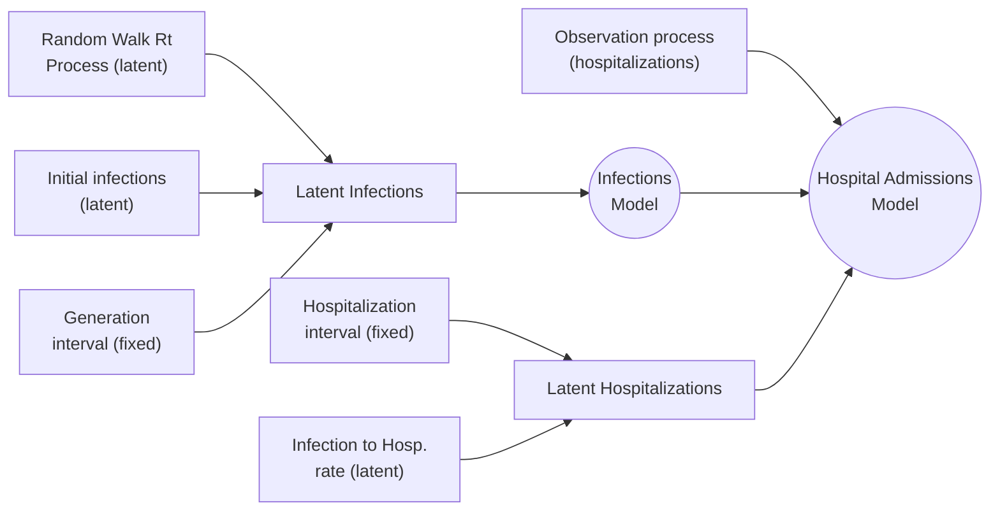

## PyRenew: A Package for Bayesian Renewal Modeling with JAX and Numpyro.

`pyrenew` is a flexible tool for simulation and statistical inference of epidemiological models, emphasizing renewal models. Built on top of the [`numpyro`](https://num.pyro.ai/) Python library, `pyrenew` provides core components for model building, including pre-defined models for processing various types of observational processes. To start, visit the tutorials section on the project's website [here](https://cdcgov.github.io/multisignal-epi-inference/tutorials/index.html).

The following diagram illustrates the composition of the `HospitalAdmissionsModel` class. Notably, all components are modular and can be replaced with custom implementations.



### Installation

Install via pip with

```bash
pip install git+https://github.com/CDCgov/multisignal-epi-inference@main#subdirectory=model
```

### Container image

A container image is available at `ghcr.io/CDCgov/pyrenew:latest`. You can pull it with

```bash
docker pull ghcr.io/CDCgov/pyrenew:latest
```
