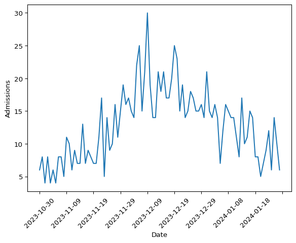

# Fitting a Hospital Admissions-only Model


This document illustrates how a hospital admissions-only model can be
fitted using data from the Pyrenew package, particularly the wastewater
dataset. The CFA wastewater team created this dataset, which contains
simulated data.

## Model definition

In this section, we provide the formal definition of the model. The
hospitalization model is a semi-mechanistic model that describes the
number of observed hospital admissions as a function of a set of latent
variables. Mainly, the observed number of hospital admissions is
discretely distributed with location at the number of latent hospital
admissions:

$$
h(t) \sim \text{HospDist}\left(H(t)\right)
$$

Where $h(t)$ is the observed number of hospital admissions at time $t$,
and $H(t)$ is the number of latent hospital admissions at time $t$. The
distribution $\text{HospDist}$ is discrete. For this example, we will
use a negative binomial distribution:

$$
h(t) \sim \text{NegativeNinomial}\left(\text{concentration} = 1, \text{logits} = \log(H(t))\right)
$$

The number of latent hospital admissions at time $t$ is a function of
the number of latent infections at time $t$ and the infection to
hospitalization rate. The latent infections are modeled as a renewal
process:

$$
\begin{align*}
I(t) &= R(t) \times \sum_{\tau < t} I(\tau) g(t - \tau) \\
I(0) &\sim \text{LogNormal}(\mu = \log(80/0.05), \sigma = 1.5)
\end{align*}
$$

The reproductive number $R(t)$ is modeled as a random walk process:

$$
\begin{align*}
R(t) & = R(t-1) + \epsilon\\
\log{\epsilon} & \sim \text{Normal}(\mu=0, \sigma=0.1) \\
R(0) &\sim \text{TruncatedNormal}(\text{loc}=1.2, \text{scale}=0.2, \text{min}=0)
\end{align*}
$$

## Data processing

We start by loading the data and inspecting the first five rows.

``` python
import polars as pl
from pyrenew import datasets

dat = datasets.load_wastewater()
dat.head(5)
```

<div><style>
.dataframe > thead > tr,
.dataframe > tbody > tr {
  text-align: right;
  white-space: pre-wrap;
}
</style>
<small>shape: (5, 14)</small>

| t   | lab_wwtp_unique_id | log_conc | date         | lod_sewage | below_LOD | daily_hosp_admits | daily_hosp_admits_for_eval | pop | forecast_date | hosp_calibration_time | site | ww_pop   | inf_per_capita |
|-----|--------------------|----------|--------------|------------|-----------|-------------------|----------------------------|-----|---------------|-----------------------|------|----------|----------------|
| i64 | i64                | f64      | str          | f64        | i64       | i64               | i64                        | f64 | str           | i64                   | i64  | f64      | f64            |
| 1   | 1                  | null     | "2023-10-30" | null       | null      | 6                 | 6                          | 1e6 | "2024-02-05"  | 90                    | 1    | 400000.0 | 0.000663       |
| 1   | 2                  | null     | "2023-10-30" | null       | null      | 6                 | 6                          | 1e6 | "2024-02-05"  | 90                    | 1    | 400000.0 | 0.000663       |
| 1   | 3                  | null     | "2023-10-30" | null       | null      | 6                 | 6                          | 1e6 | "2024-02-05"  | 90                    | 2    | 200000.0 | 0.000663       |
| 1   | 4                  | null     | "2023-10-30" | null       | null      | 6                 | 6                          | 1e6 | "2024-02-05"  | 90                    | 3    | 100000.0 | 0.000663       |
| 1   | 5                  | null     | "2023-10-30" | null       | null      | 6                 | 6                          | 1e6 | "2024-02-05"  | 90                    | 4    | 50000.0  | 0.000663       |

</div>

The data shows one entry per site, but the way it was simulated, the
number of admissions is the same across sites. Thus, we will only keep
the first observation per day.

``` python
# Keeping the first observation of each date
dat = dat.group_by("date").first().select(["date", "daily_hosp_admits"])

# Now, sorting by date
dat = dat.sort("date")

# Keeping the first 90 days
dat = dat.head(90)

dat.head(5)
```

<div><style>
.dataframe > thead > tr,
.dataframe > tbody > tr {
  text-align: right;
  white-space: pre-wrap;
}
</style>
<small>shape: (5, 2)</small>

| date         | daily_hosp_admits |
|--------------|-------------------|
| str          | i64               |
| "2023-10-30" | 6                 |
| "2023-10-31" | 8                 |
| "2023-11-01" | 4                 |
| "2023-11-02" | 8                 |
| "2023-11-03" | 4                 |

</div>

Let’s take a look at the daily prevalence of hospital admissions.

``` python
import matplotlib.pyplot as plt

# Rotating the x-axis labels, and only showing ~10 labels
ax = plt.gca()
ax.xaxis.set_major_locator(plt.MaxNLocator(nbins=10))
ax.xaxis.set_tick_params(rotation=45)
plt.plot(dat["date"].to_numpy(), dat["daily_hosp_admits"].to_numpy())
plt.xlabel("Date")
plt.ylabel("Admissions")
plt.show()
```



## Building the model

First, we will extract two datasets we will use as deterministic
quantities: the generation interval and the infection to hospitalization
interval.

``` python
gen_int = datasets.load_generation_interval()
inf_hosp_int = datasets.load_infection_admission_interval()

# We only need the probability_mass column of each dataset
gen_int = gen_int["probability_mass"].to_numpy()
inf_hosp_int = inf_hosp_int["probability_mass"].to_numpy()

# Taking a pick at the first 5 elements of each
gen_int[:5], inf_hosp_int[:5]

# Visualizing both quantities side by side
fig, axs = plt.subplots(1, 2)

axs[0].plot(gen_int)
axs[0].set_title("Generation interval")
axs[1].plot(inf_hosp_int)
axs[1].set_title("Infection to hospitalization interval")
```

    Text(0.5, 1.0, 'Infection to hospitalization interval')


With these two in hand, we can start building the model. First, we will
define the latent hospital admissions:

``` python
from pyrenew import latent, deterministic
import jax.numpy as jnp
import numpyro.distributions as dist

inf_hosp_int = deterministic.DeterministicPMF(inf_hosp_int)

hosp_rate = latent.InfectHospRate(
    dist=dist.LogNormal(jnp.log(0.05), 0.1)
)

latent_hosp = latent.HospitalAdmissions(
    infection_to_admission_interval=inf_hosp_int,
    infect_hosp_rate_dist=hosp_rate,
    )
```

    /mnt/c/Users/xrd4/Documents/repos/msr/model/.venv/lib/python3.10/site-packages/tqdm/auto.py:21: TqdmWarning: IProgress not found. Please update jupyter and ipywidgets. See https://ipywidgets.readthedocs.io/en/stable/user_install.html
      from .autonotebook import tqdm as notebook_tqdm
    An NVIDIA GPU may be present on this machine, but a CUDA-enabled jaxlib is not installed. Falling back to cpu.

The `inf_hosp_int` is a `DeterministicPMF` object that takes the
infection to hospitalization interval as input. The `hosp_rate` is an
`InfectHospRate` object that takes the infection to hospitalization rate
as input. The `HospitalAdmissions` class is a `RandomVariable` that
takes two distributions as inputs: the infection to admission interval
and the infection to hospitalization rate. Now, we can define the rest
of the other components:

``` python
from pyrenew import model, process, observation

# Infection process
latent_inf = latent.Infections()
I0 = latent.Infections0(I0_dist=dist.LogNormal(loc=jnp.log(80/.05), scale=1.5))

# Generation interval and Rt
gen_int = deterministic.DeterministicPMF(gen_int)
rtproc = process.RtRandomWalkProcess(
    Rt_rw_dist=dist.Normal(0, 0.1)
)

# The observation model
obs = observation.NegativeBinomialObservation(concentration_prior=1.0)
```

Notice all the components are `RandomVariable` instances. We can now
build the model:

``` python
hosp_model = model.HospitalizationsModel(
    latent_infections=latent_inf,
    latent_hospitalizations=latent_hosp,
    I0=I0,
    gen_int=gen_int,
    Rt_process=rtproc,
    observation_process=obs,
)
```

Let’s simulate to check if the model is working:

``` python
import numpyro as npro
import numpy as np

timeframe = 120

np.random.seed(223)
with npro.handlers.seed(rng_seed = np.random.randint(1, timeframe)):
    sim_data = hosp_model.sample(n_timepoints=timeframe)
```

``` python
import matplotlib.pyplot as plt

fig, axs = plt.subplots(1, 2)

# Rt plot
axs[0].plot(range(0, timeframe + 1), sim_data.Rt)
axs[0].set_ylabel('Rt')

# Infections plot
axs[1].plot(range(0, timeframe + 1), sim_data.sampled_admissions)
axs[1].set_ylabel('Infections')
axs[1].set_yscale('log')

fig.suptitle('Basic renewal model')
fig.supxlabel('Time')
plt.tight_layout()
plt.show()
```


## Fitting the model

We can fit the model to the data. We will use the `run` method of the
model object. The two inputs this model requires are `n_timepoints` and
`observed_hospitalizations`

``` python
import jax

hosp_model.run(
    num_samples=2000,
    num_warmup=2000,
    n_timepoints=dat.shape[0] - 1,
    observed_hospitalizations=dat["daily_hosp_admits"].to_numpy(),
    rng_key=jax.random.PRNGKey(54),
    mcmc_args=dict(progress_bar=False),
)
```

We can use the `plot_posterior` method to visualize the results[^1]:

``` python
out = hosp_model.plot_posterior(
    var="predicted_hospitalizations",
    ylab="Hospital Admissions",
    obs_signal=dat["daily_hosp_admits"].to_numpy(),
)
```


The first half of the model is not looking good. The reason is that the
infection to hospitalization interval PMF makes it unlikely to observe
admissions from the beginning. To solve this, we can use the padding
argument to add a few days of missing data at the beginning of the
model. The following code will add 21 days of missing data at the
beginning of the model:

``` python
days_to_inpute = 21

dat2 = dat["daily_hosp_admits"].to_numpy()

# Add 21 Nas to the beginning of dat2
dat2 = np.hstack((np.repeat(np.nan, days_to_inpute), dat2))

hosp_model.run(
    num_samples=2000,
    num_warmup=2000,
    n_timepoints=dat2.shape[0] - 1,
    observed_hospitalizations=dat2,
    rng_key=jax.random.PRNGKey(54),
    mcmc_args=dict(progress_bar=False),
    padding=days_to_inpute,
)
```

And plotting the results:

``` python
out = hosp_model.plot_posterior(
    var="predicted_hospitalizations",
    ylab="Hospital Admissions",
    obs_signal=dat2,
)
```


## Round 2: Incorporating weekday effects

We will re-use the infection to admission interval and infection to
hospitalization rate from the previous model. But we will also add a
weekday effect distribution. To do this, we will create a new instance
of `RandomVariable` to model the weekday effect. The weekday effect will
be a truncated normal distribution with a mean of 1.0 and a standard
deviation of 0.5. The distribution will be truncated between 0.1 and
10.0. The weekday effect will be repeated for the number of weeks in the
dataset.

``` python
from pyrenew import metaclass
import numpyro as npro

class WeekdayEffect(metaclass.RandomVariable):
    """Weekday effect distribution"""
    def __init__(self, len: int):
        """ Initialize the weekday effect distribution
        Parameters
        ----------
        len : int
            The number of observations
        """
        self.nweeks = jnp.ceil(len/7).astype(int)
        self.len = len

    @staticmethod
    def validate():
        return None

    def sample(self, **kwargs):
        ans = npro.sample(
            name="weekday_effect",
            fn=npro.distributions.TruncatedNormal(
                loc=1.0, scale=.5, low=0.1, high=10.0
                ),
            sample_shape=(7,)
        )

        return jnp.tile(ans, self.nweeks)[:self.len]

# Initializing the weekday effect
weekday_effect = WeekdayEffect(dat.shape[0])
```

Notice that the instance’s `nweeks` and `len` members are passed during
construction. Trying to compute the number of weeks and the length of
the dataset in the `validate` method will raise a `jit` error in `jax`
as the shape and size of elements are not known during the validation
step, which happens before the model is run. With the new weekday
effect, we can rebuild the latent hospitalization model:

``` python
latent_hosp_wday_effect = latent.HospitalAdmissions(
    infection_to_admission_interval=inf_hosp_int,
    infect_hosp_rate_dist=hosp_rate,
    weekday_effect_dist=weekday_effect,
    )

hosp_model_weekday = model.HospitalizationsModel(
    latent_infections=latent_inf,
    latent_hospitalizations=latent_hosp_wday_effect,
    I0=I0,
    gen_int=gen_int,
    Rt_process=rtproc,
    observation_process=obs,
)
```

Running the model (with the same padding as before):

``` python
hosp_model_weekday.run(
    num_samples=2000,
    num_warmup=2000,
    n_timepoints=dat2.shape[0] - 1,
    observed_hospitalizations=dat2,
    rng_key=jax.random.PRNGKey(54),
    mcmc_args=dict(progress_bar=False),
    padding=days_to_inpute,
)
```

And plotting the results:

``` python
out = hosp_model_weekday.plot_posterior(
    var="predicted_hospitalizations",
    ylab="Hospital Admissions",
    obs_signal=dat2,
)
```


[^1]: The output is captured to avoid `quarto` from displaying the
    output twice.
