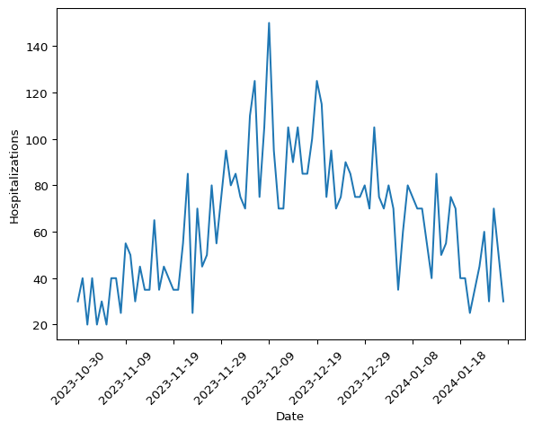

# Fitting an hospitalizations only model


This document illustrates how a hospitalization-only model can be fitted
using data from the Pyrenew package, particularly the wastewater
dataset. The CFA wastewater team created this dataset, which contains
simulated data.

``` python
import polars as pl
from pyrenew.datasets import load_wastewater
from pyrenew.model import HospitalizationsModel
```

    /mnt/c/Users/xrd4/Documents/repos/msr/model/.venv/lib/python3.10/site-packages/tqdm/auto.py:21: TqdmWarning: IProgress not found. Please update jupyter and ipywidgets. See https://ipywidgets.readthedocs.io/en/stable/user_install.html
      from .autonotebook import tqdm as notebook_tqdm
    An NVIDIA GPU may be present on this machine, but a CUDA-enabled jaxlib is not installed. Falling back to cpu.

## Model definition

In this section we provide the formal definition of the model. The
hospitalization model is a semi-mechanistic model that describes the
number of observed hospitalizations as a function of a set of latent
variables. Particularly, the observed number of hospitalizations is
discretily distributed with location at the number of latent
hospitalizations:

$$
h(t) \sim \text{HospDist}\left(H(t)\right)
$$

Where $h(t)$ is the observed number of hospitalizations at time $t$, and
$H(t)$ is the number of latent hospitalizations at time $t$. The
distribution $\text{HospDist}$ can be any discrete distribution, but in
this case we will use a negative binomial distribution.

The number of latent hospitalizations at time $t$ is a function of the
number of latent infections at time $t$ and the infection to
hospitalization rate. The latent infections are modeled as a renewal
process:

$$
I(t) = R(t) \times \sum_{\tau < t} I(\tau) g(t - \tau)
$$

The reproductive number $R(t)$ is modeled as a random walk process:

$$
\begin{align*}
R(t) & = R(t-1) + \epsilon\\
\log{\epsilon} & \sim \text{Normal}(0, \sigma) \\
R(0) &\sim \text{TruncatedNormal}(\text{loc}=1.2, \text{scale}=0.2, \text{min}=0)
\end{align*}
$$

## Data processing

We start by loading the data and inspecting the first five rows.

``` python
dat = load_wastewater()
dat.head(5)
```

<div><style>
.dataframe > thead > tr,
.dataframe > tbody > tr {
  text-align: right;
  white-space: pre-wrap;
}
</style>
<small>shape: (5, 14)</small>

| t   | lab_wwtp_unique_id | log_conc | date         | lod_sewage | below_LOD | daily_hosp_admits | daily_hosp_admits_for_eval | pop | forecast_date | hosp_calibration_time | site | ww_pop   | inf_per_capita |
|-----|--------------------|----------|--------------|------------|-----------|-------------------|----------------------------|-----|---------------|-----------------------|------|----------|----------------|
| i64 | i64                | f64      | str          | f64        | i64       | i64               | i64                        | f64 | str           | i64                   | i64  | f64      | f64            |
| 1   | 1                  | null     | "2023-10-30" | null       | null      | 6                 | 6                          | 1e6 | "2024-02-05"  | 90                    | 1    | 400000.0 | 0.000663       |
| 1   | 2                  | null     | "2023-10-30" | null       | null      | 6                 | 6                          | 1e6 | "2024-02-05"  | 90                    | 1    | 400000.0 | 0.000663       |
| 1   | 3                  | null     | "2023-10-30" | null       | null      | 6                 | 6                          | 1e6 | "2024-02-05"  | 90                    | 2    | 200000.0 | 0.000663       |
| 1   | 4                  | null     | "2023-10-30" | null       | null      | 6                 | 6                          | 1e6 | "2024-02-05"  | 90                    | 3    | 100000.0 | 0.000663       |
| 1   | 5                  | null     | "2023-10-30" | null       | null      | 6                 | 6                          | 1e6 | "2024-02-05"  | 90                    | 4    | 50000.0  | 0.000663       |

</div>

The data shows one entry per site. We will take the aggregated data for
all sites by date.

``` python
dat = dat.group_by("date").agg(
    hospitalizations = pl.sum("daily_hosp_admits"),
    population = pl.sum("pop"),
)

# Now, sorting by date
dat = dat.sort("date")

dat.head(5)
```

<div><style>
.dataframe > thead > tr,
.dataframe > tbody > tr {
  text-align: right;
  white-space: pre-wrap;
}
</style>
<small>shape: (5, 3)</small>

| date         | hospitalizations | population |
|--------------|------------------|------------|
| str          | i64              | f64        |
| "2023-10-30" | 30               | 5e6        |
| "2023-10-31" | 40               | 5e6        |
| "2023-11-01" | 20               | 5e6        |
| "2023-11-02" | 40               | 5e6        |
| "2023-11-03" | 20               | 5e6        |

</div>

Let’s take a look at the daily prevalence of hospitalizations.

``` python
import matplotlib.pyplot as plt

# Rotating the x-axis labels, and only showing ~10 labels
ax = plt.gca()
ax.xaxis.set_major_locator(plt.MaxNLocator(nbins=10))
ax.xaxis.set_tick_params(rotation=45)
plt.plot(dat["date"].to_numpy(), dat["hospitalizations"].to_numpy())
plt.xlabel("Date")
plt.ylabel("Hospitalizations")
plt.show()
```



## Building the model

First, we will extract two datasets that we will use as deterministic
quantities, the generation interval and the infection to hospitalization
interval.

``` python
from pyrenew.datasets import (
    load_generation_interval,
    load_infection_admission_interval,
)

gen_int = load_generation_interval()
inf_hosp_int = load_infection_admission_interval()

# We only need the probability_mass column of each dataset
gen_int = gen_int["probability_mass"].to_numpy()
inf_hosp_int = inf_hosp_int["probability_mass"].to_numpy()

# Taking a pick at the first 5 elements of each
gen_int[:5], inf_hosp_int[:5]

# Visualizing both quantities side by side
fig, axs = plt.subplots(1, 2)

axs[0].plot(gen_int)
axs[0].set_title("Generation interval")
axs[1].plot(inf_hosp_int)
axs[1].set_title("Infection to hospitalization interval")
```

    Text(0.5, 1.0, 'Infection to hospitalization interval')


With these two in hand, we can start building the model. First, we will
define the latent hospitalizations.

``` python
from pyrenew.latent import HospitalAdmissions, InfectHospRate
from pyrenew.deterministic import DeterministicPMF
import jax.numpy as jnp
import numpyro.distributions as dist

inf_hosp_int = DeterministicPMF((inf_hosp_int,))

hosp_rate = InfectHospRate(
    dist=dist.LogNormal(jnp.log(0.05), 0.05)
)

latent_hosp = HospitalAdmissions(
    infection_to_admission_interval=inf_hosp_int,
    infect_hosp_rate_dist=hosp_rate,
    )
```

Now we can define the rest of the other model components:

``` python
from pyrenew.model import HospitalizationsModel
from pyrenew.latent import Infections, Infections0
from pyrenew.process import RtRandomWalkProcess
from pyrenew.observation import NegativeBinomialObservation

# Infection process
latent_inf = Infections()
I0 = Infections0()

# Generation interval and Rt
gen_int = DeterministicPMF((gen_int,))
process = RtRandomWalkProcess()

# The observation model
obs = NegativeBinomialObservation(concentration_prior=0.1)
```

Notice all the components are `RandomVariable` instances. We can now
build the model:

``` python
model = HospitalizationsModel(
    latent_infections=latent_inf,
    latent_hospitalizations=latent_hosp,
    I0=I0,
    gen_int=gen_int,
    Rt_process=process,
    observed_hospitalizations=obs,
)
```

Let’s run a simulation to check if the model is working:

``` python
import numpyro as npro
import numpy as np

timeframe = 120

np.random.seed(223)
with npro.handlers.seed(rng_seed = np.random.randint(1, timeframe)):
    sim_data = model.sample(n_timepoints=timeframe)
```

``` python
import matplotlib.pyplot as plt

fig, axs = plt.subplots(1, 2)

# Rt plot
axs[0].plot(range(0, timeframe + 1), sim_data[0])
axs[0].set_ylabel('Rt')

# Infections plot
axs[1].plot(range(0, timeframe + 1), sim_data[1])
axs[1].set_ylabel('Infections')

fig.suptitle('Basic renewal model')
fig.supxlabel('Time')
plt.tight_layout()
plt.show()
```


## Fitting the model

Now we can fit the model to the data. We will use the `run` method of
the model object. The two inputs this model requires are `n_timepoints`
and `observed_hospitalizations`

``` python
import jax

model.run(
    num_samples=2000,
    num_warmup=1000,
    n_timepoints=dat.shape[0] - 1,
    observed_hospitalizations=dat["hospitalizations"].to_numpy(),
    rng_key=jax.random.PRNGKey(54),
    mcmc_args=dict(progress_bar=False),
)
```
