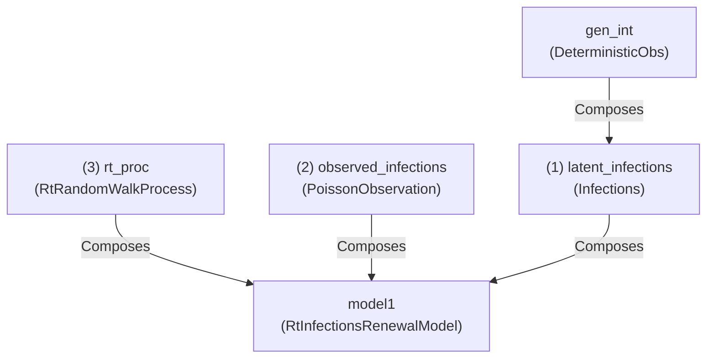
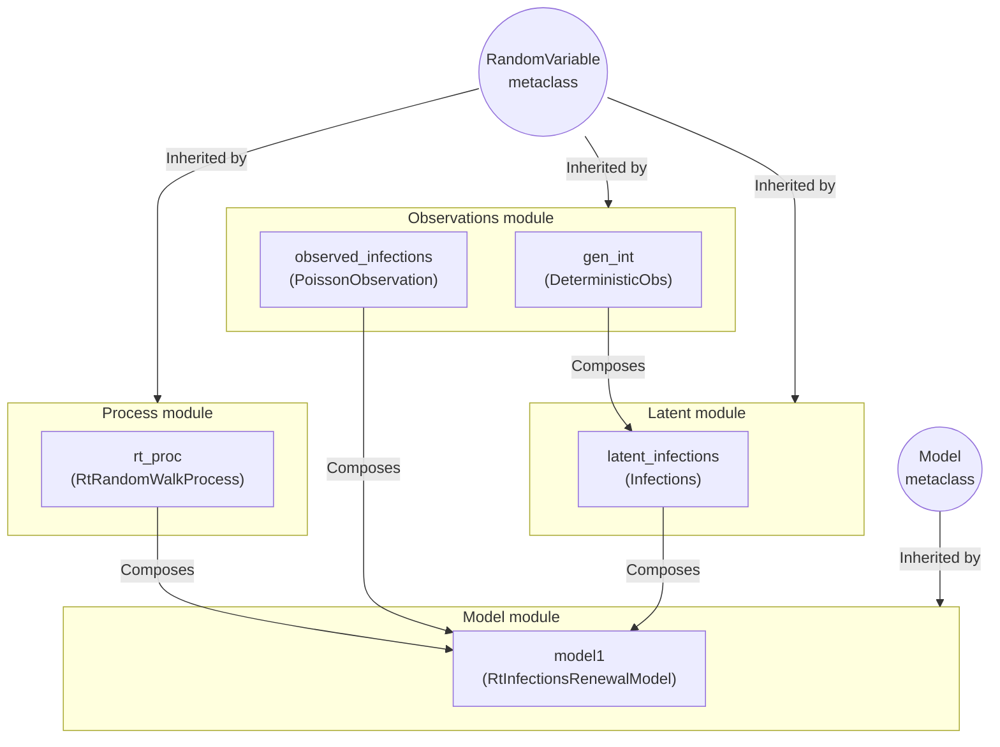

# Getting started with pyrenew


`pyrenew` is a flexible tool for simulation and inference of
epidemiological models with an emphasis on renewal models. Built on top
of `numpyro`, `pyrenew` provides core components for model building as
well as pre-defined models for processing various types of observational
processes. This document illustrates how `pyrenew` can be used to build
a basic renwal model.

## ‘Hello world’ model

In this section, we will show the steps to build a simple renewal model
featuring a latent infection process, a random walk Rt process, and an
observation process for the reported infections. We start by loading the
needed components to build a basic renewal model:

``` python
import jax.numpy as jnp
import numpy as np
import numpyro as npro
from pyrenew.process import RtRandomWalkProcess
from pyrenew.latent import Infections
from pyrenew.observation import PoissonObservation, DeterministicObs
from pyrenew.model import RtInfectionsRenewalModel
```

In the basic renewal model we can define three components: Rt, latent
infections, and observed infections.

``` python
# (1) The generation interval for the latent infection process is
# deterministic
gen_int = DeterministicObs(
    (jnp.array([0.25, 0.25, 0.25, 0.25]),),
    validate_pmf=True
)

latent_infections = Infections(gen_int=gen_int)

# (2) The observed infections process
observed_infections = PoissonObservation(
    rate_varname='latent',
    counts_varname='observed_infections',
    )

# (3) The random process for Rt
rt_proc = RtRandomWalkProcess()
```

With these three (four) pieces, we can build the basic renewal model:

``` python
model1 = RtInfectionsRenewalModel(
    Rt_process=rt_proc,
    latent_infections=latent_infections,
    observed_infections=observed_infections,
    )
```

The following diagram summarizes how the modules interact via
composition; notably, `rt_proc`, `observed_infections`,
`latent_infections`, and `gen_int` are instances of `RandomVariable`,
which means these can be easily replaced to generate different version
of `RtInfectionsRenewalModel`:



Using `numpyro`, we can simulate data using the `sample()` member
function of `RtInfectionsRenewalModel`:

``` python
np.random.seed(223)
with npro.handlers.seed(rng_seed=np.random.randint(1, 60)):
    sim_data = model1.sample(constants=dict(n_timepoints=30))

sim_data
```

    InfectModelSample(Rt=Array([1.2022278, 1.2111099, 1.2325984, 1.2104921, 1.2023039, 1.1970979,
           1.2384264, 1.2423582, 1.245498 , 1.241344 , 1.2081108, 1.1938375,
           1.271196 , 1.3189521, 1.3054799, 1.3165426, 1.291952 , 1.3026639,
           1.2619467, 1.2852622, 1.3121517, 1.2888998, 1.2641873, 1.2580931,
           1.2545817, 1.3092988, 1.2488269, 1.2397509, 1.2071848, 1.2334517,
           1.21868  ], dtype=float32), latent=Array([ 3.7023427,  4.850682 ,  6.4314823,  8.26245  ,  6.9874763,
            7.940377 ,  9.171101 , 10.051114 , 10.633459 , 11.729475 ,
           12.559867 , 13.422887 , 15.364211 , 17.50132  , 19.206314 ,
           21.556652 , 23.78112  , 26.719398 , 28.792412 , 32.40454  ,
           36.641006 , 40.135487 , 43.60607  , 48.055103 , 52.829704 ,
           60.43277  , 63.97854  , 69.82776  , 74.564415 , 82.88904  ,
           88.73811  ], dtype=float32), observed=Array([ 4,  3,  6,  5,  7,  7, 10, 11,  6,  9,  7, 13, 16, 19, 20, 27, 23,
           31, 28, 30, 43, 42, 55, 57, 44, 52, 64, 52, 77, 85, 94],      dtype=int32))

The `sample()` method of the `RtInfectionsRenewalModel` returns a list
composed of the `Rt` and `infections` sequences.

``` python
import matplotlib.pyplot as plt

fig, axs = plt.subplots(1, 2)

# Rt plot
axs[0].plot(range(0, 31), sim_data[0])
axs[0].set_ylabel('Rt')

# Infections plot
axs[1].plot(range(0, 31), sim_data[1])
axs[1].set_ylabel('Infections')

fig.suptitle('Basic renewal model')
fig.supxlabel('Time')
plt.tight_layout()
plt.show()
```


To fit the model, we can use the `run()` method of the model
`RtInfectionsRenewalModel`; an inherited method from the metaclass
`Model`:

``` python
import jax

model_data = {'n_timepoints': len(sim_data[1])-1}

model1.run(
    num_warmup=2000,
    num_samples=1000,
    random_variables=dict(observed_infections=sim_data.observed),
    constants=model_data,
    rng_key=jax.random.PRNGKey(54),
    mcmc_args=dict(progress_bar=False),
    )
```

Now, let’s investigate the output, particularly, the posterior
distribution of the Rt estimates:

``` python
import polars as pl
samps = model1.spread_draws([('Rt', 'time')])

fig, ax = plt.subplots(figsize=[4, 5])

ax.plot(sim_data[0])
samp_ids = np.random.randint(size=25, low=0, high=999)
for samp_id in samp_ids:
    sub_samps = samps.filter(pl.col("draw") == samp_id).sort(pl.col('time'))
    ax.plot(sub_samps.select("time").to_numpy(),
            sub_samps.select("Rt").to_numpy(), color="darkblue", alpha=0.1)
ax.set_ylim([0.4, 1/.4])
ax.set_yticks([0.5, 1, 2])
ax.set_yscale("log")
```


## Architecture of pyrenew

`pyrenew` leverages `numpyro`’s flexibility to build models via
composition. As a principle, most objects in `pyrenew` can be treated as
random variables from which we can sample. At the top-level `pyrenew`
has two metaclass from which most objects inherit: `RandomVariable` and
`Model`. From them, the following four sub-modules arise:

- The `process` sub-module,
- The `observation` sub-module,
- The `latent` sub-module, and
- The `models` sub-module

Where the first three are collections of instances of `RandomVariable`
and the last one a collection of instances of `Model`. The following
diagram shows a detailed view of how meta classes, modules, and classes
interact to create the `RtInfectionsRenewalModel` instantiated in the
previous section:


