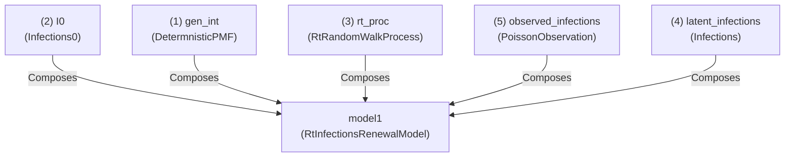
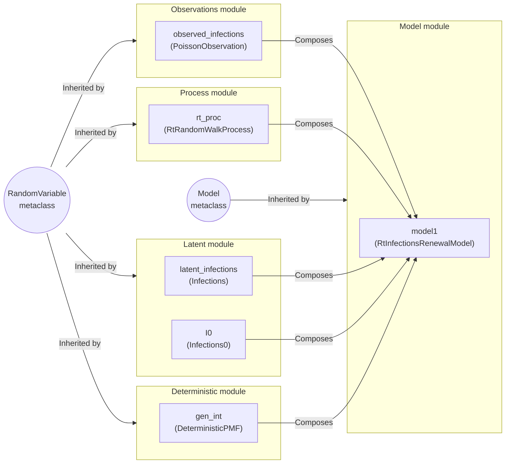

# Getting started with pyrenew


`pyrenew` is a flexible tool for simulating and making statistical
inference of epidemiological models, emphasizing renewal models. Built
on `numpyro`, `pyrenew` provides core components for model building and
pre-defined models for processing various observational processes. This
document illustrates how `pyrenew` can be used to build a basic renewal
model.

## The fundamentals

`pyrenew`’s core components are the metaclasses `RandomVariable` and
`Model`. From the package’s perspective, a `RandomVariable` is a
quantity models can sample and estimate, **including deterministic
quantities**. Mainly, sampling from a `RandomVariable` involves calling
the `sample()` method. The benefit of this design is the definition of
the sample function can be arbitrary, allowing the user to either sample
from a distribution using `numpyro.sample()`, compute fixed quantities
(like a mechanistic equation,) or return a fixed value (like a
pre-computed PMF.) For instance, we may be interested in estimating a
PMF, in which case a `RandomVariable` sampling function may roughly be
defined as:

``` python
class MyRandVar(RandomVariable):
    def sample(...) -> ArrayLike:
        return numpyro.sample(...)
```

Whereas, in some other cases, we may instead use a fixed quantity for
that variable (like a pre-computed PMF,) where the `RandomVariable`’s
sample function could be defined like:

``` python
class MyRandVar(RandomVariable):
    def sample(...) -> ArrayLike:
        return jax.numpy.array([0.2, 0.7, 0.1])
```

This way, when a `Model` samples from `MyRandVar`, it could be either
adding random variables to be estimated (first case) or just retrieving
some quantity needed for other calculations (second case.)

The `Model` metaclass provides basic functionality for estimating and
simulation. Like `RandomVariable`, the `Model` metaclass has a
`sample()` method that defines the model structure. Ultimately, models
can be nested (or inherited,) providing a straightforward way to add
layers of complexity.

## ‘Hello world’ model

This section will show the steps to build a simple renewal model
featuring a latent infection process, a random walk Rt process, and an
observation process for the reported infections. We start by loading the
needed components to build a basic renewal model:

``` python
import jax.numpy as jnp
import numpy as np
import numpyro as npro
import numpyro.distributions as dist
from pyrenew.process import RtRandomWalkProcess
from pyrenew.latent import Infections, Infections0
from pyrenew.observation import PoissonObservation
from pyrenew.deterministic import DeterministicPMF
from pyrenew.model import RtInfectionsRenewalModel
```

The basic renewal model defines five components: generation interval,
initial infections, Rt, latent infections, and observed infections. In
this example, the generation interval is not estimated but passed as a
deterministic instance of `RandomVariable`. Here is the code to
initialize the five components:

``` python
# (1) The generation interval (deterministic)
gen_int = DeterministicPMF(
    (jnp.array([0.25, 0.25, 0.25, 0.25]),),
)

# (2) Initial infections (inferred with a prior)
I0 = Infections0(I0_dist=dist.LogNormal(0, 1))

# (3) The random process for Rt
rt_proc = RtRandomWalkProcess()

# (4) Latent infection process (which will use 1 and 2)
latent_infections = Infections()

# (5) The observed infections process (with mean at the latent infections)
observed_infections = PoissonObservation(
    rate_varname   = 'latent',
    counts_varname = 'observed_infections',
    )
```

With these five pieces, we can build the basic renewal model:

``` python
model1 = RtInfectionsRenewalModel(
    gen_int             = gen_int,
    I0                  = I0,
    Rt_process          = rt_proc,
    latent_infections   = latent_infections,
    observed_infections = observed_infections,
    )
```

The following diagram summarizes how the modules interact via
composition; notably, `gen_int`, `I0`, `rt_proc`, `latent_infections`,
and `observed_infections` are instances of `RandomVariable`, which means
these can be easily replaced to generate a different version of
`RtInfectionsRenewalModel`:



Using `numpyro`, we can simulate data using the `sample()` member
function of `RtInfectionsRenewalModel`:

``` python
np.random.seed(223)
with npro.handlers.seed(rng_seed = np.random.randint(1, 60)):
    sim_data = model1.sample(constants = dict(n_timepoints=30))

sim_data
```

    InfectModelSample(Rt=Array([1.2022278, 1.2111099, 1.2325984, 1.2104921, 1.2023039, 1.1970979,
           1.2384264, 1.2423582, 1.245498 , 1.241344 , 1.2081108, 1.1938375,
           1.271196 , 1.3189521, 1.3054799, 1.3165426, 1.291952 , 1.3026639,
           1.2619467, 1.2852622, 1.3121517, 1.2888998, 1.2641873, 1.2580931,
           1.2545817, 1.3092988, 1.2488269, 1.2397509, 1.2071848, 1.2334517,
           1.21868  ], dtype=float32), latent=Array([ 2.3215084,  3.0415602,  4.0327816,  5.180868 ,  4.381411 ,
            4.978916 ,  5.750626 ,  6.3024273,  6.66758  ,  7.354823 ,
            7.8755097,  8.416656 ,  9.63394  , 10.973988 , 12.043082 ,
           13.516833 , 14.911659 , 16.75407  , 18.053928 , 20.318869 ,
           22.975292 , 25.166464 , 27.34265  , 30.13236  , 33.126217 ,
           37.89362  , 40.11695  , 43.784634 , 46.754696 , 51.974545 ,
           55.642136 ], dtype=float32), observed=Array([ 1,  2,  3,  5,  4,  4,  7,  4,  8,  4,  7,  3,  8, 12, 13, 18, 14,
           20, 17, 18, 28, 27, 36, 37, 26, 31, 40, 27, 48, 54, 60],      dtype=int32))

The `sample()` method of the `RtInfectionsRenewalModel` returns a list
composed of the `Rt` and `infections` sequences.

``` python
import matplotlib.pyplot as plt

fig, axs = plt.subplots(1, 2)

# Rt plot
axs[0].plot(range(0, 31), sim_data[0])
axs[0].set_ylabel('Rt')

# Infections plot
axs[1].plot(range(0, 31), sim_data[1])
axs[1].set_ylabel('Infections')

fig.suptitle('Basic renewal model')
fig.supxlabel('Time')
plt.tight_layout()
plt.show()
```


To fit the model, we can use the `run()` method of the model
`RtInfectionsRenewalModel`; an inherited method from the metaclass
`Model`:

``` python
import jax

model_data = {'n_timepoints': len(sim_data[1])-1}

model1.run(
    num_warmup=2000,
    num_samples=1000,
    random_variables=dict(observed_infections=sim_data.observed),
    constants=model_data,
    rng_key=jax.random.PRNGKey(54),
    mcmc_args=dict(progress_bar=False),
    )
```

Now, let’s investigate the output, particularly the posterior
distribution of the Rt estimates:

``` python
import polars as pl
samps = model1.spread_draws([('Rt', 'time')])

fig, ax = plt.subplots(figsize=[4, 5])

ax.plot(sim_data[0])
samp_ids = np.random.randint(size=25, low=0, high=999)
for samp_id in samp_ids:
    sub_samps = samps.filter(pl.col("draw") == samp_id).sort(pl.col('time'))
    ax.plot(sub_samps.select("time").to_numpy(),
            sub_samps.select("Rt").to_numpy(), color="darkblue", alpha=0.1)
ax.set_ylim([0.4, 1/.4])
ax.set_yticks([0.5, 1, 2])
ax.set_yscale("log")
```


## Architecture of pyrenew

`pyrenew` leverages `numpyro`’s flexibility to build models via
composition. As a principle, most objects in `pyrenew` can be treated as
random variables we can sample. At the top-level `pyrenew` has two
metaclass from which most objects inherit: `RandomVariable` and `Model`.
From them, the following four sub-modules arise:

- The `process` sub-module,
- The `deterministic` sub-module,
- The `observation` sub-module,
- The `latent` sub-module, and
- The `models` sub-module

The first four are collections of instances of `RandomVariable`, and the
last is a collection of instances of `Model`. The following diagram
shows a detailed view of how meta classes, modules, and classes interact
to create the `RtInfectionsRenewalModel` instantiated in the previous
section:


