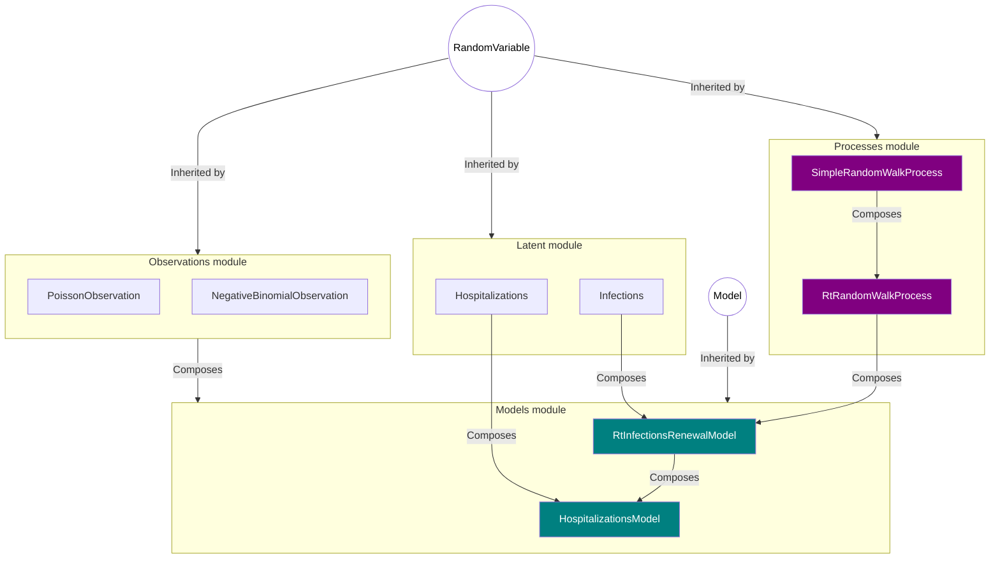

# Getting started with pyrenew


This document illustrates two features of `pyrenew`: (a) the set of
included `RandomVariable`s, and (b) model composition.

## Hospitalizations model

`pyrenew` has five main components:

- Utility and math functions,
- The `processes` sub-module,
- The `observations` sub-module,
- The `latent` sub-module, and
- The `models` sub-module

All three of `process`, `observation`, and `latent` contain classes that
inherit from the meta class `RandomVariable`. The classes under `model`
inherit from the meta class `Model`. The following diagram illustrates
the composition the model `pyrenew.models.HospitalizationsModel`:



We start by loading the needed components to build a basic renewal
model:

``` python
import jax.numpy as jnp
import numpy as np
import numpyro as npro
from pyrenew.process import RtRandomWalkProcess
from pyrenew.latent import Infections
from pyrenew.observation import PoissonObservation
from pyrenew.model import RtInfectionsRenewalModel
```

    /mnt/c/Users/xrd4/Documents/repos/msr/model/.venv/lib/python3.10/site-packages/tqdm/auto.py:21: TqdmWarning: IProgress not found. Please update jupyter and ipywidgets. See https://ipywidgets.readthedocs.io/en/stable/user_install.html
      from .autonotebook import tqdm as notebook_tqdm
    An NVIDIA GPU may be present on this machine, but a CUDA-enabled jaxlib is not installed. Falling back to cpu.

In the basic renewal model we can define three components: Rt, latent
infections, and observed infections.

``` python
latent_infections = Infections(
    gen_int=jnp.array([0.25, 0.25, 0.25, 0.25]),
    )

observed_infections = PoissonObservation(
    rate_varname='latent',
    counts_varname='observed_infections',
    )

rt_proc = RtRandomWalkProcess()
```

With observation process for the latent infections, we can build the
basic renewal model, and generate a sample calling the `sample()`
method:

``` python
model1 = RtInfectionsRenewalModel(
    Rt_process=rt_proc,
    latent_infections=latent_infections,
    observed_infections=observed_infections,
    )

np.random.seed(223)
with npro.handlers.seed(rng_seed=np.random.randint(1, 60)):
    sim_data = model1.sample(constants=dict(n_timepoints=30))

sim_data
```

    InfectModelSample(Rt=Array([1.2022278, 1.2111099, 1.2325984, 1.2104921, 1.2023039, 1.1970979,
           1.2384264, 1.2423582, 1.245498 , 1.241344 , 1.2081108, 1.1938375,
           1.271196 , 1.3189521, 1.3054799, 1.3165426, 1.291952 , 1.3026639,
           1.2619467, 1.2852622, 1.3121517, 1.2888998, 1.2641873, 1.2580931,
           1.2545817, 1.3092988, 1.2488269, 1.2397509, 1.2071848, 1.2334517,
           1.21868  ], dtype=float32), latent=Array([ 3.7023427,  4.850682 ,  6.4314823,  8.26245  ,  6.9874763,
            7.940377 ,  9.171101 , 10.051114 , 10.633459 , 11.729475 ,
           12.559867 , 13.422887 , 15.364211 , 17.50132  , 19.206314 ,
           21.556652 , 23.78112  , 26.719398 , 28.792412 , 32.40454  ,
           36.641006 , 40.135487 , 43.60607  , 48.055103 , 52.829704 ,
           60.43277  , 63.97854  , 69.82776  , 74.564415 , 82.88904  ,
           88.73811  ], dtype=float32), observed=Array([ 4,  3,  6,  5,  7,  7, 10, 11,  6,  9,  7, 13, 16, 19, 20, 27, 23,
           31, 28, 30, 43, 42, 55, 57, 44, 52, 64, 52, 77, 85, 94],      dtype=int32))

The `sample()` method of the `RtInfectionsRenewalModel` returns a list
composed of the `Rt` and `infections` sequences.

``` python
import matplotlib.pyplot as plt

fig, axs = plt.subplots(1, 2)

# Rt plot
axs[0].plot(range(0, 31), sim_data[0])
axs[0].set_ylabel('Rt')

# Infections plot
axs[1].plot(range(0, 31), sim_data[1])
axs[1].set_ylabel('Infections')

fig.suptitle('Basic renewal model')
fig.supxlabel('Time')
plt.tight_layout()
plt.show()
```


Let’s see how the estimation would go

``` python
import jax

model_data = {'n_timepoints': len(sim_data[1])-1}

model1.run(
    num_warmup=2000,
    num_samples=1000,
    random_variables=dict(observed_infections=sim_data.observed),
    constants=model_data,
    rng_key=jax.random.PRNGKey(54),
    mcmc_args=dict(progress_bar=False),
    )
```

Now, let’s investigate the output

``` python
import polars as pl
samps = model1.spread_draws([('Rt', 'time')])

fig, ax = plt.subplots(figsize=[4, 5])

ax.plot(sim_data[0])
samp_ids = np.random.randint(size=25, low=0, high=999)
for samp_id in samp_ids:
    sub_samps = samps.filter(pl.col("draw") == samp_id).sort(pl.col('time'))
    ax.plot(sub_samps.select("time").to_numpy(),
            sub_samps.select("Rt").to_numpy(), color="darkblue", alpha=0.1)
ax.set_ylim([0.4, 1/.4])
ax.set_yticks([0.5, 1, 2])
ax.set_yscale("log")
```


