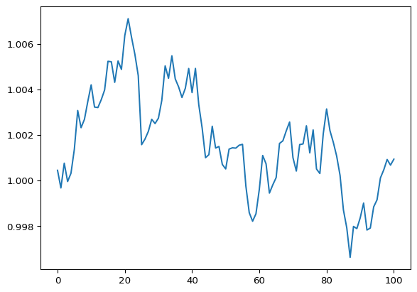
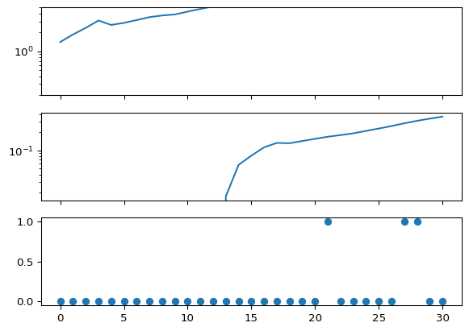
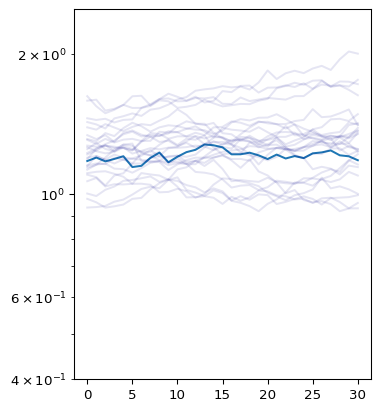

# Pyrenew demo


This demo simulates some basic renewal process data and then fits to it
using `pyrenew`.

Assuming you’ve already installed Python and pip, you’ll need to first
install `pyrenew`:

``` python
pip install pyrenew
```

You’ll also need working installations of `matplotlib`, `numpy`, `jax`,
`numpyro`, and `polars`:

``` python
pip install matplotlib numpy jax numpyro polars
```

To begin, run the following import section to call external modules and
functions necessary to run the `pyrenew` demo. The `import` statement
imports the module and the `as` statement renames the module for use
within this script. The `from` statement imports a specific function
from a module (named after the `.`) within a package (named before the
`.`).

``` python
import matplotlib as mpl
import matplotlib.pyplot as plt
import jax
import jax.numpy as jnp
import numpy as np
from numpyro.handlers import seed
import numpyro.distributions as dist
```

``` python
from pyrenew.process import SimpleRandomWalkProcess
```

To understand the simple random walk process underlying the sampling
within the renewal process model, we first examine a single random walk
path. Using the `sample` method from an instance of the
`SimpleRandomWalkProcess` class, we first create an instance of the
`SimpleRandomWalkProcess` class with a normal distribution of mean = 0
and standard deviation = 0.0001 as its input. Next, the `with` statement
sets the seed for the random number generator for the duration of the
block that follows. Inside the `with` block, the
`q_samp = q.sample(duration=100)` generates the sample instance over a
duration of 100 time units. Finally, this single random walk process is
visualized using `matplot.pyplot` to plot the exponential of the sample
instance.

``` python
np.random.seed(3312)
q = SimpleRandomWalkProcess(dist.Normal(0, 0.001))
with seed(rng_seed=np.random.randint(0,1000)):
    q_samp = q.sample(duration=100)

plt.plot(np.exp(q_samp[0]))
```



Next, import several additional functions from the `latent` module of
the `pyrenew` package to model infections, hospital admissions, initial
infections, and hospitalization rate due to infection.

``` python
from pyrenew.latent import (
    Infections, HospitalAdmissions, Infections0, InfectHospRate,
)
```

Additionally, import several classes from Pyrenew, including a Poisson
observation process, determininstic PMF and variable classes, the
Pyrenew hospitalization model, and a renewal modle (Rt) random walk
process:

``` python
from pyrenew.observation import PoissonObservation
from pyrenew.deterministic import DeterministicPMF, DeterministicVariable
from pyrenew.model import HospitalAdmissionsModel
from pyrenew.process import RtRandomWalkProcess
```

To initialize the model, we first define initial conditions, including:

1)  deterministic generation time, defined as an instance of the
    `DeterministicPMF` class, which gives the probability of each
    possible outcome for a discrete random variable given as a JAX NumPy
    array of four possible outcomes

2)  initial infections at the start of simulation as a log-normal
    distribution with mean = 0 and standard deviation = 1

3)  latent infections as an instance of the `Infections` class with
    default settings

4)  latent hospitalization process, modeled by first defining the time
    interval from infections to hospitalizations as a `DeterministicPMF`
    input with 18 possible outcomes and corresponding probabilities
    given by the values in the array. The `HospitalAdmissions` function
    then takes in this defined time interval, as well as defining the
    rate at which infections are admitted to the hospital due to
    infection, modeled as a log-normal distribution with mean =
    `jnp.log(0.05)` and standard deviation = 0.05.

5)  hospitalization observation process, modeled with a Poisson
    distribution

6)  an Rt random walk process with default settings

``` python
# Initializing model components:

# 1) A deterministic generation time
gen_int = DeterministicPMF(jnp.array([0.25, 0.25, 0.25, 0.25]))

# 2) Initial infections
I0 = Infections0(I0_dist=dist.LogNormal(0, 1))

# 3) The latent infections process
latent_infections = Infections()

# 4) The latent hospitalization process:

# First, define a deterministic infection to hosp pmf
inf_hosp_int = DeterministicPMF(
    jnp.array([0, 0, 0,0,0,0,0,0,0,0,0,0,0, 0.25, 0.5, 0.1, 0.1, 0.05]),
    )

latent_admissions = HospitalAdmissions(
    infection_to_admission_interval=inf_hosp_int,
    infect_hosp_rate_dist = InfectHospRate(
            dist=dist.LogNormal(jnp.log(0.05), 0.05),
            ),
    )

# 5) An observation process for the hospital admissions
admissions_process = PoissonObservation()

# 6) A random walk process (it could be deterministic using
# pyrenew.process.DeterministicProcess())
Rt_process = RtRandomWalkProcess()
```

The `HospitalAdmissionsModel` is then initialized using the initial
conditions just defined:

``` python
# Initializing the model
hospmodel = HospitalAdmissionsModel(
    gen_int=gen_int,
    I0=I0,
    latent_admissions=latent_admissions,
    observation_process=admissions_process,
    latent_infections=latent_infections,
    Rt_process=Rt_process
    )
```

Next, we sample from the `hospmodel` for 30 time steps and view the
output of a single run:

``` python
with seed(rng_seed=np.random.randint(1, 60)):
    x = hospmodel.sample(n_timepoints=30)
x
```

    HospModelSample(Rt=Array([1.1791104, 1.1995267, 1.1772177, 1.1913829, 1.2075942, 1.1444623,
           1.1514508, 1.1976782, 1.2292639, 1.1719677, 1.204649 , 1.2323451,
           1.2466507, 1.2800207, 1.2749145, 1.2619376, 1.2189837, 1.2192641,
           1.2290158, 1.2128737, 1.1908046, 1.2174997, 1.1941082, 1.2084603,
           1.1965215, 1.2248698, 1.2308019, 1.2426206, 1.2131014, 1.207159 ,
           1.1837622], dtype=float32), latent_infections=Array([0.05214045, 0.06867922, 0.08761451, 0.11476436, 0.09757317,
           0.10547114, 0.1167062 , 0.13010225, 0.13824694, 0.14372033,
           0.15924728, 0.17601486, 0.19236736, 0.21483542, 0.23664482,
           0.25865382, 0.27503362, 0.30029488, 0.3289544 , 0.35262382,
           0.37418258, 0.41274938, 0.43839005, 0.47672123, 0.50913286,
           0.5625195 , 0.6113282 , 0.67092246, 0.7138808 , 0.77217466,
           0.819254  ], dtype=float32), IHR=Array(0.04929917, dtype=float32), latent_admissions=Array([0.        , 0.        , 0.        , 0.        , 0.        ,
           0.        , 0.        , 0.        , 0.        , 0.        ,
           0.        , 0.        , 0.        , 0.00064262, 0.0021317 ,
           0.00302979, 0.00416974, 0.0049305 , 0.00487205, 0.00530097,
           0.00576412, 0.00624666, 0.00665578, 0.00711595, 0.0078055 ,
           0.00854396, 0.00939666, 0.01042083, 0.0114624 , 0.01246538,
           0.01345188], dtype=float32), sampled_admissions=Array([0, 0, 0, 0, 0, 0, 0, 0, 0, 0, 0, 0, 0, 0, 0, 0, 0, 0, 0, 0, 0, 0,
           0, 0, 0, 0, 0, 1, 0, 0, 0], dtype=int32))

Visualizations of the single model output show (top) infections over the
30 time steps, (middle) hospitalizations over the 30 time steps, and
(bottom)

``` python
fig, ax = plt.subplots(nrows=3, sharex=True)
ax[0].plot(x.latent_infections)
ax[0].set_ylim([1/5, 5])
ax[1].plot(x.latent_admissions)
ax[2].plot(x.sampled_admissions, 'o')
for axis in ax[:-1]:
    axis.set_yscale("log")
```



To fit the `hospmodel` to the simulated data, we call `hospmodel.run()`,
an MCMC algorithm, with the arguments generated in `hospmodel` object,
using 1000 warmup stepts and 1000 samples to draw from the posterior
distribution of the model parameters. The model is run for
`len(x.sampled_admissions)-1` time steps with the seed set by
`jax.random.PRNGKey()`

``` python
# from numpyro.infer import MCMC, NUTS
hospmodel.run(
    num_warmup=1000,
    num_samples=1000,
    observed_admissions=x.sampled_admissions,
    n_timepoints = len(x.sampled_admissions)-1,
    rng_key=jax.random.PRNGKey(54),
    mcmc_args=dict(progress_bar=False),
    )
```

Print a summary of the model:

``` python
hospmodel.print_summary()
```


                                     mean       std    median      5.0%     95.0%     n_eff     r_hat
                             I0      1.30      1.20      0.94      0.07      2.75    975.77      1.00
                            Rt0      1.24      0.17      1.23      0.96      1.50   1734.73      1.00
     Rt_transformed_rw_diffs[0]     -0.00      0.03      0.00     -0.04      0.04   2293.16      1.00
     Rt_transformed_rw_diffs[1]      0.00      0.03     -0.00     -0.04      0.04   1610.92      1.00
     Rt_transformed_rw_diffs[2]      0.00      0.03     -0.00     -0.04      0.04   1998.77      1.00
     Rt_transformed_rw_diffs[3]      0.00      0.02     -0.00     -0.04      0.04   1882.49      1.00
     Rt_transformed_rw_diffs[4]      0.00      0.02      0.00     -0.04      0.04   1734.76      1.00
     Rt_transformed_rw_diffs[5]      0.00      0.02     -0.00     -0.04      0.04   2342.58      1.00
     Rt_transformed_rw_diffs[6]      0.00      0.03      0.00     -0.04      0.04   1865.46      1.00
     Rt_transformed_rw_diffs[7]      0.00      0.02      0.00     -0.04      0.04   1803.14      1.00
     Rt_transformed_rw_diffs[8]     -0.00      0.02     -0.00     -0.04      0.04   3352.33      1.00
     Rt_transformed_rw_diffs[9]     -0.00      0.03     -0.00     -0.04      0.04   2182.47      1.00
    Rt_transformed_rw_diffs[10]      0.00      0.03      0.00     -0.04      0.04   1589.55      1.00
    Rt_transformed_rw_diffs[11]     -0.00      0.02     -0.00     -0.04      0.04   2951.80      1.00
    Rt_transformed_rw_diffs[12]     -0.00      0.03      0.00     -0.04      0.04   1706.74      1.00
    Rt_transformed_rw_diffs[13]      0.00      0.02      0.00     -0.04      0.04   1937.62      1.00
    Rt_transformed_rw_diffs[14]      0.00      0.03     -0.00     -0.04      0.04   1162.86      1.00
    Rt_transformed_rw_diffs[15]     -0.00      0.03     -0.00     -0.04      0.04   1827.85      1.00
    Rt_transformed_rw_diffs[16]     -0.00      0.03     -0.00     -0.04      0.04   2005.09      1.00
    Rt_transformed_rw_diffs[17]     -0.00      0.02     -0.00     -0.03      0.04   1311.79      1.00
    Rt_transformed_rw_diffs[18]      0.00      0.03     -0.00     -0.04      0.04   1805.85      1.00
    Rt_transformed_rw_diffs[19]      0.00      0.03     -0.00     -0.04      0.04   1557.23      1.00
    Rt_transformed_rw_diffs[20]     -0.00      0.03     -0.00     -0.04      0.05   2047.52      1.00
    Rt_transformed_rw_diffs[21]      0.00      0.02      0.00     -0.04      0.04   1598.30      1.00
    Rt_transformed_rw_diffs[22]      0.00      0.02      0.00     -0.04      0.04   2065.97      1.00
    Rt_transformed_rw_diffs[23]      0.00      0.03     -0.00     -0.04      0.05   2000.96      1.00
    Rt_transformed_rw_diffs[24]      0.00      0.02      0.00     -0.04      0.04   2301.05      1.00
    Rt_transformed_rw_diffs[25]      0.00      0.03      0.00     -0.04      0.04   1958.36      1.00
    Rt_transformed_rw_diffs[26]     -0.00      0.02     -0.00     -0.04      0.03   1554.19      1.00
    Rt_transformed_rw_diffs[27]      0.00      0.03      0.00     -0.04      0.04   2474.99      1.00
    Rt_transformed_rw_diffs[28]     -0.00      0.03      0.00     -0.04      0.05   1944.24      1.00
    Rt_transformed_rw_diffs[29]     -0.00      0.02     -0.00     -0.04      0.04   1820.05      1.00
            infection_hosp_rate      0.05      0.00      0.05      0.05      0.05   2296.48      1.00

    Number of divergences: 0

Next, we will use the `spread_draws` function from the
`pyrenew.mcmcutils` module to process the MCMC samples. The
`spread_draws` function reformats the samples drawn from the
`mcmc.get_samples()` from the `hospmodel`. The samples are simulated Rt
values over time.

``` python
from pyrenew.mcmcutils import spread_draws
samps = spread_draws(hospmodel.mcmc.get_samples(), [("Rt", "time")])
```

We visualize these samples below, with individual possible Rt estimates
over time shown in light blue, and the overall mean estimate Rt shown in
dark blue.

``` python
import numpy as np
import polars as pl
fig, ax = plt.subplots(figsize=[4, 5])

ax.plot(x[0])
samp_ids = np.random.randint(size=25, low=0, high=999)
for samp_id in samp_ids:
    sub_samps = samps.filter(pl.col("draw") == samp_id).sort(pl.col('time'))
    ax.plot(sub_samps.select("time").to_numpy(),
            sub_samps.select("Rt").to_numpy(), color="darkblue", alpha=0.1)
ax.set_ylim([0.4, 1/.4])
ax.set_yticks([0.5, 1, 2])
ax.set_yscale("log")
```


