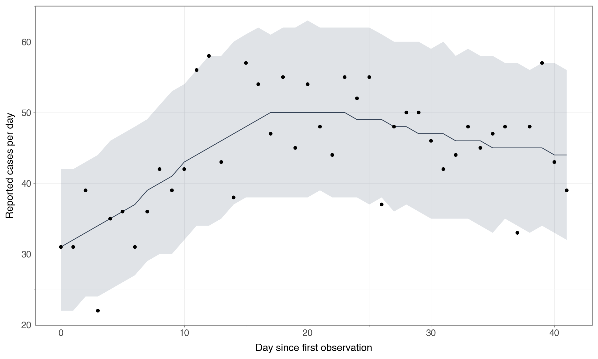
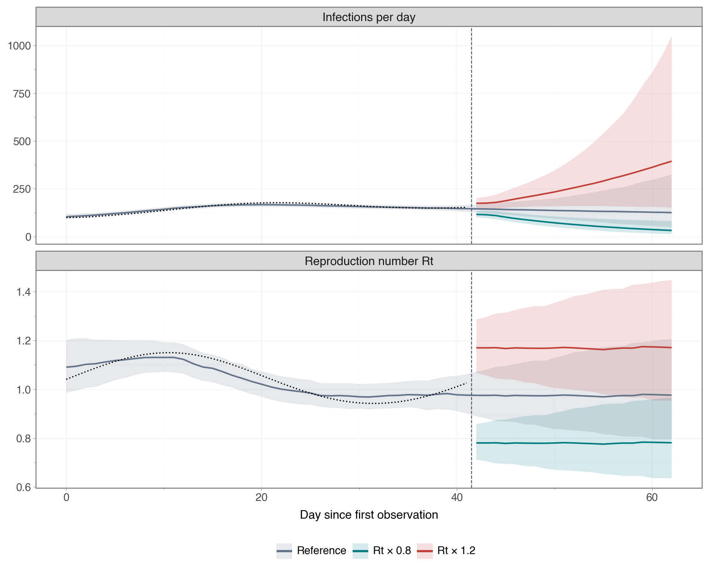

# Scenario Projections with NumPyro Effect Handlers

This tutorial fits a simple PyRenew model to synthetic case counts and projects two scenarios: a sustained 20% reduction or a sustained 20% increase in $R_t$.
Both scenarios start immediately after the last observation.
An unchanged reference projection provides a comparison.

For every posterior draw, we generate one future log-$R_t$ path and reuse it across scenarios.
We then add a scenario-specific offset and recompute infections and expected case counts.
There is no additional inference step.

The example targets the current PyRenew API and uses only a tutorial-local subclass; no changes to the package are needed.
From the repository root, render it with the development dependencies installed:

```bash
uv sync --group dev
uv run quarto render docs/tutorials/scenario_projections.qmd
```

## Define the scenarios

Write $\ell_t = \log R_t$.
For a multiplier $m$, the scenario is

$$
  \ell_t^{(m)} = \ell_t + \log(m)\,\mathbf{1}(t \ge T),
  \qquad
  R_t^{(m)} = R_t m^{\mathbf{1}(t \ge T)},
$$

where observations cover days $0,\ldots,T-1$.
We use $m=0.8$ and $m=1.2$.
These are **additive shifts in log-$R_t$**.
Multiplying log-$R_t$ by a constant $c$ would instead produce $R_t^c$, which is a different intervention.

NumPyro’s [`scale` handler](https://num.pyro.ai/en/stable/handlers.html#scale) scales log-probability contributions, not the values of $R_t$.
Here we use [`substitute`](https://num.pyro.ai/en/stable/handlers.html#substitute) to transform the trajectory used by the renewal calculation.

<details>
<summary>Code</summary>

```python
from typing import Any

import jax
import jax.numpy as jnp
import numpy as np
import numpyro
import numpyro.distributions as dist
import pandas as pd
import plotnine as p9
import polars as pl
from _tutorial_theme import theme_tutorial
from jax.typing import ArrayLike
from numpyro import handlers
from numpyro.diagnostics import summary
from numpyro.infer import Predictive

from pyrenew.deterministic import DeterministicPMF, DeterministicVariable
from pyrenew.latent import PopulationInfections, RandomWalk
from pyrenew.model import PyrenewBuilder
from pyrenew.observation import PoissonNoise, PopulationCounts
from pyrenew.randomvariable import DistributionalVariable

numpyro.enable_x64()
```

</details>
<details>
<summary>Code</summary>

```python
n_fit = 42
n_forecast = 21
population_size = 100_000
ascertainment = 0.3
innovation_sd = 0.025
gen_int_pmf = jnp.array([0.05, 0.15, 0.30, 0.25, 0.15, 0.07, 0.03])
log_rt_site = "log_rt_single_for_infections"

data_key, prior_key, fit_key, future_key, observation_key = jax.random.split(
    jax.random.key(2026), 5
)
```

</details>

## Expose the trajectory to an effect handler

An effect handler can only change downstream computations if they consume the value returned by the intercepted NumPyro primitive.
In `PopulationInfections`, the existing `PopulationInfections::log_rt_single` site records a trajectory after infections have been computed.
Changing that recorded site does not change infections.

This subclass adds a deterministic site at the return of the temporal process.
`PopulationInfections` consumes that return value before exponentiating it and evaluating the renewal equation.
Without a handler, the subclass behaves like the ordinary random walk.

<details>
<summary>Code</summary>

```python
class IntervenableRandomWalk(RandomWalk):
    """Generate log-Rt paths that can be replaced before computing infections."""

    def sample(
        self,
        n_timepoints: int,
        initial_value: float | ArrayLike | None = None,
        n_processes: int = 1,
        name_prefix: str = "rw",
        *,
        first_day_dow: int | None = None,
    ) -> ArrayLike:
        """Return a random-walk trajectory through a named deterministic site."""
        log_rt = super().sample(
            n_timepoints=n_timepoints,
            initial_value=initial_value,
            n_processes=n_processes,
            name_prefix=name_prefix,
            first_day_dow=first_day_dow,
        )
        return numpyro.deterministic(f"{name_prefix}_for_infections", log_rt)
```

</details>

NumPyro 0.21’s [`do` handler](https://num.pyro.ai/en/stable/handlers.html#do) acts on sample sites.
Our hook is deterministic, so we use `substitute` during forward simulation.
This numerical replacement does not itself establish a causal interpretation of the model.

## Build a small inference model

The latent infections follow the renewal equation.
We assume a known generation interval and ascertainment probability, with immediate reporting and Poisson observation noise:

$$
  I_t = R_t \sum_{s=1}^{7} w_s I_{t-s},
  \qquad
  Y_t \sim \operatorname{Poisson}(0.3 I_t).
$$

Here $I_t$ denotes infection counts; the latent PyRenew component computes proportions and the model multiplies them by `population_size`.
The initial infection proportion has prior `Beta(10, 9990)`, with mean 0.001.
The initial log-$R_t$ has prior `Normal(0, 0.1)`, and successive log-$R_t$ increments have known standard deviation 0.025.
These illustrative choices keep the example focused on trajectory interventions.

We use `parameterization="state"` so NumPyro can replay fitted random-walk states and sample the remaining states when the prediction horizon is extended.

<details>
<summary>Code</summary>

```python
builder = PyrenewBuilder()
builder.configure_latent(
    PopulationInfections,
    gen_int_rv=DeterministicPMF("gen_int", gen_int_pmf),
    I0_rv=DistributionalVariable("I0", dist.Beta(10.0, 9990.0)),
    log_rt_time_0_rv=DistributionalVariable("log_rt_time_0", dist.Normal(0.0, 0.1)),
    single_rt_process=IntervenableRandomWalk(
        innovation_sd_rv=DeterministicVariable("innovation_sd", innovation_sd),
        parameterization="state",
    ),
)
builder.add_observation(
    PopulationCounts(
        name="cases",
        ascertainment_rate_rv=DeterministicVariable("ascertainment", ascertainment),
        delay_distribution_rv=DeterministicPMF("reporting_delay", jnp.array([1.0])),
        noise=PoissonNoise(),
    )
)
model = builder.build()
n_init = model.latent.n_initialization_points
intervention_index = n_init + n_fit
print(
    f"Initialization: {n_init} days; observations: {n_fit}; projection: {n_forecast}."
)
```

</details>

```
Initialization: 7 days; observations: 42; projection: 21.
```

## Generate synthetic observations and check the prior

Choose a smooth synthetic log-$R_t$ trajectory and an initial infection proportion of 0.001.
Only the resulting Poisson counts are supplied to the fit; the generating trajectory is used later to assess recovery.
Negative days identify the initialization period.

<details>
<summary>Code</summary>

```python
fit_days = np.arange(-n_init, n_fit)
true_log_rt = (0.04 + 0.10 * jnp.sin(2 * jnp.pi * jnp.asarray(fit_days) / n_fit))[
    :, None
]
synthetic_model = handlers.substitute(
    model.model,
    data={
        "I0": jnp.array(0.001),
        "log_rt_time_0": true_log_rt[0, 0],
        log_rt_site: true_log_rt,
    },
)
synthetic = Predictive(
    synthetic_model,
    num_samples=1,
    return_sites=["cases_obs", "latent_infections"],
)(data_key, n_days_post_init=n_fit, population_size=population_size)
observed = synthetic["cases_obs"][0, n_init:]
observed_padded = model.pad_observations(observed)
```

</details>

Before inference, simulate from the prior.
The table compares the prior distribution of the total observed count with the synthetic total.
This is a scale check for the example, not a calibration to real surveillance data.

<details>
<summary>Code</summary>

```python
prior = Predictive(model.model, num_samples=200, return_sites=["cases_obs"])(
    prior_key, n_days_post_init=n_fit, population_size=population_size
)
prior_total = np.asarray(prior["cases_obs"][:, n_init:]).sum(axis=1)
prior_quantiles = np.quantile(prior_total, [0.05, 0.5, 0.95])
pl.DataFrame(
    {
        "quantity": ["Prior 5%", "Prior median", "Prior 95%", "Synthetic total"],
        "total_cases": [*prior_quantiles, float(observed.sum())],
    }
)
```

</details>

  | quantity          | total_cases |
  | ----------------- | ----------- |
  | str               | f64         |
  | "Prior 5%"        | 293.2       |
  | "Prior median"    | 1232.5      |
  | "Prior 95%"       | 10950.55    |
  | "Synthetic total" | 1870.0      |

## Fit the observed period

The fit ends at day `n_fit - 1`.
Future states and scenario offsets are absent from inference.
Initialization days are masked with `NaN` observations.
We run two chains sequentially so the tutorial also works on a single device.

<details>
<summary>Code</summary>

```python
model.run(
    num_warmup=600,
    num_samples=800,
    rng_key=fit_key,
    nuts_args={"target_accept_prob": 0.95},
    mcmc_args={"num_chains": 2, "chain_method": "sequential", "progress_bar": False},
    n_days_post_init=n_fit,
    population_size=population_size,
    cases={"obs": observed_padded},
)
```

</details>

Inspect divergences, effective sample sizes, and split $\widehat R$ before interpreting the projections.
The state row summarizes all fitted time points.

<details>
<summary>Code</summary>

```python
sample_sites = ("I0", "log_rt_time_0", "log_rt_single_state")
posterior_by_chain = model.mcmc.get_samples(group_by_chain=True)
diagnostics = summary({name: posterior_by_chain[name] for name in sample_sites})
divergences = int(model.mcmc.get_extra_fields()["diverging"].sum())
print(f"Divergences: {divergences}")
pl.DataFrame(
    [
        {
            "variable": name,
            "minimum_ESS": float(np.min(values["n_eff"])),
            "maximum_R_hat": float(np.max(values["r_hat"])),
        }
        for name, values in diagnostics.items()
    ]
)
```

</details>

```
Divergences: 0
```

  | variable              | minimum_ESS | maximum_R_hat |
  | --------------------- | ----------- | ------------- |
  | str                   | f64         | f64           |
  | "I0"                  | 368.405933  | 1.003191      |
  | "log_rt_time_0"       | 493.061119  | 1.004132      |
  | "log_rt_single_state" | 403.354473  | 1.005338      |

## Draw future paths once, then reuse them

First extend each posterior draw through the projection period.
The fitted states are substituted, and the future states are sampled conditionally on the last fitted state.
Save these complete sample-site arrays to use in every scenario.
This explicitly shares future random-walk innovations as well as posterior parameters across scenarios.

<details>
<summary>Code</summary>

```python
paired_samples = Predictive(
    model.model,
    posterior_samples=model.mcmc.get_samples(),
    return_sites=sample_sites,
    exclude_deterministic=True,
)(
    future_key,
    n_days_post_init=n_fit + n_forecast,
    population_size=population_size,
)
```

</details>

Now intercept the deterministic hook and shift only the future rows.
The mask uses the **full padded time axis**, so the first projection index is `n_init + n_fit`, not `n_fit`.
For this single-population model the hook has shape `(time, 1)`.

`exclude_deterministic=True` ensures derived quantities are recomputed instead of being frozen at saved posterior values.
We omit observations when predicting.
The observation key is shared across scenarios as a simulation coupling; the comparisons below concern latent infections and expected counts, not differences between noisy observed counts.

<details>
<summary>Code</summary>

```python
def project(log_rt_shift: float) -> dict[str, jax.Array]:
    """Project a sustained log-Rt shift using the shared fitted and future states."""

    def shift_trajectory(site: dict[str, Any]) -> jax.Array | None:
        """Shift the consumed log-Rt path only on projection days."""
        if site["type"] == "deterministic" and site["name"] == log_rt_site:
            log_rt = site["value"]
            shift = jnp.where(
                jnp.arange(log_rt.shape[0]) >= intervention_index,
                log_rt_shift,
                0.0,
            )
            return log_rt + shift[:, None]
        return None

    scenario_model = handlers.substitute(model.model, substitute_fn=shift_trajectory)
    return Predictive(
        scenario_model,
        posterior_samples=paired_samples,
        return_sites=[log_rt_site, "latent_infections", "cases_predicted", "cases_obs"],
        exclude_deterministic=True,
    )(
        observation_key,
        n_days_post_init=n_fit + n_forecast,
        population_size=population_size,
    )


multipliers = {"Reference": 1.0, "Rt × 0.8": 0.8, "Rt × 1.2": 1.2}
projections = {
    label: project(float(np.log(multiplier)))
    for label, multiplier in multipliers.items()
}
```

</details>

These checks verify that the intervention propagates into infections, leaves the fitted period unchanged, and has the requested multiplicative effect on $R_t$ in every draw.
They also check that extending the horizon preserves the fitted infection trajectories.

<details>
<summary>Code</summary>

```python
reference = projections["Reference"]
np.testing.assert_allclose(
    reference["latent_infections"][:, :intervention_index],
    model.mcmc.get_samples()["latent_infections"],
    rtol=1e-8,
)
assert float(jnp.std(reference[log_rt_site][:, -1, 0])) > 0.0

for label, multiplier in multipliers.items():
    result = projections[label]
    for site in (log_rt_site, "latent_infections", "cases_predicted"):
        np.testing.assert_allclose(
            result[site][:, :intervention_index],
            reference[site][:, :intervention_index],
        )
    np.testing.assert_allclose(
        jnp.exp(
            result[log_rt_site][:, intervention_index:]
            - reference[log_rt_site][:, intervention_index:]
        ),
        multiplier,
        rtol=1e-8,
    )

assert jnp.all(
    projections["Rt × 0.8"]["latent_infections"][:, intervention_index:]
    < reference["latent_infections"][:, intervention_index:]
)
assert jnp.all(
    projections["Rt × 1.2"]["latent_infections"][:, intervention_index:]
    > reference["latent_infections"][:, intervention_index:]
)
print(
    "Fitted paths preserved; Rt multipliers and downstream infection changes verified."
)
```

</details>

```
Fitted paths preserved; Rt multipliers and downstream infection changes verified.
```

## Check the fit and plot the scenarios

Use medians and pointwise 90% intervals.
The case-count fit plot includes observation noise; the scenario plot instead displays latent infections and $R_t$, whose uncertainty comes from the posterior and future temporal process.

<details>
<summary>Code</summary>

```python
def summarize_paths(
    draws: ArrayLike, days: np.ndarray, label: str, quantity: str
) -> pl.DataFrame:
    """Summarize draws with a median and pointwise 90% intervals."""
    lower, median, upper = np.quantile(np.asarray(draws), [0.05, 0.5, 0.95], axis=0)
    return pl.DataFrame(
        {
            "day": days,
            "lower": lower,
            "median": median,
            "upper": upper,
            "scenario": label,
            "quantity": quantity,
        }
    )


def plot_data(frame: pl.DataFrame) -> pd.DataFrame:
    """Convert a Polars summary for plotnine without an Arrow dependency."""
    return pd.DataFrame(frame.to_dict(as_series=False))


case_fit = summarize_paths(
    reference["cases_obs"][:, n_init:intervention_index],
    np.arange(n_fit),
    "Fitted model",
    "Reported cases",
)
observed_df = pl.DataFrame({"day": np.arange(n_fit), "cases": np.asarray(observed)})
```

</details>
<details>
<summary>Code</summary>

```python
(
    p9.ggplot(plot_data(case_fit), p9.aes("day", "median"))
    + p9.geom_ribbon(p9.aes(ymin="lower", ymax="upper"), fill="#64748b", alpha=0.2)
    + p9.geom_line(color="#334155")
    + p9.geom_point(
        plot_data(observed_df), p9.aes("day", "cases"), inherit_aes=False, size=1.5
    )
    + p9.labs(x="Day since first observation", y="Reported cases per day")
    + theme_tutorial
)
```

</details>



Figure 1: Posterior predictive median and pointwise 90% intervals for reported cases, with the synthetic observations shown as points.

For the scenario plot, show the shared fitted trajectory once and display all three projections from day 42 onward.
The dashed vertical line separates inference from projection.
The dotted curves show the synthetic generating values during the fitted period only.

<details>
<summary>Code</summary>

```python
days = np.arange(n_fit + n_forecast)
scenario_frames = []
for label, result in projections.items():
    for quantity, draws in (
        ("Reproduction number Rt", jnp.exp(result[log_rt_site][:, n_init:, 0])),
        ("Infections per day", result["latent_infections"][:, n_init:]),
    ):
        frame = summarize_paths(draws, days, label, quantity)
        if label != "Reference":
            frame = frame.filter(pl.col("day") >= n_fit)
        scenario_frames.append(frame)
scenario_df = pl.concat(scenario_frames)
truth_df = pl.DataFrame(
    {
        "day": np.tile(np.arange(n_fit), 2),
        "value": np.concatenate(
            [
                np.exp(np.asarray(true_log_rt[n_init:, 0])),
                np.asarray(synthetic["latent_infections"][0, n_init:]),
            ]
        ),
        "quantity": ["Reproduction number Rt"] * n_fit + ["Infections per day"] * n_fit,
    }
)
colors = {"Reference": "#64748b", "Rt × 0.8": "#007c83", "Rt × 1.2": "#c2413b"}
```

</details>
<details>
<summary>Code</summary>

```python
(
    p9.ggplot(
        plot_data(scenario_df),
        p9.aes("day", "median", color="scenario", fill="scenario"),
    )
    + p9.geom_ribbon(p9.aes(ymin="lower", ymax="upper"), alpha=0.16, color=None)
    + p9.geom_line(size=0.9)
    + p9.geom_line(
        plot_data(truth_df),
        p9.aes("day", "value"),
        inherit_aes=False,
        color="black",
        linetype="dotted",
        size=0.7,
    )
    + p9.geom_vline(xintercept=n_fit - 0.5, linetype="dashed", color="#475569")
    + p9.facet_wrap("quantity", ncol=1, scales="free_y")
    + p9.scale_color_manual(values=colors, breaks=list(multipliers))
    + p9.scale_fill_manual(values=colors, breaks=list(multipliers))
    + p9.labs(x="Day since first observation", y="", color="", fill="")
    + theme_tutorial
    + p9.theme(figure_size=(10, 8), legend_position="bottom")
)
```

</details>



Figure 2: Paired scenario projections with medians and pointwise 90% intervals.
The same posterior draws and future random-walk innovations underlie all scenarios.
Dotted curves show the synthetic truth during fitting; the vertical line marks the start of projection.

## Summarize the paired differences

Sum infections over the 21 projection days **within each draw**, then subtract the reference total for that same draw.
Quantiles of these differences describe the paired contrast.
Subtracting marginal interval endpoints would not do so.

<details>
<summary>Code</summary>

```python
reference_total = np.asarray(
    reference["latent_infections"][:, intervention_index:]
).sum(axis=1)
contrast_rows = []
for label in ("Rt × 0.8", "Rt × 1.2"):
    scenario_total = np.asarray(
        projections[label]["latent_infections"][:, intervention_index:]
    ).sum(axis=1)
    difference = scenario_total - reference_total
    lower, median, upper = np.quantile(difference, [0.05, 0.5, 0.95])
    contrast_rows.append(
        {
            "scenario": label,
            "median_total_infections": float(np.median(scenario_total)),
            "difference_5%": lower,
            "difference_median": median,
            "difference_95%": upper,
        }
    )
pl.DataFrame(contrast_rows).with_columns(pl.selectors.numeric().round(1))
```

</details>

  | scenario   | median_total_infections | difference_5% | difference_median | difference_95% |
  | ---------- | ----------------------- | ------------- | ----------------- | -------------- |
  | str        | f64                     | f64           | f64               | f64            |
  | "Rt × 0.8" | 1434.2                  | -2552.6       | -1407.6           | -828.8         |
  | "Rt × 1.2" | 5580.2                  | 1488.9        | 2736.4            | 5351.4         |

These are model-based projections under specified changes to $R_t$.
They do not estimate how a particular policy changes transmission.
A causal interpretation requires assumptions connecting that policy to the imposed trajectory change and specifying which other mechanisms remain invariant.

This simple model has no susceptibility depletion or infection feedback, and it holds ascertainment, reporting delay, and innovation variance fixed.
If an infection process includes feedback, this hook changes the input $R_t$ and allows feedback to be recomputed; the effective $R_t$ need not retain the same multiplier.
The strict ordering of infections checked above is specific to this positive, deterministic renewal model without feedback.

The intervention is applied after the natural path is generated.
Future innovations are shared, and the shift is sustained on every projection day.
Changing just the state at the forecast boundary and then evolving a modified transition process would define a different scenario for processes such as AR(1).
